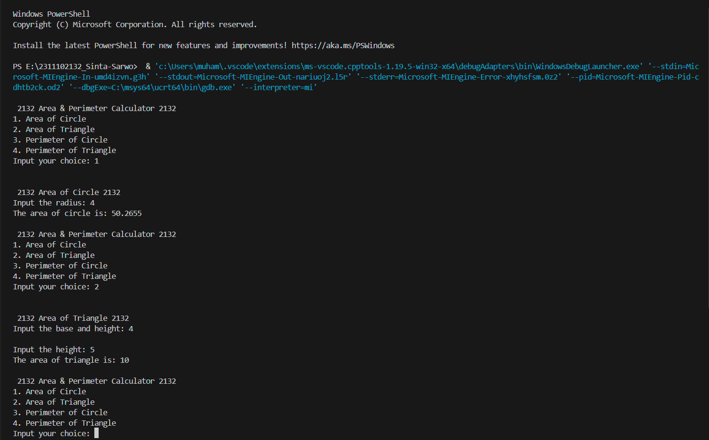
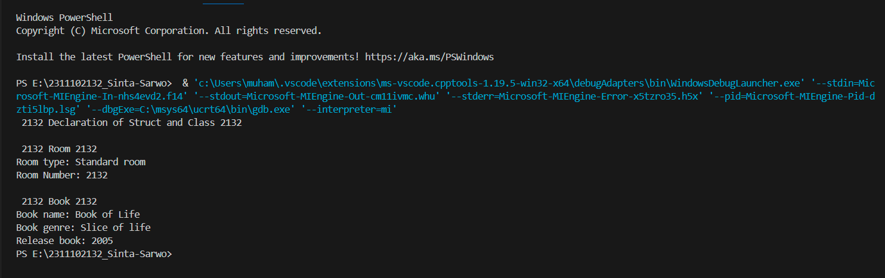
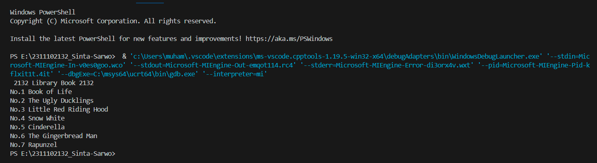

# <h1 align="center">Laporan Praktikum Modul 1 - Tipe Data</h1>
<p align="center">Sinta Sarwo - 2311102132</p>

## Dasar Teori

Tipe data merupakan kategori yang digunakan untuk mengklasifikasikan data berdasarkan sifat dan karakteristiknya. Tiga kategori utama tipe data dalam pemrograman dalam bahasa C++ serta penjelasannya;

**1. Tipe Data Primitif**

Tipe data primitif merupukan tipe data dasar yang disediakan oleh bahasa pemrograman termasuk C++. Tipe data ini tidak bisa diubah atau dipecah menjadi bagian yang lebih kecil. Berikut adalah contoh tipe data primitif;
- Bilangan bulat: byte, short, int, long
- Bilangan desimal: float, double
- Karakter: char
- Nilai boolean: boolean (true/false)

**2. Tipe Data Abstrak**

Tipe data abstrak merupakan tipe data yang dibentuk oleh programmer sendiri. Data abstrak memungkinkan program mengabaikan detail bagaimana tipe data direpresentasikan.

**3. Tipe Data Koleksi**

Tipe data koleksi atau Collection Data Type merupakan tipe data yang digunkan untuk menyimpan sebuah kelompok data yang mempunyai nilai atau objek secara besamaan. Collection data memungkinkan programmer untuk menyimpan, mengelola, dan mengakses dara besar dengan cara terstruktur. Beberapa tipe data koleksi, yaitu;

- Array, sebuah data statis yang dapat menyimpan sekelompok elemen dengan tipe data yang sama, elemen tersebut dapat diakses dengan indeks.
- Vector, mempunyai fungsi mirip dengan array untuk menyimpan data dalam bentuk elemen-elemen yang alokasi memori dilakukan secara otomatis dan bersebelahan.
- Map, mirip dengan array tetapi memungkinkan untuk lebih dari satu tipe data selain integer dan pada map indeks disebut "key". Map digunakan Self-Balancing Tree khususnya Red-Black Tree.

## Guided 

### 1. Tipe Data Primitif

```C++
#include <iostream>
#include <iomanip>

using namespace std;

int main(){
    char op;
    float num1, num2;

    cout << "Enter operator (+, -, *, /): ";
    cin >> op;

    cout << "Enter two operands : ";
    cin >> num1 >> num2;

    switch (op)
    {
    case '+':
        cout <<"Result : " << num1 + num2;
        break;
    case '-':
        cout << "Result : " << num1 - num2;
        break;
    case '*':
        cout << "Result : " << num1 * num2;
        break;
    case '/':
        if (num2 != 0){
            cout << "Result: " <<fixed<<setprecision(2)<<num1/num2;
            break;
        }else{
            cout << "Error! Division by zero is not allowed.";
            break;
        }
        default:
            cout <<"Error! operator is not correct";
            break;
    }
    return 0;
}
```
Kode di atas digunakan untuk menghitung operational sederhana seperti penambahan (+), pengurangan (-), perkalian (*), dan penjumlahan (/). Operasi ini akan dijalankan jika user menginput salah satu dari tanda operasional yang di inginkan. User butuh menginput dua angka yang ingin dihitung saat penginputan cin. Dalam kode di atas terdapat data primitif yang digunakana yaitu float dan char. Tipe dara char digunakan saat pemilihan switch case, sedangkan float digunakan untuk kedua nomor yang akan di input oleh user. Jika user tidak memasukan operator char maka program akan memunculkan "Error! operator is not correct".

### 2. Tipe data abstarak

```C++
#include <stdio.h>
#include <string.h>

//Struct
struct Mahasiswa
{
    char name[50];
    char address[100];
    int age;
};

int main(){
    //menggunakan struct
    struct Mahasiswa mhs1, mhs2;
    //mengisi nilai struct
    strcpy(mhs1.name, "Dian");
    strcpy(mhs1.address, "Mataram");
    mhs1.age = 22;
    strcpy(mhs2.name, "Bambang"); 
    strcpy(mhs2.address, "Surabaya"); 
    mhs2.age = 23; 
     
    // mencetak isi struct 
    printf("## Mahasiswa 1 ##\n"); 
    printf("Nama: %s\n", mhs1.name); 
    printf("Alamat: %s\n", mhs1.address); 
    printf("Umur: %d\n", mhs1.age); 
    printf ("\n"); 
    printf("## Mahasiswa 2 ##\n"); 
    printf("Nama: %s\n", mhs2.name); 
    printf("Alamat: %s\n", mhs2.address); 
    printf("Umur: %d\n", mhs2.age); 
    return 0; 
} 
```
Kode diatas menggunakan struct dan mencetaknya. Struct merupakan salah satu tipe data abstrak. Pada kode struct Mahasiswa di atas mempunyai 3 nilai, yaitu char name dengan ukuran 50, char address dengan ukuran yang sama, dan juga int age. Dalam int main kode sturct mhs1 dan mhs2 dengan isi nilai struct tersebut. Struct Mahasiswa mhs1 dengan nama Dian, alamat Mataram, dan umur 23. Sedangkan mhs2 dengan nama Bambang, alamat Surabaya, dan umur 23. Struct dicetak menggunakan printf satu persatu dengan nilai dalam struct mhs1 dan mhs2.

### 3. Tipe data koleksi
```C++
#include <iostream> 
#include <array> 
using namespace std; 
 
int main() { 
    // Deklarasi dan inisialisasi array 
    int nilai[5]; 
    nilai[0] = 23; 
    nilai[1] = 50; 
    nilai[2] = 34; 
    nilai[3] = 78; 
    nilai[4] = 90; 
 
    // Mencetak array dengan tab 
    cout << "Isi array pertama  : " << nilai[0] << endl; 
    cout << "Isi array kedua    : " << nilai[1] << endl; 
    cout << "Isi array ketiga   : " << nilai[2] << endl; 
    cout << "Isi array keempat  : " << nilai[3] << endl; 
    cout << "Isi array kelima   : " << nilai[4] << endl; 
 
    return 0; 
}
```
Kode di atas menggunakan array untuk menyimpan tipe data integer dengan ukuran 5. Dalam kode di atas array di deklasrasi dan di inisialisasi dengan indeksnya. Terdapat array yang bernilai 23, 50, 34, 78, 90, dengan indeks yang mulai dari 0 sampai 4. Nilai array tersebut dicetak satu-satu menggunakan tab dan operasi cout berutan dari indeks 0 sampai 4.

## Unguided 

### 1. Buatlah program menggunakan tipe data primitif minimal dua fungsi dan bebas. Menampilkan program, jelaskan program tersebut dan ambil kesimpulan dari materi tipe data primitif! 

```C++

// Sinta Sarwo - 2311102132

#include <iostream>
#include <cmath> // Library untuk fungsi pada perihitungan Area dan Perimeter of Circle

using namespace std;

char n_2132; //Data premitif char untuk pilihan menu n_2132
double r; // Data premitif double untuk bilangan r dalam fungsi CircleArea_2132 & CirclePerimeter_2132
float a, b, c, h; // Data permitif float untuk fungsi AreaTriangle_2132 & TrianglePerimeter_2132

void Menu_2132 (){ //procedur untuk menunjukan pilihan menu Menu_2132
    cout << "\n 2132 Area & Perimeter Calculator 2132 ";
    cout << "\n1. Area of Circle";
    cout << "\n2. Area of Triangle";
    cout << "\n3. Perimeter of Circle";
    cout << "\n4. Perimeter of Triangle";
    cout << "\nInput your choice: ";
    cin >> n_2132; 
}

double CircleArea_2132 (){ // Fungsi untuk menghitung luas lingkaran
    cout << "\n 2132 Area of Circle 2132 "<< endl;
    cout << "Input the radius: ";
    cin >> r;
    cout << "The area of circle is: ";
    return M_PI * pow(r,2); //Mengembalikan hasil luas lingkaran dan pow dan M_PI fungsi dari cmath library
}

double CirclePerimeter_2132 (){ //Fungsi untuk menghitung keliling lingkaran
    cout << "\n 2132 Perimeter of Circle 2132" << endl;
    cout << "Input the radius: ";
    cin >> r;
    cout << "The perimeter of circle is: ";
    return 2 * M_PI * r; //Mengembalikan hasil keliling lingkaran dan M_PI fungsi dari cmath library
}

float AreaTriangle_2132 (){ //Fungsi untuk menghitung luas segitiga
    cout << "\n 2132 Area of Triangle 2132 " << endl;
    cout << "Input the base and height: ";
    cin >> b;
    cout << endl;
    cout << "Input the height: ";
    cin >> h;
    cout << "The area of triangle is: ";
    return b * h * 0.5; //Mengembalikan hasil luas segitiga
}

float TrianglePerimeter_2132 (){ //Fungsi untuk menghitung keliling segitiga
    cout << "\n 2132 Perimeter of Triangle 2132 " << endl;
    cout << "Input the first side of triangle: ";
    cin >> a;
    cout << "Second side of the triangle: ";
    cin >> b;
    cout << "Third side of triangle: ";
    cin >> c;
    cout << "The parameter of triangle is: ";
    return a + b + c; //Mengembalikan hasil keliling segitiga   
}

int main(){
    do {//Looping menu pilihan
        Menu_2132();
        switch (n_2132){ // Switch case untuk memilih menu
            case '1':
            cout << "\n" << CircleArea_2132() << endl; // Jika user memilih 1, maka akan menjalankan fungsi menghitung luas lingkaran
            break;
            case '2':
            cout << "\n" << AreaTriangle_2132() << endl; // Jika user memilih 2, maka akan menjalankan funsgi menghitung luas segitiga
            break;
            case '3':
            cout << "\n" << CirclePerimeter_2132() << endl; // Jika user memilih 3, maka akan menjalankan fungsi menghitung keliling lingkaran
            break;
            case '4':
            cout << "\n" << TrianglePerimeter_2132() << endl; // Jika user memilih 4, maka akan menjalankan fungsi menghitung keliling segitiga
            break;
            default:
            cout << "Invalid command! bai bai!!" << endl; // Jika user tidak memilih 1-4 atau memasukan hal yang lain, maka pesan tersebut akan keluar
            return 0;
        }
    } while (n_2132 != 0); //Looping akan terus berjalan selama user tidak memilih 0

    return 0;
}
```
#### Output:


Kode di atas digunakan untuk menghitung luas dan keliling sebuah lingkaran dan segitiga. Kode di atas menggunakan tipe data primitif char, double float dan juga menggunakan library cmath untuk memudahkan penghitungan operasi luas dan keliling lingkaran. Dalam program di atas mempunyai 4  fungsi  dan 1 procedur untuk mempermudah dalam int main program. 4 fungsi menampung 4 operasi dari perhitungan-perhitungan luas dan keliling lingkaran dan segitiga. Pada kode di atas juga menggunakan do-while untuk looping program tersebut, jika user memilih 0 maka program akan berhenti.

Kesimpulan data primitif:
Data primitif merupakan tipe data yang sudah ditentukan oleh sistem terdapat di berbagai bahasa pemrograman, dan bersifat penting dalam menyimpan nilai-nilai sederhana.

### 2. Jelaskan fungsi dari class dan struct secara detail dan berikan contoh programnya.

```C++

//Sinta Sarwo - 2311102132

#include <iostream>

using namespace std;

// Struct terdapat data string RoomType_2132 untuk tipe kamar dan int RoomNumber_2132 untuk nomor kamar
struct Room_2132{
    string RoomType_2132;
    int RoomNumber_2132;
};

//Class terdapat data string title, genre, dan int YearRelease_2132 dalam akses public
class book_2132{
    public:
    string title_2132;
    string genre_2132;
    int YearRelease_2132;
};

int main () {
    cout << " 2132 Declaration of Struct and Class 2132 " <<endl;

    //Deklarasi struct
    Room_2132 tipekamar{"Standard room" , 2132};
    cout << "\n 2132 Room 2132 " << endl;
    cout << "Room type: " << tipekamar.RoomType_2132 << endl;
    cout << "Room Number: " << tipekamar.RoomNumber_2132 << endl;

    //Deklarasi class
    book_2132 book;
    book.title_2132 = "Book of Life";
    book.genre_2132 = "Slice of life";
    book.YearRelease_2132 = 2005;
    cout << "\n 2132 Book 2132 " << endl;
    cout << "Book name: " << book.title_2132 << endl;
    cout << "Book genre: " << book.genre_2132 << endl;
    cout << "Release book: " << book.YearRelease_2132 << endl;

    return 0;
}
```

#### Output:


Kode di atas digunakan untuk mencetak teks kedua struct dan class. Kode di atas terdapat struct Room_2132 data string RoomType_2132 untuk tipe kamar dan int RoomNumber_2132 untuk nomor kamar, dan class yang terdapat data string title, genre, dan int YearRelease_2132 dalam akses publik. Pada int main Struct Room_2132 tipekamar diisi dengan nilai Standard room, dan nomor 2132. Sedangkan Class book_2132 book bernilai Book of Life, Slice of life, dan rilis pada tahun 2005. Lalu keduanya di deklarasikan dan dicetak dengan operasi cout.

- Fungsi Class<br/>
Class merupakan salah satu konsep OOP digunakan untuk mengemas data abstrak procedural sebagai gambaran umum atau desain suatu objek, yang dapat digunakan oleh metode apa pun untuk mendefinisikan atau mendeskripsikan konten.

- Fungsi Struct<br/>
Struct merupakan sekumpul data yang dikelompokkan dalam sebuah tabel yang memiliki nilai-niali yang terkait bersama. Struct digunakaa saat data-data tersebut mempunyai hubungan.

### 3. Buat dan jelaskan program menggunakan fungsi map dan jelaskan perbedaan dari array dengan map.

```C++

// Sinta Sarwo - 2311102132

#include <iostream>
#include <map> // Library untuk menggunakan fungsi map dalam int main

using namespace std;

int main() {
    
    // Deklarasi map dengan key int dan value string
    map<int, string> book_2132;
  
    // Elemen-elemen ke dalam map
    book_2132[1] = "Book of Life";
    book_2132[2] = "The Ugly Ducklings";
    book_2132[3] = "Little Red Riding Hood";
    book_2132[4] = "Snow White";
    book_2132[5] = "Cinderella";
    book_2132[6] = "The Gingerbread Man";
    book_2132[7] = "Rapunzel";

    cout << " 2132 Library Book 2132 " << endl;
    for (int i = 1; i <= book_2132.size(); ++i) { // Looping untuk menampilkan semua elemen pada amap
        cout << "No." << i << " " << book_2132[i] << endl; // Menampilkan elemen map
    }

    return 0;
}
```
#### Output:


Kode diatas menggunakan library map untuk menyimpan pasangan "key"-nilai. Map book__2132 dideklarasikan dengan "key" int dan nilai string, pada kode diatas menambahkan elemen-elemen dengan "key". Program akan mencetak nomor dan judul buku dalam map dengan looping for.

Perbedaan Array dan Map

Array <br/>
- Menggunakan indeks yang mulai dari nilai 0 dan berurutan.
- Ukuran yang dideklarasikan dan tetap.
- Hanya menyimpan data tipe data primitif.
- Lebih digunakan saat data yang disimpan berurutan.

Map<br/>
- Menggunkan "key" yang mulai dari 1, dapat bernilai apapun, dan tidak harus berurutan.
- Data yang diakses berdasarkan "key"
- Deklarasi ukuran yang dinamis.
- Dapat menyimpan tipe data apapun.
- Lebih digunkaan saat data yang disimpan tidak berurutan.

## Kesimpulan
Tipe data merupukan hal yang sangat signifikan dalam pemograman C++ dan bahasa lain. Tipe data merupakan elemen yang menentukan jenis dan karakteristik nilai yang dapat disimpan dan operasi apa yang dapat dilakukan kepada nilai tersebut. Dengan memahami dan mengerti tipe data, kita dapat pemahaman yang lebih tinggi dalam menulis program dengan bena dan akurat.

## Referensi
[1] Putri, et al., Algoritma dan Struktur Data. Bandung: Widina Bhakti Persada, 2022.<br/>
[2] Meidyan Permata Putri, et al., Algoritma dan Struktur Data. Bandung: Widina Bhakti Persada Bandung, 2022.
