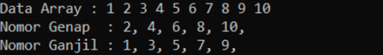
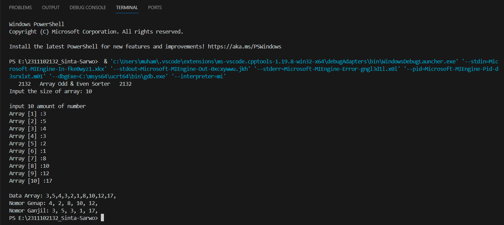
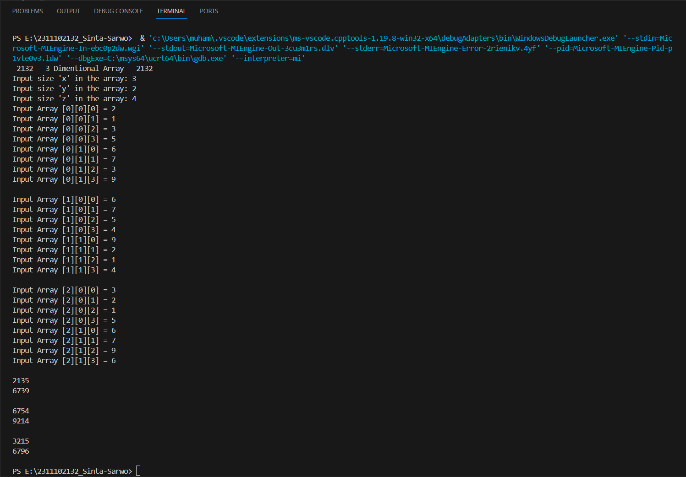
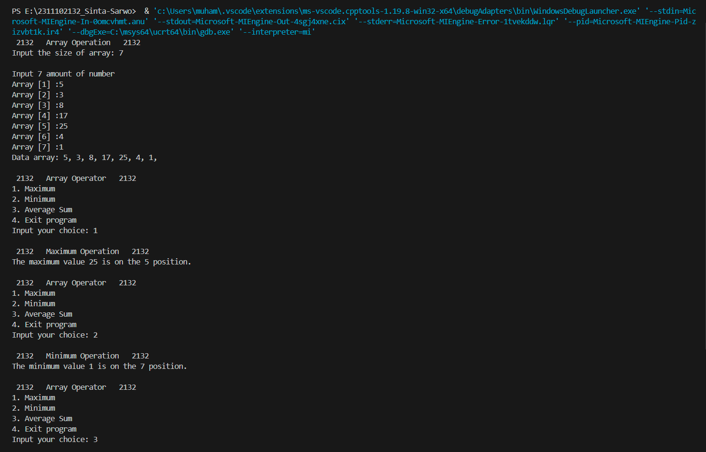
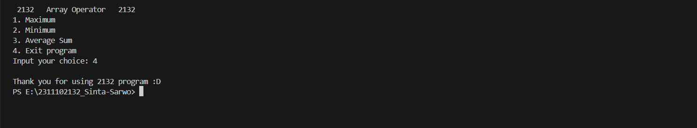

# <h1 align="center">Laporan Praktikum Modul 2 - Array</h1>
<p align="center">Sinta Sarwo - 2311102132</p>

## Dasar Teori
Array merupakan suatu tipe data terstruktur yang digunakan dalam bahasa pemrograman untuk menyimpan data atau elemen dengan tipe data yang sama. Array menyimpan data dalam indeks yang mulai dari 0 sampai N-1, dimana N adalah ukuran array dan dapat kita akses dengan indeknya. Dalam pemrograman array sering digunakan untuk menyimpan data seperti bilangan (int), karakter (char), string, dan sebagainya. Array memiliki beberapa jenis yaitu:
1. Array 1 Dimensi<br\>
Array 1  dimensi atau vector merupakan suat array yang hanya memiliki satu baris, di mana data atau elemen arraynya hanya ditunjukkan oleh satu indeks. Contoh:
    - int Bilangan[10], deklarasi array untuk menyimpan data integer dengan ukuran 10.
2. Array 2 Dimensi<br\>
Array 2 dimensi merupakan array yang terdiri dari elemen-elemen yang disusun dalam baris dan kolom. Setiap elemen dapat diakses menggunakan dua indeks, indeks baris dan indeks kolom. Array 2 dimensi ini biasanya digunakan untuk merepresentasikan data yang terkait dengan baris dan kolom, seperti tabel, matriks, atau citra. Contoh:
    - int Matriks[3][3], deklarasi array 2 dimensi dengan 3 baris dan 3 kolom.
3. Array Multi Dimensi <br\>
Array Multi dimensi mempunyai lebih dari dua baris dan kolom. Dalam array 2 dimensi, data disusun dalam baris dan kolom, sedangkan dalam array multi-dimensi yang lebih tinggi, data akan disusun dalam tiga atau lebih dimensi. Elemen dapat diakses menggunakan indeks yang sesuai dengan jumlah dimensi yang dimiliki. Array multi-dimensi sering digunakan daam pemograman untuk merepresentasikan data kompleks, dan untuk mempermudah pemrosesan data dalam bentuk matriks dan tabel. Contoh:
    - int Matriks[3][3], array 2 dimensi termasuk sebagai array multi dimensi.
    - Kubus 3x3x3, setiap elemen memiliki koordinat tiga-dimensi (tinggi, lebar, kedalaman).

## Guided 

### 1. Program input array tiga dimensi

```C++
#include <iostream>
using namespace std;
// PROGRAM INPUT ARRAY 3 DIMENSI
 
 int main()
 {
    // Deklarasi array
    int arr[2][3][3];
    // Input elemen
    for (int x = 0; x < 2; x++) {
        for (int y = 0; y < 3; y++){
            for (int z = 0; z < 3; z++) {
                cout << "Input Array [" << x << "][" << y << "][" << z << "] = ";
                cin >> arr[x][y][z];
            }
        }
    cout << endl;
    }
    // Output Array
    for (int x = 0; x < 2; x++){
        for (int y = 0; y < 3; y++){
            for (int z = 0; z < 3; z++){
                cout << "Data Array [" << x << "][" << y << "][" << z << "] = " << arr[x][y][z] << endl;
            }
        }
    }
    cout << endl;
    // Tampilan array
    for (int x = 0; x < 2; x++) {
        for (int y = 0; y < 3; y++){
            for (int z = 0; z < 3; z++) {
                cout << arr[x][y][z] << ends;
            }
        cout << endl;
        }
    cout << endl;
    }
 }
```
Kode di atas merupakan program array yang menggunakan tiga dimensi dengan ukuran yang sudah di deklarasi, x = 2, y = 3, dan z = 3. Program akan melakukan perulangan untuk inputan nilai dalam array sesuai ukuran yang telah di deklarasi. Lalu program akan mencetak nilai yang di input dengan user menggunakan perulangan. 

### 2. Program mencari nilai maksimal pada array

```C++
#include <iostream>
using namespace std;

int main(){
    int maks, a, i = 1, lokasi;
    cout << "Masukkan panjang array: ";
    cin >> a;
    int array[a];
    cout << "Masukkan " << a << " angka\n";
    for (i = 0; i < a; i++){
        cout << "Array ke-" << (i) << ": ";
        cin >> array[i];
    }
    maks = array[0];
    for (i = 0; i < a; i++) {
        if (array[i] > maks){
            maks = array[i];
            lokasi = i;
        }
    }
    cout << "Nilai maksimum adalah " << maks << " berada di Array ke " << lokasi << endl;
} 
```
Kode di atas mecari nilai maksimum dan lokasi nilai tersebut dalam array 1 dimensi. Dalam program, user dapat menentukan ukuran array dengan int a dan user dapat menginput nilai array. Kode di atas menggunakan perulangan dan memberi kondisi di mana program akan membandingkan nilai array, jika nilai array tersebut lebih besar maka akan melanjutkan perbandingan tersebut dengan nilai selanjutnya dalam array. Jika program menemuka nilai tertinggi maka program akan meenunjukan "Nilai maksimum adalah" nilai maksimum dalam array " berada di Array ke " posisi indeks nilai maksimum.

## Unguided 

### 1. Buatlah program untuk menampilkan Output seperti berikut dengan data yang diinputkan oleh user!


```C++

// Sinta Sarwo - 2311102132

#include <iostream>
using namespace std;

int a_2132, i; //deklarasi int a_2132 untuk ukuran array dan i dalam perulangan

int main() {
    
    cout << "   2132   Array Odd & Even Sorter   2132   \n";
    //User menginput ukuran array
    cout << "Input the size of array: ";
    cin >> a_2132;
    
    //Deklarasi array dengan ukuran yang di input oleh user
    int Array_2132[a_2132]; 
    cout << "\n";

    //User menginput bilangan array
    cout << "input " << a_2132 << " amount of number\n";
    for (i = 0; i < a_2132; i++){ //Perulangan untuk menginput nilai dalam array
        cout << "Array " << "[" << i + 1 << "]" << " :";
        cin >> Array_2132[i];
    }
    cout << endl;

    //Output Array
    cout << "Data Array: ";
    for (i = 0; i < a_2132; i++){
        cout << Array_2132[i] << ",";
    }
    cout << endl;

    //Perulangan untuk menentukan bilangan genap dalam array
    cout << "Nomor Genap: ";
    for (i = 0; i < a_2132; i++){//Logika perulangan
        if (Array_2132[i] % 2 ==0){ //Kondisi untuk mengindetifikasi bilang genap
            cout << Array_2132[i] << ", "; //Mencetak bilanga-bilagan yang sesuai dengan kondisi di atas
        }
    }
    cout << endl;

    //Perulangan untuk menentukan bilang ganjil dalam array
    cout << "Nomor Ganjil: ";
    for (i = 0; i < a_2132; i++){//Logika perulangan
        if (Array_2132[i] % 2 != 0){ //Kondisi untuk menindetifikasi bilangan ganjil
            cout << Array_2132[i] << ", "; //Mencetak bilangan-bilangan yang sesuai dengan kondisi di atas
        }
    }
    cout << endl;

    return 0;
}
```
#### Output:


Kode di atas menggunakan array 1 dimensi, user akan menentukan ukuran program dan nilai program. Kode di atas akan menunjukan hasil data array yang user masukan. Program akan menyortir bilangan genap dan ganjil dalam array masing-masing, dengan menggunakan perulangan dan kondisi untuk bilang genap dan ganjil. Program akan menunjukan hasil sortiran pada array masing-masing.

### 2. Buatlah program input array tiga dimensi (seperti pada guided) tetapi jumlah ukuran elemennya di inputkan oleh user!

```C++

// Sinta Sarwo - 2311102132

#include <iostream>

using namespace std;

int Sizex_2132, Sizey_2132, Sizez_2132; //Deklarasi int untuk ukuran array 3 dimensi

int main() {
    cout << " 2132   3 Dimentional Array   2132 \n";
    //User akan menentukan ukuran ke tiga array
    cout << "Input size 'x' in the array: ";
    cin >> Sizex_2132;
    cout << "Input size 'y' in the array: ";
    cin >> Sizey_2132;
    cout << "Input size 'z' in the array: ";
    cin >> Sizez_2132;

    //Deklarasi array 3 dimensi dengan ukuran yang telah di input oleh user
    int Array_2132[Sizex_2132][Sizey_2132][Sizez_2132];

    //Perulangan untuk menginput nilai dalam array 3 dimensi
    for (int x = 0; x < Sizex_2132; x++){//nilai dalam array x
        for (int y = 0; y < Sizey_2132; y++){//nilai dalam array y
            for (int z = 0; z < Sizez_2132; z++){//nilai dalam z
                cout << "Input Array [" << x << "][" << y << "][" << z << "] = ";
                cin >> Array_2132[x][y][z];
            }
        }
    cout << endl;
    }

    //Logika perulangan untuk mencetak Array 3 dimensi
    for (int x = 0; x < Sizex_2132; x++) {
        for (int y = 0; y < Sizey_2132; y++){
            for (int z = 0; z < Sizez_2132; z++) {
                cout << Array_2132[x][y][z] << ends;
            }
        cout << endl;
        }
    cout << endl;
    }
    return 0;
}
```
#### Output:


Kode diatas mempunyai kesamaan dengan program guided 1, kedua program menggunakan array 3 dimensi. Namun, pada kode di atas user dapat menentukan ukurana array 3 dimensi dan menginput nilai array tersebut, guided 1 hanya dapat menginputkan nilai array. Kode di atas akan menunjukan hasil inputan array oleh user.

### 3. Buatlah program menut untuk mencari nilai Maksimum, Minimum dan Nilai rata-rata dari suatu array dengan input yang dimasukan oleh user!

```C++

// Sinta Sarwo - 2311102132

#include <iostream>

using namespace std;

int n_2132, a_2132, i; //Deklarasi variable int n_2132 untuk memilih dalam switch case, a_2132 untuk ukuran array, i digunakan dalam perulangan
int max_2132, min_2132; //Deklarasi variable min_2132 & max_2132 untuk mencari maksimum dan minimum dalam array
double mean_2132; //Deklarasi variable mean_2132 untuk hasil dari hitungan rata-rata array
int lokasi_2132, sum_2132; //Deklarasi lokasi_2132 untuk menyimpan posisi dari maksimum dan minimum

int main() {

    cout << " 2132   Array Operation   2132" << endl;

    //User menginput ukuran array
    cout << "Input the size of array: ";
    cin >> a_2132;
    int Array_2132[a_2132];
    cout << "\n";
    cout << "Input " << a_2132 << " amount of number\n";

    // User meninput nilai array
    for (i = 0; i < a_2132; i++) {
        cout << "Array " << "[" <<i + 1 << "]" << " :";
        cin >> Array_2132[i];
    }

    //Hasil dari inputan array oleh user
    cout << "Data array: ";
    for (i = 0; i < a_2132; i++) {
        cout << Array_2132[i] << ", ";
    }
    cout << "\n" <<endl;

    do {// Program akan looping terus dari tampilan menu untuk mengoperasikan maksimum, minimum, dan rata-rata
    //Menu
        cout << " 2132   Array Operator   2132 \n";
        cout << "1. Maximum\n";
        cout << "2. Minimum\n";
        cout << "3. Average Sum\n";
        cout << "4. Exit program\n";
        cout << "Input your choice: ";
        cin >> n_2132;
        cout << endl;

        switch (n_2132) {
            case 1:
                //Perulangan untuk mencari nilai maksimum dalam array
                cout << " 2132   Maximum Operation   2132 \n";
                max_2132 = Array_2132[0]; //max_2132 menjadi nilai array yang mulai dari indeks 0 dan akan di bandingkan untuk mecari nilai maksimum
                for (int i = 0; i < a_2132; i++) {
                    if (Array_2132[i] > max_2132) {//Nilai array akan di bandingkan untuk mencari nilai maksimum, nilai tersbut akan tersimpan dalam Array_2132[i]
                        max_2132 = Array_2132[i]; //max_2132 akan menyimpan nilai yang disimpan oleh Array_2132[i] dari hasil perbandingan
                        lokasi_2132 = i; //Posisi nilai maksimum  dalam array
                    }
                }
                cout << "The maximum value " << max_2132 << " is on the " << lokasi_2132 + 1 << " position.\n" << endl; //Mencetak hasil nilai dan lokasi nilai maksimum
                break;
            case 2:
                //Perulangan untuk mencari nilai minimum dalam array
                cout << " 2132   Minimum Operation   2132 \n";
                min_2132 = Array_2132[0]; //min_2132 menjadi nilai array yang mulai dari indeks 0 dan akan di bandingkan untuk mencari nilai minimum
                for (i = 0; i < a_2132; i++) {
                    if (Array_2132[i] < min_2132) { //Nilai array akan di bandingkan untuk mencari nilai minimum, nilai tersebut akan tersimpan dalam Array_2132[i]
                        min_2132 = Array_2132[i]; //min_2132 akan menyimpan nilai yang disimpan oleh Array_2132[i] dari hasil perbandingan
                        lokasi_2132 = i; //Posisi nilai minimum dalam array
                    }
                }
                cout << "The minimum value " << min_2132 << " is on the " << lokasi_2132 + 1 << " position.\n" << endl; //Mecetak hasil nilai dan lokasi nilai minimum
                break;
            case 3:
                //Perulangan untuk mencari nilai rata-rata dalam array
                cout << " 2132   Averange Sum Operation   2132 \n";
                sum_2132 = 0;
                for (i = 0; i < a_2132; i++) {//Perulangan untuk menambahkan seluruh julmah array dan mendeklarasikannya sebagain sum_2132
                    sum_2132 += Array_2132[i];
                }
                //Rumus untuk menghitung rata-rata
                mean_2132 = sum_2132 / a_2132;
                cout << "The average of this array is " << mean_2132 << "\n" << endl; //Mencatak hasil perhitungan
                break;
            case 4:
                cout << "Thank you for using 2132 program :D" << endl;
                return 0;
           default:
                cout << "uh... what did you put?? Invalid Command!" << endl;
        }

        }while (n_2132 != 0); //program akan berhenti jika user menginputkan 0 atau 4 dalam pilihan switch case
    
    return 0;
    }
```
#### Output:



Kode di atas digunakan untuk menghitung maksimum, minimum, dan rata-rata dengan array 1 dimensi. Pada kode di atas user akan menentukan ukuran dan nilai array yang akan di operasikan. Setelah user menginputkan ukuran dan nilai array, hasil array tersebut akan di tampilkan dalam output, dan program akan lanjut kepada menu untuk operator maksimum, minimum, dan rata-rata. Dalam bagian kode ini user dapat menginput operasi yang di lakukan dalam array yang telah di input. Pada pilihan 1, program akan mencari nilai maksimum dan menampilkan hasil nilai maksimum dan lokasi nilai maksimum. Pada pilah 2, program akan mencari nilai minimum dan menampilkan hasil nilai minimum dan lokasi nilai minimum. Pada pilihan 3, program akan mencari nilai rata-rata dari array dan menampilkan hasil perhitungan. Pada pilihan 4, program akan berhenti dan menampilkan "Thank you for using 2132 program :D". Program akan berlanjut dari tampilan menu untuk mengoperasikan maksimum, minimum, dan rata-rata, hingga user menginputkan 4 atau 0 program akan berhenti.


## Kesimpulan
Array merupakan tipe data terstruktur yang digunakan dalam pemrograman untuk menyimpan elemen dengan tipe data yang sama. Beberapa jenis array:
1. Array 1 dimensi, hanya memiliki satu baris dan elemen diakses melalui satu indeks. Format deklarasi, (tipe_data) Nama_variable[].<br\>
2. Array 2 dimensi, memiliki dua baris dan dua kolom, sering digunakan dalam data tabel dan matriks. Format deklarasi, (tipe_data) Nama_variable[][]. <br\>
3. Array multi dimensi, Memiliki lebih dari dua dimensi, digunakan untuk data kompleks seperti matriks tiga dimensi atau kubus. Semua jenis array ini memungkinkan kita untuk menyimpan dan memanipulasi data dengan lebih efisien dalam pemrograman. Format deklarasi, (tipe_data) Nama_variable[][][]++.

Semua jenis array ini memungkinkan kita untuk menyimpan dan memanipulasi data dengan lebih efisien dalam pemrograman.

## Referensi
[1] Putri, et al., Algoritma dan Struktur Data. Bandung: Widina Bhakti Persada, 2022.<br/>
[2] Rangga Gelar Guntara, Algoritma dan Pemrograman Dasar Menggunakan Bahasa Pemrograman C ++ dengan Contoh Kasus Aplikasi untuk Bisnis dan Manajemen. Bontomarannu: CV. Ruang Tentor, 2023.
