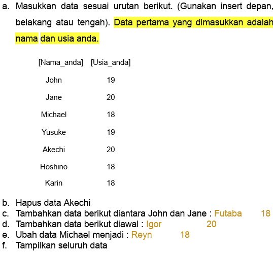
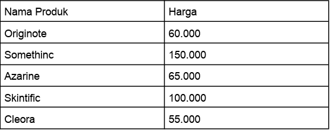

# <h1 align="center">Laporan Praktikum Modul 2 - Array</h1>
<p align="center">Sinta Sarwo - 2311102132</p>

## Dasar Teori

Linked list merupakan struktur data yang terdiri dari sekumpul node atau elemen yang saling terhubung. Setiap node memiliki dua bagian, data dan refresnsi ke node berikutnya dalam urutan. Beberapa jenis Linked List: <br/>
1. Single Linked List<br/>
Setiap node memiliki refrensi ke node berikutnya saja. Akhir dari list ini ditandai dengan node yang refrensinya adalah NULL. Single linked list biasa digunakan jika user hanya memerlukan traversal dalam satu arah.
2. Double Linked List<br/>
Pada Linked ini setiap node memiliki dua refrensi, satu ke node sebelumnya dan ke node berikutnya. Karena ini memungkinkan pergerakan dua arah dalam list. Double linked list biasa digunakan jika user memerlukan traversal dalam dua arah.
3. Circular Linked List<br/>
Circlar linked list mirip dengan single linked list, tetapi node terakhir dalam list ini mengarah kembali ke node pertama (head), membentuk lingkaran. Linked list ini biasa digunakan dalam sistem operasi untuk menjalankan proses secara round-robin, dimana setiap proses mendapatkan slot waktu CPU dan kemudian dipindahkan ke belakang antrian.
4. Double Circular Linked List<br/>
Double circular linked list mirip dengan double linked list, tetapi node terakhir mengarah ke node pertama dan node pertama mengarah ke node terakhir. Dapat digunakan dalam aplikasi seperti penjelajahan gambar, di mana user dapat menavigasi maju atau mundur melalui sekumpulan gambar dan setelah mencapai akhir, navigasi akan kembali ke awal.

Linked list merupakan struktur data yang lebih fleksibel dari array. Setiap jenis linked list memiliki kegunaan dan aplikasinya masing-masing tergantung pada kebutuhan dan keinginan user. 

## Guided 

### 1. Latihan Single Linked List

```C++
#include <iostream>
using namespace std;

///PROGRAM SINGLE LINKED LIST NON-CIRCULAR

//Deklarasi Struct Node
struct Node {
    int data;
    Node* next;
};

Node* head;
Node* tail;

//Inisialisasi Node
void init() {
    head = NULL;
    tail = NULL;
}

// Pengecekan
bool isEmpty() {
    if (head == NULL)
        return true;
    else
        return false;
}

//Tambah Depan
void insertDepan(int nilai) {
    //Buat Node baru
    Node* baru = new Node;
    baru->data = nilai;
    baru->next = NULL;

    if (isEmpty() == true) {
        head = tail = baru;
        tail->next = NULL;
    }
    else {
        baru->next = head;
        head = baru;
    }
}

//Tambah Belakang
void insertBelakang(int nilai) {
    //Buat Node baru
    Node* baru = new Node;
    baru->data = nilai;
    baru->next = NULL;

    if (isEmpty() == true) {
        head = tail = baru;
        tail->next = NULL;
    }
    else {
        tail->next = baru;
        tail = baru;
    }
}

//Hitung Jumlah List
int hitungList() {
    Node* hitung;
    hitung = head;
    int jumlah = 0;

    while (hitung != NULL) {
        jumlah++;
        hitung = hitung->next;
    }

    return jumlah;
}

//Tambah Tengah
void insertTengah(int data, int posisi) {
    if (posisi < 1 || posisi > hitungList()) {
        cout << "Posisi diluar jangkauan" << endl;
    }
    else if (posisi == 1) {
        cout << "Posisi bukan posisi tengah" << endl;
    }
    else {
        Node* baru, * bantu;
        baru = new Node();
        baru->data = data;

        // tranversing
        bantu = head;
        int nomor = 1;

        while (nomor < posisi - 1) {
            bantu = bantu->next;
            nomor++;
        }

        baru->next = bantu->next;
        bantu->next = baru;
    }
}

//Hapus Depan
void hapusDepan() {
    Node* hapus;

    if (isEmpty() == false) {
        if (head->next != NULL) {
            hapus = head;
            head = head->next;
            delete hapus;
        }
        else {
            head = tail = NULL;
        }
    }
    else {
        cout << "List kosong!" << endl;
    }
}

//Hapus Belakang
void hapusBelakang() {
    Node* hapus;
    Node* bantu;

    if (isEmpty() == false) {
        if (head != tail) {
            hapus = tail;
            bantu = head;

            while (bantu->next != tail) {
                bantu = bantu->next;
            }

            tail = bantu;
            tail->next = NULL;
            delete hapus;
        }
        else {
            head = tail = NULL;
        }
    }
    else {
        cout << "List kosong!" << endl;
    }
}

//Hapus Tengah
void hapusTengah(int posisi) {
    Node* hapus, * bantu, * bantu2;

    if (posisi < 1 || posisi > hitungList()) {
        cout << "Posisi di luar jangkauan" << endl;
    }
    else if (posisi == 1) {
        cout << "Posisi bukan posisi tengah" << endl;
    }
    else {
        int nomor = 1;
        bantu = head;

        while (nomor <= posisi) {
            if (nomor == posisi - 1) {
                bantu2 = bantu;
            }

            if (nomor == posisi) {
                hapus = bantu;
            }

            bantu = bantu->next;
            nomor++;
        }

        bantu2->next = bantu;
        delete hapus;
    }
}

//Ubah Depan
void ubahDepan(int data) {
    if (isEmpty() == false) {
        head->data = data;
    }
    else {
        cout << "List masih kosong!" << endl;
    }
}

//Ubah Tengah
void ubahTengah(int data, int posisi) {
    Node* bantu;

    if (isEmpty() == false) {
        if (posisi < 1 || posisi > hitungList()) {
            cout << "Posisi di luar jangkauan" << endl;
        }
        else if (posisi == 1) {
            cout << "Posisi bukan posisi tengah" << endl;
        }
        else {
            bantu = head;
            int nomor = 1;

            while (nomor < posisi) {
                bantu = bantu->next;
                nomor++;
            }

            bantu->data = data;
        }
    }
    else {
        cout << "List masih kosong!" << endl;
    }
}

//Ubah Belakang
void ubahBelakang(int data) {
    if (isEmpty() == false) {
        tail->data = data;
    }
    else {
        cout << "List masih kosong!" << endl;
    }
}

//Hapus List
void clearList() {
    Node* bantu, * hapus;
    bantu = head;

    while (bantu != NULL) {
        hapus = bantu;
        bantu = bantu->next;
        delete hapus;
    }

    head = tail = NULL;
    cout << "List berhasil terhapus!" << endl;
}

//Tampilkan List
void tampil() {
    Node* bantu;
    bantu = head;

    if (isEmpty() == false) {
        while (bantu != NULL) {
            cout << bantu->data << ends;
            bantu = bantu->next;
        }

        cout << endl;
    }
    else {
        cout << "List masih kosong!" << endl;
    }
}

int main() {
    init();
    insertDepan(3);
    tampil();
    insertBelakang(5);
    tampil();
    insertDepan(2);
    tampil();
    insertDepan(1);
    tampil();
    hapusDepan();
    tampil();
    hapusBelakang();
    tampil();
    insertTengah(7, 2);
    tampil();
    hapusTengah(2);
    tampil();
    ubahDepan(1);
    tampil();
    ubahBelakang(8);
    tampil();
    ubahTengah(11, 2);
    tampil();

    return 0;
}
```
Kode di atas digunakan untuk menjalankan single linked list non-circular. Kode di atas mengdeklarasi struct node dengan int data dan Node* next. Kode di atas juga mempunyai banyak fungsi dan mempunyai kegunaan masing-masing; <br/>

1. void init(), berfungsi untuk menginisialisasi head dan tail dari linked list pada NULL.
2. bool isEmpty(), menggunakan bool untuk memeriksa jika linked list kosong dengan memeriksa headnya NULL. Fungsi akan mengembalikan nilai true jika kosong, dan false jika tidak.
3. void insertDepan(int nilai), berfungsi untuk menambahkan data di depan.
4. void insertBelakang(int nilai), berfungsi untuk menambahkan data di belakang.
5. int hitunglist, berfungsi untuk menghitung jumlah node dalam linked list dan mengembalikan hasilnya.
6. void insertTengah(int data, int posisi), berfungsi untuk menambahkan data pada posisi yang diinginkan oleh user.
7. void hapusDepan(), berfungsi untuk menghapus data di depan.
8. void hapusBelakang(), berfungsi unutk menghapus data di belakang.
9. void hapusTengah(int posisi), berfungsi untuk menghapus data pada posisi yang diinginkan oleh user.
10. void ubahDepan(int data), berfungsi untuk mengubah data di depan.
11. void ubahBelakang(int data), berfungsi untuk mengubah data di belakang.
12. ubahTengah(int data, int posisi), berfungsi untuk mengubah data pada posisi yang diinginkan oleh user.
13. clearList(), berfungsi untuk menghapus semua data.
14. tampil(), berfungsi untuk menampilkan data.

Fungsi utama dalam kode di atas ini untuk mendemonstrasikan bagaimana menggunakan fungsi-fungsi di atas untuk memanipulasi linked list. Fungsi ini membuat linked list baru, menambahkan beberapa node ke dalamnya, dan mencetak nilai-nilai node, dan menghapus beberapa node dan mengupdate nilai node lainnya.

### 2. Latihan Double Linked List

```C++
#include <iostream>
using namespace std;

class Node {
public:
    int data;
    Node* prev;
    Node* next;
};

class DoublyLinkedList {
public:
    Node* head;
    Node* tail;

    DoublyLinkedList() {
        head = nullptr;
        tail = nullptr;
    }

    void push(int data) {
        Node* newNode = new Node;
        newNode->data = data;
        newNode->prev = nullptr;
        newNode->next = head;

        if (head != nullptr) {
            head->prev = newNode;
        }
        else {
            tail = newNode;
        }

        head = newNode;
    }

    void pop() {
        if (head == nullptr) {
            return;
        }

        Node* temp = head;
        head = head->next;

        if (head != nullptr) {
            head->prev = nullptr;
        }
        else {
            tail = nullptr;
        }

        delete temp;
    }

    bool update(int oldData, int newData) {
        Node* current = head;

        while (current != nullptr) {
            if (current->data == oldData) {
                current->data = newData;
                return true;
            }
            current = current->next;
        }

        return false;
    }

    void deleteAll() {
        Node* current = head;

        while (current != nullptr) {
            Node* temp = current;
            current = current->next;
            delete temp;
        }

        head = nullptr;
        tail = nullptr;
    }

    void display() {
        Node* current = head;

        while (current != nullptr) {
            cout << current->data << " ";
            current = current->next;
        }

        cout << endl;
    }
};

int main() {
    DoublyLinkedList list;

    while (true) {
        cout << "1. Add data" << endl;
        cout << "2. Delete data" << endl;
        cout << "3. Update data" << endl;
        cout << "4. Clear data" << endl;
        cout << "5. Display data" << endl;
        cout << "6. Exit" << endl;

        int choice;
        cout << "Enter your choice: ";
        cin >> choice;

        switch (choice) {
            case 1: {
                int data;
                cout << "Enter data to add: ";
                cin >> data;
                list.push(data);
                break;
            }
            case 2: {
                list.pop();
                break;
            }
            case 3: {
                int oldData, newData;
                cout << "Enter old data: ";
                cin >> oldData;
                cout << "Enter new data: ";
                cin >> newData;

                bool updated = list.update(oldData, newData);

                if (!updated) {
                    cout << "Data not found" << endl;
                }
                break;
            }
            case 4: {
                list.deleteAll();
                break;
            }
            case 5: {
                list.display();
                break;
            }
            case 6: {
                return 0;
            }
            default: {
                cout << "Invalid choice" << endl;
                break;
            }
        }
    }

    return 0;
}
```
Kode di atas digunakan untuk menjalankan double linked list. Kode di atas menggunakan class public node yang memiliki int data, Node* prev, dan Node* next. Di mana int data merupakan nilai yang disimpan dalam node, Node* head merupakan pointer ke node pertama dalam list dan sabliknya untuk Node* tail. Class DoublyLinkedList ini mempresentasikan linked list dan memiliki dua atribut head yaitu pointer ke node pertama dan sebaliknya untuk tail. Pada class ini juga memiliki beberapa fungsi:<br/>
1. void push(int data), berfungsi untuk menambahkan node baru ke awal list dengan nilai yang diberikan.
2. void pop(), berfungsi menghapus node pertama dari list.
3. bool update(int oldData, int newData), berfungsi mengganti nilai pertama pertama yang cocok dengan oldData dengan newData. Metode ini mengembalikan true jika berhasil dan false jika oldData tidak ditemukan dalam list.
4. deleteAll(), berfungsi unutk menghapus semua node dalam list.
5. display(), berfungsi menampilkan semua nilai dalam list.

Kode di atas mempunyai fungsi utama yang menjalankan program menu kepada user unutk melakukan operasi pada linked list, seperti menambahkan data, menghapus data, memperbarui data, menghapus semua data, menampilkan data, atau kelaur dari keluar dari program.

## Unguided 

### 1. Soal mengenai Single Linked List <br/>
Buatlah program menu Single Linked List Non-Circular untuk menyimpan Nama dan usia mahasiswa, dengan menggunakan inputan dari user. Lakukan operasi berikut:<br\>


```C++

//Sinta Sarwo - 2311102132

#include <iostream>
#include <iomanip> //library untuk memanipulasikan output untuk menjadi lebih rapi

using namespace std;

//Deklarasi Struct Node
struct Node {
    string Nama_2132; //Deklarasi string Nama_2132 untuk menyimpan nama-nama mahasiswa
    int Umur_2132; //Deklarasi int umur_2132 untuk menyimpan usia mahasiswa
    Node* next; //pointer ke node selanjutnya
};

Node* head; //Deklarasi head
Node* tail; //Deklarasi tail

//Inisialisasi Node
void init_2132() {
    head = NULL;
    tail = NULL;
}

// Pengecekan jika list kosong atau tidak
bool Empty_2132() {
    if (head == NULL)
        return true;
    else
        return false;
}

//Menambahkan data pada posisi depan
void InsertDepan_2132(string nama, int umur) {
    //Buat Node baru
    Node* baru = new Node;
    baru->Nama_2132 = nama;
    baru->Umur_2132 = umur;
    baru->next = NULL;

    if (Empty_2132() == true) {
        head = tail = baru;
        tail->next = NULL;
    }
    else {
        baru->next = head;
        head = baru;
    }
}

//Menambahkan data pada posisi belakang
void InsertBelakang_2132(string nama, int umur) {
    //Buat Node baru
    Node* baru = new Node;
    baru->Nama_2132 = nama;
    baru->Umur_2132 = umur;
    baru->next = NULL;

    if (Empty_2132() == true) {
        head = tail = baru;
        tail->next = NULL;
    }
    else {
        tail->next = baru;
        tail = baru;
    }
}

//Hitung Jumlah List unutk mempermudah fungsi void InsertTengah_2132, HapusTengah_2132, UbahTengah_2132. Posisi digunakan untuk mengetahui posisi yang mana user akan memanipulasi data pada linked list. 
int HitungList_2132() {
    Node* hitung;
    hitung = head;
    int jumlah = 0;

    while (hitung != NULL) {
        jumlah++;
        hitung = hitung->next;
    }

    return jumlah;
}

//Menambah data pada posisi yang diinginkan oleh user dengan menginput posisi tersebut
void InsertTengah_2132(string nama, int umur, int posisi) {
    if (posisi < 1 || posisi > HitungList_2132()) {
        cout << "Posisiton out of range!" << endl;
    }
    else if (posisi == 1) {
        cout << "The position is not in the middle!" << endl;
    }
    else {
        Node* baru, * bantu;
        baru = new Node();
        baru->Nama_2132 = nama;
        baru->Umur_2132 = umur;

        // tranversing
        bantu = head;
        int nomor = 1;

        while (nomor < posisi - 1) {
            bantu = bantu->next;
            nomor++;
        }

        baru->next = bantu->next;
        bantu->next = baru;
    }
}

//Menghapus data pada posisi depan
void HapusDepan_2132() {
    Node* hapus;

    if (Empty_2132() == false) {
        if (head->next != NULL) {
            hapus = head;
            head = head->next;
            delete hapus;
        }
        else {
            head = tail = NULL;
        }
    }
    else {
        cout << "Nothing there." << endl;
    }
}

//Menghapus data pada posisi belakang
void HapusBelakang_2132() {
    Node* hapus;
    Node* bantu;

    if (Empty_2132() == false) {
        if (head != tail) {
            hapus = tail;
            bantu = head;

            while (bantu->next != tail) {
                bantu = bantu->next;
            }

            tail = bantu;
            tail->next = NULL;
            delete hapus;
        }
        else {
            head = tail = NULL;
        }
    }
    else {
        cout << "Nothing there." << endl;
    }
}

//Menghapus data pada posisi yang diinginkan oleh user dengan menginput posisi tersebut
void HapusTengah_2132(int posisi) {
    Node* hapus, * bantu, * bantu2;

    if (posisi < 1 || posisi > HitungList_2132()) {
        cout << "Posisiton out of range!" << endl;
    }
    else if (posisi == 1) {
        cout << "The position is not in the middle!" << endl;
    }
    else {
        int nomor = 1;
        bantu = head;

        while (nomor <= posisi) {
            if (nomor == posisi - 1) {
                bantu2 = bantu;
            }

            if (nomor == posisi) {
                hapus = bantu;
            }

            bantu = bantu->next;
            nomor++;
        }

        bantu2->next = bantu;
        delete hapus;
    }
}

//Mengubah data pada posisi depan
void UbahDepan_2132(string nama, int umur) {
    if (Empty_2132() == false) {
        head->Nama_2132 = nama;
        head->Umur_2132 = umur;
    }
    else {
        cout << "It's the same?" << endl;
    }
}

//Mengubah data pada posisi yang diinginkan oleh user dengan menginput posisi tersebut
void UbahTengah_2132(string nama, int umur, int posisi) {
    Node* bantu;

    if (Empty_2132() == false) {
        if (posisi < 1 || posisi > HitungList_2132()) {
            cout << "Posisiton out of range!" << endl;
        }
        else if (posisi == 1) {
            cout << "The position is not in the middle!" << endl;
        }
        else {
            bantu = head;
            int nomor = 1;

            while (nomor < posisi) {
                bantu = bantu->next;
                nomor++;
            }

            bantu->Nama_2132 = nama;
            bantu->Umur_2132 = umur;
        }
    }
    else {
        cout << "Nothing there." << endl;
    }
}

//Mengubah data pada posisi belakang
void UbahBelakang_2132(string nama, int umur) {
    if (Empty_2132() == false) {
        tail->Nama_2132 = nama;
        tail->Umur_2132 = umur;
    }
    else {
        cout << "Nothing there." << endl;
    }
}

//Menghapus semua data pada List
void HapusList_2132() {
    Node* bantu, * hapus;
    bantu = head;

    while (bantu != NULL) {
        hapus = bantu;
        bantu = bantu->next;
        delete hapus;
    }

    head = tail = NULL;
    cout << "Nice, the list have been deleted." << endl;
}

//Tampilkan List
void Tampil_2132() {
    Node* bantu;
    bantu = head;

    cout << left << setw(15) << " Nama " << right << setw(4) << " Usia " << endl; // Memanipulasi output untuk lebih rapi

    if (Empty_2132() == false) {
        while (bantu != NULL) {
            cout << left << setw(15) << bantu->Nama_2132 << right << setw(4) << bantu->Umur_2132 << endl; // Memanipulasi output untuk menjadi lurus
            bantu = bantu->next;
        }

        cout << endl;
    }
    else {
        cout << "Nothing there." << endl;
    }
}

int main() {
    init_2132(); // Inisialisasi Linked List
    int Pilihan_2132; //Deklarasi Pilihan untuk menjadi inputan dalam switch-case

    cout << "\n 2132   Program penyimpanan nama dan usia Mahasiswa   2132 \n" << endl; // Data sebelum dimanipulasi oleh user
    InsertDepan_2132("Karin", 18);
    InsertDepan_2132("Hoshino", 18);
    InsertDepan_2132("Akechi", 20); 
    InsertDepan_2132("Yusuke", 19);
    InsertDepan_2132("Michael", 18);
    InsertDepan_2132("Jane", 20);
    InsertDepan_2132("John", 19);
    InsertDepan_2132("Sinta", 16);
    Tampil_2132 (); //Data list akan di tampilkan saat program di run

        while (true)
    {
        cout << " 2132   Menu Data Mahasiswa   2132 \n" << endl; //Menu untuk memberi user pilihan ingin menggunakan fungsi-fungsi di dalam program
        cout << "1. Menambah Data di Depan" << endl;
        cout << "2. Menambah Data di Belakang" << endl;
        cout << "3. Menambah Data di Tengah" << endl;
        cout << "4. Hapus Data di Depan" << endl;
        cout << "5. Hapus Data di Belakang" << endl;
        cout << "6. Hapus Data di Tengah" << endl;
        cout << "7. Ubah Data di Tengah" << endl;
        cout << "8. Hapus Semua Data" << endl;
        cout << "9. Tampilkan Data" << endl;
        cout << "10. Exit" << endl;
        cout << endl;
        cout << "Masukkan pilihan: ";
        cin >> Pilihan_2132; //User akan memasukan nomor untuk menggunakan program
        cout << endl;

        switch (Pilihan_2132)
        {
        case 1:
        {
            string nama_2132;
            int umur_2132;

            cout << " 2132   Menambahkan Data Mahasiswa Pada Posisi Depan   2132 \n" << endl;
            cout << "Masukkan nama: ";
            cin >> nama_2132; //Memasukan data nama mahasiswa yang ingin ditambahkan
            cout << "Masukkan umur: ";
            cin >> umur_2132; //Memasukan data umur mahasiswa yang ingin ditambahkan
            InsertDepan_2132(nama_2132, umur_2132); //Memanggil fungsi InsertDepan_2132
            cout << "Data berhasil ditambahkan" << endl;
            cout << endl;
            break;
        }
        case 2:
        {
            string nama_2132;
            int umur_2132;

            cout << " 2132   Menambahkan Data Mahasiswa Pada Posisi Belakang   2132 \n" << endl;
            cout << "Masukkan nama: ";
            cin >> nama_2132; //Memasukan data nama mahasiswa yang ingin ditambahkan
            cout << "Masukkan umur: ";
            cin >> umur_2132; //Memasukan data umur mahasiswa yang ingin ditambahkan
            InsertBelakang_2132(nama_2132, umur_2132); //Memanggil funsgi InsertBelakang_2132
            cout << "Data berhasil ditambahkan" << endl;
            cout << endl;
            break;
        }
        case 3:
        {
            string nama_2132;
            int umur_2132, posisi;

            cout << " 2132   Menambahkan Data Mahasiswa Pada Posisi Tengah   2132 \n" << endl;
            cout << "Masukkan nama: ";
            cin >> nama_2132; //Memasukan data nama mahasiswa yang ingin ditambahkan
            cout << "Masukkan umur: ";
            cin >> umur_2132; //Memasukan data umur mahasiswa yang ingin ditambahkan
            cout << "Masukkan posisi: ";
            cin >> posisi; //Memasukan posisi data yang ingin ditambahkan dengan data mahasiswa baru
            InsertTengah_2132(nama_2132, umur_2132, posisi); //Memanggil fungsi InsertTengah_2132
            cout << "Data berhasil ditambahkan" << endl;
            cout << endl;
            break;
        }
        case 4:
        {
            HapusDepan_2132(); //Memanggil fungsi HapusDepan_2132
            cout << "Data berhasil dihapus" << endl;
            cout << endl;
            break;
        }
        case 5:
        {
            HapusBelakang_2132(); //Memanggil fungsi HapusBelakang_2132
            cout << "Data berhasil dihapus" << endl;
            cout << endl;
            break;
        }
        case 6:
        {
            int posisi;

            cout << "Masukkan posisi: ";
            cin >> posisi; //Memasukan posisi data yang ingin dihapus
            HapusTengah_2132(posisi); //Memanggil fungsi HapusTengah_2132
            cout << "Data berhasil dihapus" << endl;
            cout << endl;
            break;
        }
        case 7:
        {
            string nama_2132;
            int umur_2132, posisi;

            cout << "Masukkan nama: ";
            cin >> nama_2132; //Memasukan data nama mahasiswa yang baru
            cout << "Masukkan umur: ";
            cin >> umur_2132; //Memasukan data umur mahasiswa yang baru
            cout << "Masukkan posisi: ";
            cin >> posisi; //Memasukan posisi data mahasiswa yang ingin diubah
            UbahTengah_2132(nama_2132, umur_2132, posisi); //Memanggil fungsi UbahTengah_2132
            cout << "Data berhasil diubah" << endl;
            cout << endl;
            break;
        }
        case 8:
        {
            HapusList_2132(); //Memanggil fungsis HapusList_2132
            break;
        }
        case 9:
        {
            Tampil_2132(); //Memanggil fungsi Tampil_2132
            break;
        }
        case 10:
        {
            return 0; //User akan keluar dari program jika memilih 10
        }
        default:
        {
            cout << "Command Invalid!" << endl; //Jika user tidak memasukan pilihan yang tidak ada pada menu maka output akan keluar dan program akan mengulang
            break;
        }
        }
    }

    return 0;
}
```
#### Output:


Kode di atas menggunakan single linked list non-circular untuk menyimpan data nama dan usia mahasiswa. Program menginisialisasi list dan menyediakan menu untuk user memanipulasi list tersebut. User dapat memilih untuk menambah, menghapus, atau mengubah data dalam list, dan dapat menampilkan list dan keluar dari program.

Dari soal yang diberi pada modul 3 kita bisa lihat pada output poin (a) menginsert data-data seperti di poin (a) dan data pertama yang dimasukan adalah nama dan usia praktika dengan InsertDepan_2132 dan di tampilkan dalam program saat dirun. Poin (b) dilakukan dengan menggunakan case 6. Poin (c) dilakukan menggunakan case 3. Poin (d) dilakukan menggunakan case 1. Poin (e) dilakukan menggunakan case 7 dan poin (f) dilakukan menggunakan case 9.

### 2. Soal mengenai Double Linked List <br/>
Modifikasi Guided Double Linked List dilakukan dengan penambahan operasi untuk menambah data, menghapus, dan update di tengah / di urutan tertentu yang diminta. Selain itu, buatlah agar tampilannya menampilkan Nama produk dan harga.


Case: <br/>
1. Tambahkan produk Azarine dengan harga 65000 diantara Somethinc dan Skintific
2. Hapus produk wardah
3. Update produk Hanasui menjadi Cleora dengan harga 55.000
4. Tampilkan menu seperti dibawah ini <br/>
Toko Skincare Purwokerto<br/>
 1. Tambah Data
 2. Hapus Data
 3. Update Data
 4. Tambah Data Urutan Tertentu
 5. Hapus Data Urutan Tertentu
 6. Hapus Seluruh Data
 7. Tampilkan Data
 8. Exit <br/>
 Pada menu 7, tampilan akhirnya akan menjadi seperti dibawah ini :



```C++

// Sinta Sarwo - 2311102132

#include <iostream>
#include <iomanip>

using namespace std;

// Deklarasi class Node
class Node {
public:
    string Produk_2132; //Deklarasi produk
    int Harga_2132; // Deklarasi harga
    Node* prev; // Pointer ke node sebelumnya
    Node* next; // Pointer ke node selanjutnya
};

// Deklarasi class DoublyLinkedList
class DoublyLinkedList {
public:
    Node* head; // Deklarasi head
    Node* tail; // Deklarasi tail

    // pembuatan double linked list 
    DoublyLinkedList() {
        head = nullptr; // Inisialisasi head
        tail = nullptr; // Inisialisasi tail
    }

    // Menambahkan data
    void Push_2132(string produk, int harga) {
        Node* newNode = new Node;
        newNode->Produk_2132 = produk;
        newNode->Harga_2132 = harga;
        newNode->prev = nullptr;
        newNode->next = head;
        if (head != nullptr) {
            head->prev = newNode;
        }
        else {
            tail = newNode;
        }
        head = newNode;
    }
    
    // Menambahkan data pada posisi tertentu
    void PushPosisi_2132(string produk, int harga, int posisi) {
    Node* newNode = new Node;
    newNode->Produk_2132 = produk;
    newNode->Harga_2132 = harga;

    // Pengecekan posisi, jika posisi kurang sama dengan 0 maka newNode akan dihapus dan akan menampilkan Position Invalid!
    if (posisi <= 0) {  
        cout << "Position Invalid!" << endl;
        delete newNode;
        return;
    }

    // Pengecekan posisi, jika posisi sama dengan 1 maka akan menambah pada posisi depan (head)
    if (posisi == 1) {  
        newNode->prev = nullptr;
        newNode->next = head;
        if (head != nullptr) {
            head->prev = newNode;
        } else {
            tail = newNode;
        }
        head = newNode;
        return;
    }

    Node* current = head;
    int currentPosition = 1;  // Inisialisasi posisi saat ini
    while (currentPosition < posisi - 1 && current != nullptr) {
        current = current->next;
        currentPosition++;
    }

    // Pengecekan posisi, jika posisi yang diminta melebihi panjang daftar maka posisi tidak valid
    if (current == nullptr) { 
        cout << "Position Invalid!" << endl;
        delete newNode;
        return;
    }

    newNode->prev = current;
    newNode->next = current->next;
    if (current->next != nullptr) {
        current->next->prev = newNode;
    } else {
        tail = newNode;
    }
    current->next = newNode;
}
 
    // Menghapus data
    void Pop_2132() {
        if (head == nullptr) {
            return;
        }
        Node* temp = head;
        head = head->next;
        if (head != nullptr) {
            head->prev = nullptr;
        }
        else {
            tail = nullptr;
        }
        delete temp;
    }

    // Menghapus data pada posisi tertentu
   void PopPosisi_2132(int posisi) {
    // Pengecekan posisi, kurang atau sama dengan 0 maka tidak valid
    if (posisi <= 0 || head == nullptr) {
        cout << "Position Invalid / No Data" << endl;
        return;
    }

    Node* current = head;
    int currentPosition = 1; // Inisialisasi posisi saat ini
    while (currentPosition < posisi && current != nullptr) {
        current = current->next;
        currentPosition++;
    }

    // Pengecekan posisi, jika posisi yang diminta melebihi panjang daftar maka posisi tidak valid
    if (current == nullptr) {
        cout << "Position Invalid!" << endl;
        return;
    }

    if (current->prev != nullptr) {
        current->prev->next = current->next;
    } else {
        head = current->next;
    }

    if (current->next != nullptr) {
        current->next->prev = current->prev;
    } else {
        tail = current->prev;
    }

    delete current;
}

    // Mengupdate data
    bool Update_2132(string oldProduk, string newProduk, int newHarga) {
        Node* current = head;
        while (current != nullptr) {
            if (current->Produk_2132 == oldProduk) {
                current->Produk_2132 = newProduk;\
                current->Harga_2132 = newHarga;
                return true;
            }
            current = current->next;
        }
        return false;
    }

    // Menghapus semua data
    void DeleteAll_2132() {
        Node* current = head;
        while (current != nullptr) {
            Node* temp = current;
            current = current->next;
            delete temp;
        }
        head = nullptr;
        tail = nullptr;
    }

    //  Menampilkan data
    void Display_2132() {
        Node* current = head;
        cout << left << setw(20) << "Produk" << right <<setw(20) << "Harga" << endl; // Memanipulasi output untuk lebih rapi
        while (current != nullptr) {
            cout << left << setw(20) << current->Produk_2132 << right << setw(20) << current->Harga_2132<< endl; // Memanipulasi output untuk menjadi lurus
            current = current->next;
        }
        cout << endl;
    }
};

int main() {
    
    int Pilih_2132; //Deklarasi untuk switch-case
    DoublyLinkedList list; //Deklarasi double linked list

    cout << " 2132   Daftar Produk Skincare  2132 " << endl; // Data sebelum dimanipulasi oleh user
    list.Push_2132("Hanasui", 30000);
    list.Push_2132("Wardah", 50000);
    list.Push_2132("Skintific", 100000);
    list.Push_2132("Somethinc", 150000);
    list.Push_2132("Originote", 60000);
    list.Display_2132(); //Data list akan di tampilkan saat program di run

    while (true) {
        cout << " 2132   Toko Skincare Purwokerto   2132 " << endl; //Menu untuk memberi user pilihan ingin menggunakan fungsi-fungsi di dalam program
        cout << "1. Insert Produk" << endl;
        cout << "2. Delete Produk" << endl;
        cout << "3. Update Produk" << endl;
        cout << "4. Tambah Data Urutan Tertentu" << endl;
        cout << "5. Hapus Data Urutan Tertentu" << endl;
        cout << "6. Hapus Seluruh Data" << endl;
        cout << "7. Tampilkan Produk Data" << endl;
        cout << "8. Exit" << endl;
        cout << endl;
        cout << "Input your choice: "; //User akan memasukan nomor untuk menggunakan program
        cin >> Pilih_2132;
        cout << endl;

        switch (Pilih_2132) {
            case 1: {
                string produk_2132;
                int harga_2132;

                cout << " 2132   Add New Skincare Product   2132 \n";
                cout << "Masukan produk skincare baru: ";
                cin >> produk_2132; //Memasukan data nama produk skincare yang ingin ditambahkan
                cout << "Masukan harga produk skincare baru: ";
                cin >> harga_2132; //Memasukan data harga skincare yang ingin ditambahkan
                list.Push_2132(produk_2132, harga_2132); //Memanggil fungsi Push_2132 dengan list
                cout << "Produk has been added!, good job =D" << endl;
                cout << endl;
                break;
            }
            case 2: {
                list.Pop_2132(); 
                cout << "Produk paling atas telah dihapus!" << endl;
                cout << endl;
                break;
            }
            case 3: {
                string OldProduk_2132, NewProduk_2132;
                int NewHarga_2132;

                cout << " 2132   Updating Skincare Product   2132 \n";
                cout << "Masukan nama produk baru: ";
                cin >> NewProduk_2132; //Memasukan data nama produk skincare yang baru
                cout << "Masukan harga baru: ";
                cin >> NewHarga_2132; //Memasukan data harga produk skincare yang baru
                cout << "Masukan nama produk yang ingin di update: ";
                cin >> OldProduk_2132; //Memasukan data nama produk skincare yang ingin diupdate/ubah
                bool updated = list.Update_2132(OldProduk_2132, NewProduk_2132, NewHarga_2132); //Memanggil fungsi Update_2132 dengan list, Jika tidak ditumakan produk lama maka akan menampilkan ouput pada baris 248
                if (!updated) {
                    cout << "Produk tidak ditemukan" << endl;  
                }
                else {
                    cout << "Produk berhasil diupdate" << endl;
                }
                break;
            }
            case 4: {
                int posisi, harga_2132;
                string produk_2132;

                cout << " 2132   Add Produk Skincare Pada Posisi Tertentu   2132 \n" << endl;
                cout << "Input produk skincare baru: ";
                cin.ignore(); // Mengabaikan karakter newline dari cin sebelumnya dan memasukan nama produk skincare yang baru
                getline(cin, produk_2132); // Menggunakan getline agar bisa membaca spasi
                cout << "Input harga: ";
                cin >> harga_2132;  //Memasukan data harga produk skincare yang baru
                cout << "Input posisi untuk produk baru: ";
                cin >> posisi; // Memasukkan posisi data yang ingin ditambahkan
                list.PushPosisi_2132(produk_2132, harga_2132, posisi); // Memanggil prosedur PushPosisi_2132 untuk menambahkan data pada posisi tersebut
                cout << "Produk berhasil ditambahkan pada posisi ke-" << posisi << "!" << endl;
                cout << endl;
                break;
            }
            case 5: {
                int posisi;

                cout << " 2132   Delete Data Produk Skincare Dengan Posisi   2132 \n" << endl;
                cout << "Input posisi to delete data: ";
                cin >> posisi; //Memasukan data posisi produk skincare yang ingin dihapus
                list.PopPosisi_2132(posisi); //Memanggil fungsi PopPosisi_2132
                cout << "Data berhasil dihapus pada posisi ke-" << posisi << "!" << endl;
                cout << endl;
                break;
            }
            case 6: {
                list.DeleteAll_2132(); // Memanggil prosedur DeleteAll_2132 untuk menghapus semua data
                cout << "All Deleted!" << endl;
                cout << endl;
                break;
            }
            case 7: {
                list.Display_2132(); //Memasukan data-data produk skincare
                cout << endl;
                break;
            }
            case 8: {
                return 0; //Program akan berhenti jika user memilih 8
            }
            default: {
                cout << "Command Invalid!!" << endl; //Jika user tidak memasukan pilihan yang tidak ada pada menu maka output akan keluar dan program akan mengulang
                break;
            }
        }
    }
    return 0;
}
```
#### Output:


Kode di atas meggunakan Double linked list untuk memodifikasi list produk skincare. Pada kode di atas user dapat menambah, menghapus, mengubah, dan menampilkan list produk skincare. User dapat menggunakan fungsi-fungsi tersebut melalu sistem menu.

Dari soal yang diberi dari modul 3 kita bisa melihat case 1 dapat dilakukan dengan menggunakan sistem menu 4 dimana user dapat mengposisikan produk azarine diantara Somethinc dan Skintific. Pada case 2 dapat dilakukan menggunakan sistem menu 5 karena ingin menghapus wardah yang berposisi pada 5 di dalam list. Pada case 3 dapat dilakukan menggunakan sistem menu 4 dimana kita mengantinkan Hanasui dengan Cleora. Pade case 4 dapat ditunjukan menggunakan switch-case untuk membuat sistem menu dalam program. Tampilan akhir sesuai dengan modul 3.

## Kesimpulan
Linked list merupakan struktur data yang lebih fleksibel dari array. Setiap jenis linked list memiliki kegunaan dan aplikasinya masing-masing tergantung pada kebutuhan dan keinginan user. <br/>
1. Single linked list, node memiliki refrensi ke node berikutnya saja dan biasa digunakan jika user hanya memerlukan traversal dalam satu arah.
2. Double linked list setiap node memiliki dua refrensi, satu ke node sebelumnya dan ke node berikutnya.
3. Circlar linked list, mirip dengan single linked list tetapi berbeda pada node terakhir dalam list ini mengarah kembali ke node pertama (head)
4. Double circular linked list, mirip dengan double linked list tetapi berbeda pada node terakhir mengarah ke node pertama dan node pertama mengarah ke node terakhir.

## Referensi
[1] K.R. Devi, "Analysis of Arraylist and Linked list", 31 Mei 2019. <br/>
[2] Muhammad Nugraha, Dasar Pemrograman Dengan C++, Materi Paling Dasar untuk Menjadi Programmer Berbagai Platform. Yogyakarta: Deepublish, 2021.
