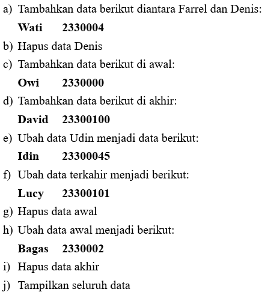
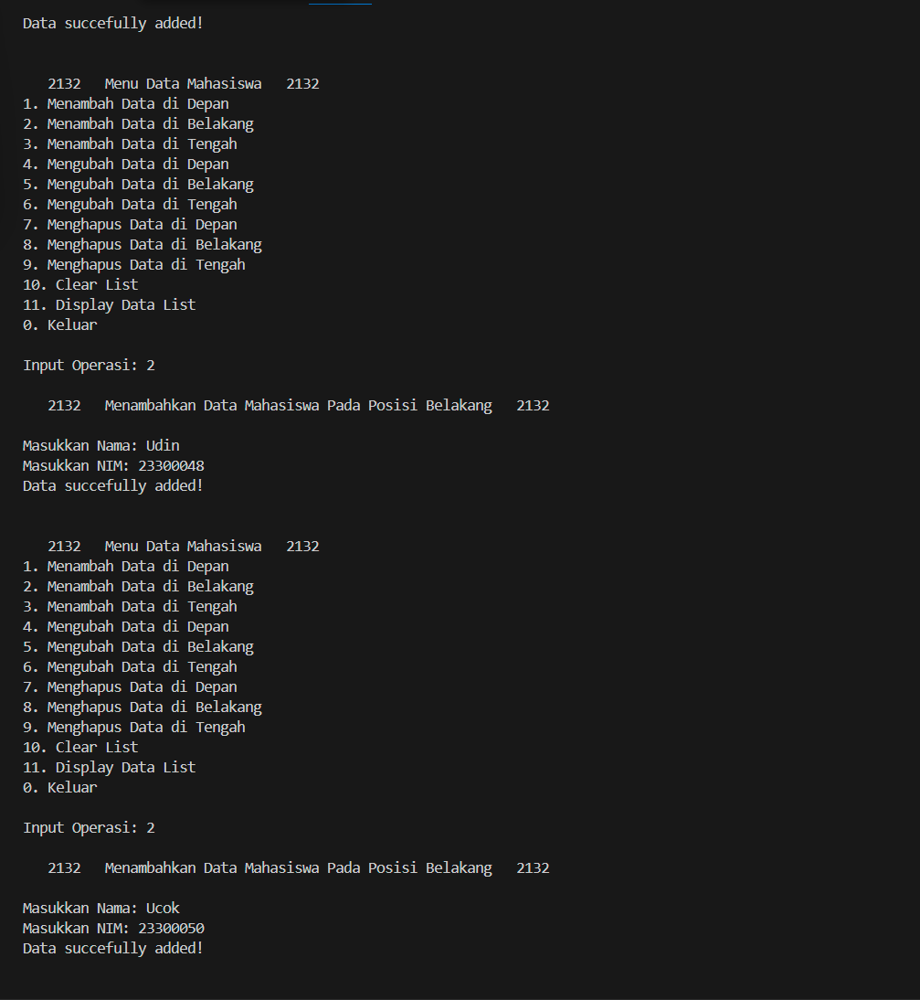

# <h1 align="center">Laporan Praktikum Modul 4 - Linked list Circular dan Non Circular</h1>
<p align="center">Sinta Sarwo - 2311102132</p>

## Dasar Teori

Linked list merupakan struktur data yang terdiri dari sekumpul node atau elemen yang saling terhubung. Setiap node memiliki dua bagian, data dan refrensi ke node berikutnya dalam urutan. Beberapa jenis Linked List: <br/>
1. Single Linked List<br/>
Setiap node memiliki refrensi ke node berikutnya saja. Akhir dari list ini ditandai dengan node yang refrensinya adalah NULL. Single linked list biasa digunakan jika user hanya memerlukan traversal dalam satu arah.
2. Double Linked List<br/>
Pada Linked ini setiap node memiliki dua refrensi, satu ke node sebelumnya dan ke node berikutnya. Karena ini memungkinkan pergerakan dua arah dalam list. Double linked list biasa digunakan jika user memerlukan traversal dalam dua arah.
3. Circular Linked List<br/>
Circlar linked list mirip dengan single linked list, tetapi node terakhir dalam list ini mengarah kembali ke node pertama (head), membentuk lingkaran. Linked list ini biasa digunakan dalam sistem operasi untuk menjalankan proses secara round-robin, dimana setiap proses mendapatkan slot waktu CPU dan kemudian dipindahkan ke belakang antrian.
4. Double Circular Linked List<br/>
Double circular linked list mirip dengan double linked list, tetapi node terakhir mengarah ke node pertama dan node pertama mengarah ke node terakhir. Dapat digunakan dalam aplikasi seperti penjelajahan gambar, di mana user dapat menavigasi maju atau mundur melalui sekumpulan gambar dan setelah mencapai akhir, navigasi akan kembali ke awal.

Linked list sering digunakan untuk data yang sering mengalami perubahan dan membutuhkan fleksibilitas dalam operasi penambahan atau penghapusan. Setiap jenis linked list memiliki kegunaan dan dapat di implementasikan masing-masing tergantung pada kebutuhan dan keinginan user. 

## Guided 

### 1. Linked List Non Circular

```C++
#include <iostream>

using namespace std;

// PROGRAM SINGLE LINKED LIST NON-CIRCULAR

// Deklarasi struct node
struct Node
{
    int data;
    Node *next;
};

Node *head; // Deklarasi head
Node *tail; // Deklarasi tail

// Inisialisasi Node
void init()
{
    head = NULL;
    tail = NULL;
}

// Pengecekkan apakah linked list kosong
bool isEmpty()
{
    if (head == NULL)
    {
        return true;
    }
    else
    {
        return false;
    }
}

    // Tambah depan
    void insertDepan(int nilai)
    {

        // buat node baru
        Node *baru = new Node();
        baru->data = nilai;
        baru->next = NULL;
        if (isEmpty() == true)
        {
            head = tail = baru;
            head->next = NULL;
        }
        else
        {
            baru->next = head;
            head = baru;
        }
    }

    // Tambah belakang
    void insertBelakang(int nilai)
    {
        // buat node baru
        Node *baru = new Node();
        baru->data = nilai;
        baru->next = NULL;
        if (isEmpty() == true)
        {
            head = tail = baru;
            head->next = NULL;
        }
        else
        {
            tail->next = baru;
            tail = baru;
        }
    }

    // Hitung jumlah list
    int hitungList()
    {
        Node *hitung;
        hitung = head;
        int jumlah = 0;
        while (hitung != NULL)
        {
            jumlah++;
            hitung = hitung->next;
        }
        return jumlah;
    }

    // Tambah tengah
    void insertTengah(int data, int posisi)
    {
        if (posisi < 1 || posisi > hitungList())
        {
            cout << "Posisi di luar jangkauan" << endl;
        }
        else if (posisi == 1)
        {
            cout << "Posisi bukan posisi tengah" << endl;
        }
        else
        {
            Node *baru, *bantu;
            baru = new Node();
            baru->data = data;

            // tranversing
            bantu = head;
            int nomor = 1;
            while (nomor < posisi - 1)
            {
                bantu = bantu->next;
                nomor++;
            }

            baru->next = bantu->next;
            bantu->next = baru;
        }
    }

    // Hapus depan
    void hapusDepan()
    {
        Node *hapus;
        if (isEmpty() == false)
        {
            if (head->next != NULL)
            {
                hapus = head;
                head = head->next;
                delete hapus;
            }
            else
            {
                head = tail = NULL;
            }
        }
        else
        {
            cout << "Linked list masih kosong" << endl;
        }
    }

    // Hapus belakang
    void hapusBelakang()
    {
        Node *hapus;
        Node *bantu;
        if (isEmpty() == false)
        {
            if (head != tail)
            {
                hapus = tail;
                bantu = head;
                while (bantu->next != tail)
                {
                    bantu = bantu->next;
                }
                tail = bantu;
                tail->next = NULL;
                delete hapus;
            }
            else
            {
                head = tail = NULL;
            }
        }
        else
        {
            cout << "Linked list masih kosong" << endl;
        }
    }
    // Hapus tengah
    void hapusTengah(int posisi)
    {
        Node *hapus, *bantu, *sebelum;
        if (posisi < 1 || posisi > hitungList())
        {
            cout << "Posisi di luar jangkauan" << endl;
        }
        else if (posisi == 1)
        {
            cout << "Posisi bukan posisi tengah" << endl;
        }
        else
        {
            int nomor = 1;
            bantu = head;
            while (nomor <= posisi)
            {
                if (nomor == posisi - 1)
                {
                    sebelum = bantu;
                }
                if (nomor == posisi)
                {
                    hapus = bantu;
                }
                bantu = bantu->next;
                nomor++;
            }
            sebelum->next = bantu;
            delete hapus;
        }
    }

    // ubah depan
    void ubahDepan(int data)
    {
        if (isEmpty() == 0)
        {
            head->data = data;
        }
        else
        {
            cout << "Linked list masih kosong" << endl;
        }
    }

    // ubah tengah
    void ubahTengah(int data, int posisi)
    {
        Node *bantu;
        if (isEmpty() == 0)
        {
            if (posisi < 1 || posisi > hitungList())
            {
                cout << "Posisi di luar jangkauan" << endl;
            }
            else if (posisi == 1)
            {
                cout << "Posisi bukan posisi tengah" << endl;
            }
            else
            {
                int nomor = 1;
                bantu = head;
                while (nomor < posisi)
                {
                    bantu = bantu->next;
                    nomor++;
                }
                bantu->data = data;
            }
        }
        else
        {
            cout << "Linked list masih kosong" << endl;
        }
    }

    // ubah belakang
    void ubahBelakang(int data)
    {
        if (isEmpty() == 0)
        {
            tail->data = data;
        }
        else
        {
            cout << "Linked list masih kosong" << endl;
        }
    }

    // Hapus list
    void clearList()
    {
        Node *bantu, *hapus;
        bantu = head;
        while (bantu != NULL)
        {
            hapus = bantu;
            bantu = bantu->next;
            delete hapus;
        }
        head = tail = NULL;
        cout << "List berhasil terhapus!" << endl;
    }

    // Tampilkan list
    void tampilList()
    {
        Node *bantu;
        bantu = head;
        if (isEmpty() == false)
        {
            while (bantu != NULL)
            {
                cout << bantu->data << " ";
                bantu = bantu->next;
            }
            cout << endl;
        }
        else
        {
            cout << "Linked list masih kosong" << endl;
        }
    }

    int main()
    {
        init();
        insertDepan(3);
        tampilList();
        insertBelakang(5);
        tampilList();
        insertDepan(2);
        tampilList();
        insertDepan(1);
        tampilList();
        hapusDepan();
        tampilList();
        hapusBelakang();
        tampilList();
        insertTengah(7, 2);
        tampilList();
        hapusTengah(2);
        tampilList();
        ubahDepan(1);
        tampilList();
        ubahBelakang(8);
        tampilList();
        ubahTengah(11, 2);
        tampilList();

        return 0;
    }
```
Kode di atas menggunakan non single linked list non-circular. Kode di atas mengdeklarasi struct node dengan int data dan Node* next pointer diatur ke NULL untuk menunjukan akhir daftar. Kode di atas juga mempunyai banyak fungsi dan mempunyai kegunaan masing-masing; <br/>

1. void init(), berfungsi untuk menginisialisasi head dan tail dari linked list pada NULL.
2. bool isEmpty(), menggunak fungsi boolean untuk memeriksa jika linked list dengan memeriksa headnya NULL. Fungsi akan mengembalikan nilai true jika kosong, dan false jika tidak.
3. void insertDepan(int nilai), berfungsi untuk menambahkan data di depan.
4. void insertBelakang(int nilai), berfungsi untuk menambahkan data di belakang.
5. int hitunglist, berfungsi untuk menghitung jumlah node dalam linked list dan mengembalikan hasilnya. Fungsi ini membantu dalam fungsi yang berhubungan dengan memanipulasi data di tengah linked list seperti, void insertTengah, void hapusTengah, ubahTengah.
6. void insertTengah(int data, int posisi), berfungsi untuk menambahkan data pada posisi yang diinginkan oleh user.
7. void hapusDepan(), berfungsi untuk menghapus data di depan.
8. void hapusBelakang(), berfungsi unutk menghapus data di belakang.
9. void hapusTengah(int posisi), berfungsi untuk menghapus data pada posisi yang diinginkan oleh user.
10. void ubahDepan(int data), berfungsi untuk mengubah data di depan.
11. void ubahBelakang(int data), berfungsi untuk mengubah data di belakang.
12. ubahTengah(int data, int posisi), berfungsi untuk mengubah data pada posisi yang diinginkan oleh user.
13. clearList(), berfungsi untuk menghapus semua data pada linked list.
14. tampil(), berfungsi untuk menampilkan data di dalam linked list.

Fungsi utama dalam kode di atas untuk menunjukan bagaimana data linked list di manipulasi dengan menggunakan fungsi-fungsi dalam kode di atas. Fungsi-fungsi tersebut dapat menambahkan, menghapus, dan mengubah data dalam linked list. Fungsi juga dapat menghapus semua data pada linked list dan menampilkan data linked list.

### 2. Linked List Circular

```C++
#include <iostream>

using namespace std;

// PROGRAM SINGLE LINKED LIST CIRCULAR

// Deklarasi struct node
struct Node
{
    string data;
    Node *next;
};

Node *head, *tail, *baru, *bantu, *hapus;

// Inisialisasi Node
void init()
{
    head = NULL;
    tail = NULL;
}

// Pengecekkan apakah linked list kosong
int isEmpty()
{
    if (head == NULL)
    {
        return 1;
    }
    else
    {
        return 0;
    }
}

// Buat node baru
void buatNode(string data)
{
    baru = new Node();
    baru->data = data;
    baru->next = baru;
}

// Hitung list
int hitungList()
{
    int jumlah = 0;
    bantu = head;
    while (bantu->next != head)
    {
        jumlah++;
        bantu = bantu->next;
    }
    return jumlah;
}

// Tambah depan
void insertDepan(string data)
{
    // Buat node baru
    buatNode(data);
    if (isEmpty() == 1)
    {
        head = baru;
        tail = head;
        baru->next = head;
    }
    else
    {
        while (tail->next != head)
        {
            tail = tail->next;
        }
        baru->next = head;
        head = baru;
        tail->next = head;
    }
}

// Tambah belakang
void insertBelakang(string data)
{
    // Buat node baru
    buatNode(data);
    if (isEmpty() == 1)
    {
        head = baru;
        tail = head;
        baru->next = head;
    }
    else
    {
        while (tail->next != head)
        {
            tail = tail->next;
        }
        tail->next = baru;
        baru->next = head;
    }
}

// Tambah tengah
void insertTengah(string data, int posisi)
{
    if (isEmpty() == 1)
    {
        head = baru;
        tail = head;
        baru->next = head;
    }
    else
    {
        baru->data = data;

        // transversing
        int nomor = 1;
        bantu = head;
        while (nomor < posisi - 1)
        {
            bantu = bantu->next;
            nomor++;
        }
        baru->next = bantu->next;
        bantu->next = baru;
    }
}

// Hapus depan
void hapusDepan()
{
    if (isEmpty() == 0)
    {
        hapus = head;
        tail = head;

        if (hapus->next == head)
        {
            head = NULL;
            tail = NULL;
            delete hapus;
        }
        else
        {
            while (tail->next != head)
            {
                tail = tail->next;
            }
            head = head->next;
            tail->next = head;
            delete hapus;
        }
    }
    else
    {
        cout << "Linked list kosong" << endl;
    }
}

// Hapus belakang
void hapusBelakang()
{
    if (isEmpty() == 0)
    {
        hapus = head;
        tail = head;

        if (hapus->next == head)
        {
            head = NULL;
            tail = NULL;
            delete hapus;
        }
        else
        {
            while (hapus->next != head)
            {
                tail = hapus;
                hapus = hapus->next;
            }
            tail->next = head;
            delete hapus;
        }
    }
    else
    {
        cout << "Linked list kosong" << endl;
    }
}

// hapus tengah
void hapusTengah(int posisi)
{
    if (isEmpty() == 0)
    {
        // transversing
        int nomor = 1;
        bantu = head;
        while (nomor < posisi - 1)
        {
            bantu = bantu->next;
            nomor++;
        }
        hapus = bantu->next;
        bantu->next = hapus->next;
        delete hapus;
    }
    else
    {
        cout << "List masih kosong!" << endl;
    }
}

// Hapus list
void hapusList()
{
    if (head != NULL)
    {
        hapus = head->next;
        while (hapus != head)
        {
            bantu = hapus->next;
            delete hapus;
            hapus = bantu;
        }
        delete head;
        head = NULL;
    }
    cout << "List berhasil terhapus!" << endl;
}

// Tampilkan list
void tampil()
{
    if (isEmpty() == 0)
    {
        tail = head;
        do
        {
            cout << tail->data << ends;
            tail = tail->next;
        } while (tail != head);
        cout << endl;
    }
    else
    {
        cout << "List masih kosong!" << endl;
    }
}

int main()
{
    init();
    insertDepan("Ayam");
    tampil();
    insertDepan("Bebek");
    tampil();
    insertBelakang("Cicak");
    tampil();
    insertBelakang("Domba");
    tampil();
    hapusBelakang();
    tampil();
    hapusDepan();
    tampil();
    insertTengah("Sapi", 2);
    tampil();
    hapusTengah(2);
    tampil();
    return 0;
}
```
Kode di atas mirip dengan kode sebelumnya guided 1, tetapi pada kode di atas menggunakan single linked list circular. struct node dideklarasi dengan string data dan Node *next, dimana node terakhir menunjuk kembali pada node pertama sehingga membentuk bentuk lingkaran. Kedua head dan tail akan melacak awal dan akhir dari linked list. Fungsi-fungsi yang ada dalam kode di atas yaitu;<br/>
1. void init(), berfungsi untuk menginisialisasi kedua head dan tail dari linked list pada NULL.
2. int isEmpty(), mempunyai fungsi yang sama pada guided 1.
3. void buatNode(string data), berfungsi membuat node baru dan meninsialisasi data fieldnya dengan data string yang diberikan.
4. int hitungList(), berfungsi untuk menghitung jumlah node dalam linked list dan mengembalikan hasilnya dan membantu operasi beberapa fungsi.
5. void insertDepan(string data), berfungsi untuk menambahkan data di depan.
6. void insertBelakang(string data), berfungsi untuk menambahkan data di belakang.
7. void insertTengah(string data, int posisi), berfungsi untuk menambahkan data pada posisi yang diinginkan oleh user.
8. void hapusDepan(), berfungsi untuk menghapus data di depan.
9. void hapusBelakang(), berfungsi untuk menghapus data di belakang.
10. void hapusTengah(int posisi), berfungsi untuk menghapus data pada posisi yang diinginkan oleh user.
11. void hapusList(), berfungsi untuk menghapus seuluruh data pada linked list.
12. void tampil(), berfungsi untuk menampilkan data di dalam linked list.

Fungsi utama dalam kode di atas untuk menunjukan penggunaan dari circular linked list dengan menambahkan, menghapus, dan memodifikasi node, dan menampilkan data tersebut.


## Unguided 

### Buatlah program menu Linked List Non Circular untuk menyimpan Nama dan NIM mahasiswa, dengan menggunakan input dari user. 

#### 1. Buatlah menu untuk menambahkan, mengubah, menghapus, dan melihat Nama dan NIM mahasiswa, berikut contoh tampilan output dari nomor 1:  <br/>
- Tampilan Menu:<br/>


- Tampilan Operasi Tambah:<br/>


- Tampilan Operasi Hapus:<br/>


- Tampilan Operasi Ubah:<br/>


- Tampilan Operasi Tampil Data:<br/>


#### 2. Setelah membuat menu tersebut, masukkan data sesuai urutan berikut, lalu tampilkan data yang telah dimasukkan. (Gunakan insert depan, belakang atau tengah)<br/>


#### 3. Lakukan perintah berikut:<br/>


```C++

// Sinta Sarwo - 2311102132

#include <iostream> // library untuk fungsi input dan ouput
#include <iomanip> // Library untuk memanipulasikan output untuk menjadi lebih rapi

using namespace std;

// Deklarasi struct node
struct Node
{
    string Name_2132; //Deklarasi string Name_2132 untuk menyimpan nama-nama mahasiswa
    long long int NIM_2132; //Deklarasi long long int NIM_2132 untuk menyimpan NIM mahasiswa, long long int digunakan karena dapat menyimpan data integer yang panjang
    Node *next; //pointer ke node selanjutnya
};

Node *head = NULL; // Deklarasi head
Node *tail = NULL; // Deklarasi tail

// Inisialisasi Node
void Initialization_2132()
{
    head = NULL;
    tail = NULL;
}

// Pengecekkan jika list kosong atau tidak
bool Empty_2132()
{
    if (head == NULL)
    {
        return true;
    }
    else
    {
        return false;
    }
}

// Menambahkan data pada posisi depan
void InsertFront_2132(string name, long long int nim)
{
    // buat node baru
    Node *newNode = new Node();
    newNode->Name_2132 = name;
    newNode->NIM_2132 = nim;
    newNode->next = NULL;
    if (Empty_2132() == true)
    {
        head = tail = newNode;
        head->next = NULL;
    }
    else
    {
        newNode->next = head;
        head = newNode;
    }
}

// Menambahkan data pada posisi belakang
void InsertBack_2132(string name, long long int nim)
{
    // buat node baru
    Node *newNode = new Node();
    newNode->Name_2132 = name;
    newNode->NIM_2132 = nim;
    newNode->next = NULL;
    if (Empty_2132() == true)
    {
        head = tail = newNode;
        head->next = NULL;
    }
    else
    {
        tail->next = newNode;
        tail = newNode;
    }
}

// Hitung jumlah list untuk mempermudah fungsi void InsertMiddle_2132, ModifyMiddle_2132, DeleteMiddle_2132. Karena void ini membantu untuk program mengetahui posisi mana yang user akan memanipulasi data pada linked list.
int hitungList_2132()
{
    Node *hitung;
    hitung = head;
    int jumlah = 0;
    while (hitung != NULL)
    {
        jumlah++;
        hitung = hitung->next;
    }
    return jumlah;
}

// Menambah data pada posisi yang diinginkan oleh user dengan menginput posisi tersebut
void InsertMiddle_2132(string name, long long int nim, int position)
{
    if (position < 1 || position > hitungList_2132())
    {
        cout << "Position out of range!" << endl;
    }
    else if (position == 1)
    {
        cout << "The position is not in the middle!" << endl;
    }
    else
    {
         Node *newNode, *bantu;
        newNode = new Node();
        newNode->Name_2132 = name;
        newNode->NIM_2132 = nim;

        // tranversing
        bantu = head;
        int number = 1;
        while (number < position - 1)
        {
            bantu = bantu->next;
            number++;
        }

        newNode->next = bantu->next;
        bantu->next = newNode;
    }
}

// Menghapus data pada posisi depan
void DeleteFront_2132()
{
    Node *hapus;
    if (Empty_2132() == false)
    {
        if (head->next != NULL)
        {
            hapus = head;
            head = head->next;
            delete hapus;
        }
        else
        {
            head = tail = NULL;
        }
    }
    else
    {
        cout << "No data in the list." << endl;
    }
}

// Menghapus data pada posisi belakang
void DeleteBack_2132()
{
    Node *hapus;
    Node *bantu;
    if (Empty_2132() == false)
    {
        if (head != tail)
        {
            hapus = tail;
            bantu = head;
            while (bantu->next != tail)
            {
                bantu = bantu->next;
            }
            tail = bantu;
            tail->next = NULL;
            delete hapus;
        }
        else
        {
            head = tail = NULL;
        }
    }
    else
    {
        cout << "No data in the list." << endl;
    }
}

// Menghapus data pada posisi yang diinginkan oleh user dengan menginput posisi tersebut
void DeleteMiddle_2132(int position)
{
    Node *hapus, *bantu, *prev;
    if (position < 1 || position > hitungList_2132())
    {
        cout << "Position out of range!" << endl;
    }
    else if (position == 1)
    {
        cout << "The position is not in the middle!" << endl;
    }
    else
    {
        int number = 1;
        bantu = head;
        while (number <= position)
        {
            if (number == position - 1)
            {
                prev = bantu;
            }
            if (number == position)
            {
                hapus = bantu;
            }
            bantu = bantu->next;
            number++;
        }
        prev->next = bantu;
        delete hapus;
    }
}

// Mengubah data pada posisi depan
void ModifyFront_2132(string name, long long int nim)
{
    if (Empty_2132() == 0)
    {
        head->Name_2132 = name;
        head->NIM_2132 = nim;

    }
    else
    {
        cout << "Linked list is empty.." << endl;
    }
}

// Mengubah data pada posisi belakang
void ModifyBack_2132(string name, long long int nim)
{
    if (Empty_2132() == 0)
    {
        tail->Name_2132 = name;
        tail->NIM_2132 = nim;
    }
    else
    {
        cout << "Linked list is empty.." << endl;
    }
}

// Mengubah data pada posisi yang diinginkan oleh user dengan menginput posisi tersebut
void ModifyMiddle_2132(string name, long long int nim, int position)
{
    Node *bantu;
    if (Empty_2132() == 0)
    {
        if (position < 1 || position > hitungList_2132())
        {
            cout << "Position out of range!" << endl;
        }
        else if (position == 1)
        {
            cout << "The position is not in the middle!" << endl;
        }
        else
        {
            int number = 1;
            bantu = head;
            while (number < position)
            {
                bantu = bantu->next;
                number++;
            }
            bantu->Name_2132 = name;
            bantu->NIM_2132 = nim;
        }
    }
    else
    {
        cout << "Linked list is empty.." << endl;
    }
}


// Menghapus semua data pada List
void ClearList_2132()
{
    Node *bantu, *hapus;
    bantu = head;
    while (bantu != NULL)
    {
        hapus = bantu;
        bantu = bantu->next;
        delete hapus;
    }
    head = tail = NULL;
    cout << "List has been successfully cleared!" << endl;
}

// Tampilkan list
void DisplayList_2132()
{
    Node* bantu;
    bantu = head;
    if (Empty_2132() == false)
        {
            cout << "============ TAMPILKAN LIST ============" << endl;
            cout << "----------------------------------------" << endl;
            cout << left << setw(20) << "| Nama" << "| NIM" << endl;
            cout << "----------------------------------------" << endl;
            while (bantu != NULL)
            {
                cout << left << setw(20) << "| " + bantu->Name_2132 << "| " << bantu->NIM_2132 << endl; // setw digunakan untuk menentukan lebar kolom
                bantu = bantu->next;
            }
            cout << "----------------------------------------" << endl;
        }
        else
        {
            cout << "====2132==== DATA MAHASISWA ====2132====" << endl;
            cout << "----------------------------------------" << endl;
            cout << left << setw(20) << "| Nama" << "| NIM" << endl;
            cout << "----------------------------------------" << endl;
            cout << left << setw(20) << "| (NULL)" << "| (NULL) " << endl;
            cout << "----------------------------------------" << endl;
        }
}

int main()
{
    Initialization_2132(); // Inisialisasi Linked List
    int Choice_2132; // Deklarai Choice_2132 untuk menjadi inputan dalam switch-case
    string name_2132; // Deklarasi name_2132 untuk variable (data nama mahasiswa) yang akan menyimpan inputan user nanti pada switch-case
    long long int nim_2132; // // Deklarasi name_2132 untuk variable (data NIM mahasiswa) yang akan menyimpan inputan user nanti pada switch-case
    int position_2132; //Deklrasi posisi untuk menyimpan posisi yang user ingin isi, ubah, atau hapus dalam linked list.

    while (true)
    {
        cout <<"\n   2132   Menu Data Mahasiswa   2132   " << endl; //Menu untuk memberi user pilihan ingin menggunakan fungsi-fungsi di dalam program
        cout <<"1. Menambah Data di Depan" <<endl;
        cout <<"2. Menambah Data di Belakang" << endl;
        cout <<"3. Menambah Data di Tengah" << endl;
        cout <<"4. Mengubah Data di Depan" << endl;
        cout <<"5. Mengubah Data di Belakang" << endl;
        cout <<"6. Mengubah Data di Tengah" << endl;
        cout <<"7. Menghapus Data di Depan" << endl;
        cout <<"8. Menghapus Data di Belakang" << endl;
        cout <<"9. Menghapus Data di Tengah"<< endl;
        cout <<"10. Clear List"<< endl;
        cout <<"11. Display Data List" << endl;
        cout <<"0. Keluar"<< endl;
        cout << endl;
        cout <<"Input Operasi: ";
        cin >> Choice_2132; // Inputan user untuk berinteraksi dengan program
        cout << endl;

    switch (Choice_2132){
    case 1:{
            cout << "   2132   Menambahkan Data Mahasiswa Pada Posisi Depan   2132   \n" << endl;
            cout << "Masukkan Nama: ";
            cin >> name_2132; //Memasukan data Nama mahasiswa yang ingin ditambahkan
            cout << "Masukkan NIM: ";
            cin >> nim_2132; //Memasukan data NIM mahasiswa yang ingin ditambahkan
            InsertFront_2132(name_2132, nim_2132); //Memanggil fungsi InsertFront_2132
            cout << "Data succefully added!" << endl;
            cout << endl;
            break;
        }
        case 2:{
            cout << "   2132   Menambahkan Data Mahasiswa Pada Posisi Belakang   2132   \n" << endl;
            cout << "Masukkan Nama: ";
            cin >> name_2132; //Memasukan data Nama mahasiswa yang ingin ditambahkan
            cout << "Masukkan NIM: ";
            cin >> nim_2132; //Memasukan data NIM mahasiswa yang ingin ditambahkan
            InsertBack_2132(name_2132, nim_2132); //Memanggil fungsi InsertBack_2132
            cout << "Data succefully added!" << endl;
            cout << endl;
            break;
        }
        case 3:{
            cout << "   2132   Menambahkan Data Mahasiswa Pada Posisi Tengah   2132   \n" << endl;
            cout << "Masukkan Nama: ";
            cin >> name_2132; //Memasukan data Nama mahasiswa yang ingin ditambahkan
            cout << "Masukkan NIM: ";
            cin >> nim_2132; //Memasukan data NIM mahasiswa yang ingin ditambahkan
            cout << "Masukkan posisi: ";
            cin >> position_2132; //Memasukan posisi data yang ingin ditambahkan dengan data nama & NIM mahasiswa baru
            InsertMiddle_2132(name_2132, nim_2132, position_2132); //Memanggil fungsi InsertMiddle_2132
            cout << "Data succefully added on "<< position_2132 <<" position !" << endl;
            cout << endl;
            break;
        }
        case 4:{
            cout << "   2132   Mengubah Data Mahasiswa Pada Posisi Depan   2132   \n" << endl;
            cout << "Masukkan Nama: ";
            cin >> name_2132; //Memasukan data Nama mahasiswa yang ingin diubah
            cout << "Masukkan NIM: ";
            cin >> nim_2132; //Memasukan data NIM mahasiswa yang ingin diubah

            string oldName_2132 = head->Name_2132; // deklarasi oldName_2132 untuk nama mahasiswa yang sebelum diubah untuk ditampilkan di output
            ModifyFront_2132(name_2132, nim_2132); //Memanggil fungsi ModifyFront_2132
            cout << "Data [" << oldName_2132 <<"] succefully modify to [" << name_2132 << "]!" << endl;
            cout << endl;
            break;
        }
        case 5:{
            cout << "   2132   Mengubah Data Mahasiswa Pada Posisi Belakang   2132   \n" << endl;
            cout << "Masukkan Nama: ";
            cin >> name_2132; //Memasukan data Nama mahasiswa yang ingin diubah
            cout << "Masukkan NIM: ";
            cin >> nim_2132; //Memasukan data NIM mahasiswa yang ingin diubah

            string oldName_2132 = tail->Name_2132; // deklarasi oldName_2132 untuk nama mahasiswa yang sebelum diubah untuk ditampilkan di output
            ModifyBack_2132(name_2132, nim_2132); //Memanggil fungsi Modifyback_2132
            cout << "Data [" << oldName_2132 <<"] succefully modify to [" << name_2132 << "]!" << endl;
            cout << endl;
            break;
        }
        case 6:
        {
            cout << "   2132   Mengubah Data Mahasiswa Pada Posisi Tengah   2132   \n" << endl;
            cout << "Masukkan nama: ";
            cin >> name_2132; //Memasukan data nama mahasiswa yang baru
            cout << "Masukkan NIM: ";
            cin >> nim_2132; //Memasukan data umur mahasiswa yang baru
            cout << "Masukkan posisi: ";
            cin >> position_2132; //Memasukan posisi data mahasiswa yang ingin diubah

            Node *bantu = head;
            for (int i = 1; i < position_2132; i++)
            {
                bantu = bantu->next;
            }
            string oldName_2132 = bantu->Name_2132; // deklarasi oldName_2132 untuk nama mahasiswa yang sebelum diubah untuk ditampilkan di output
            ModifyMiddle_2132(name_2132, nim_2132, position_2132); //Memanggil fungsi ModifyMiddle_2132
            cout << "Data [" << oldName_2132 <<"] succefully modify to [" << name_2132 << "]!" << endl;
            cout << endl;
            break;
        }
        case 7:{
            cout << "   2132   Menghapus Data Mahasiswa Pada Posisi Depan   2132   \n" << endl;
            DeleteFront_2132(); //Memanggil fungsi DeleteFront_2132
            string oldName_2132 = head->Name_2132; // deklarasi oldName_2132 untuk nama mahasiswa yang akan di hapus
            cout << "Data "<< oldName_2132 <<" succefully deleted!" << endl;
            cout << endl;
            break;
        }
        case 8:{
            cout << "   2132   Menghapus Data Mahasiswa Pada Posisi Belakang   2132   \n" << endl;
            DeleteBack_2132(); //Memanggil fungsi DeleteBack_2132
            string oldName_2132 = tail->Name_2132; // deklarasi oldName_2132 untuk nama mahasiswa yang akan di hapus
            cout << "Data " << oldName_2132 << " succefully deleted!" << endl;
            cout << endl;
            break;
        }
        case 9:
        {
            cout << "   2132   Menghapus Data Mahasiswa Pada Posisi Tengah   2132   \n" << endl;
            cout << "Masukkan posisi: ";
            cin >> position_2132; //Memasukan posisi data yang ingin dihapus

            Node *bantu = head;
            for (int i = 1; i < position_2132; i++)
            {
                bantu = bantu->next;
            }
            string oldName_2132 = bantu->Name_2132; // deklarasi oldName_2132 untuk nama mahasiswa yang akan di hapus
            DeleteMiddle_2132(position_2132); //Memanggil fungsi DeleteMiddle_2132
            cout << "Data " << oldName_2132 << " succefully deleted!" << endl;
            cout << endl;
            break;
        }
        case 10:
        {
            ClearList_2132(); //Memanggil fungsis ClearList_2132
            break;
        }
        case 11:
        {
            DisplayList_2132(); //Memanggil fungsi DisplayList_2132
            break;
        }
        case 0:
        {
            return 0; //User akan keluar dari program jika memilih 0
        }
        default:
        {
            cout << "Command Invalid!" << endl; //Jika user tidak memasukan pilihan yang tidak ada pada menu maka output akan keluar dan program akan mengulang
            break;
        }

    }

    }
   
    return 0;
}
```
#### Output:




Kode di atas menggunakan single linked list non-circular untuk menyimpan data nama dan NIM mahasiswa. Program meninisialisasi list dan menyediakan menu untuk user berinteraksi dengan program. Dalam menu user dikasih opsi untuk memilih menambah, menghapus, atau mengubah data dalam linked list, menghapus semua data, dan pilihan untuk manampilkan list dan keluar dari program.

Dari soal yang deberi pada modul 4 nomor 1 diselesaikan dengan menggunakan fungsi switch-case dan menu yang dibuat untuk menunjukan fungsi-fungsi dalam setiap case.

Jawaban dari soal ke-2 dapat dilihat pada output di atas, dengan menggunakan ke tiga fungsi untuk menambahkan data-data mahasiswa dan menyesuaikan hasil akhir yang terdapat pada modul 4, case 1, 2, dan 3. Hasil tampil data untuk soal 2:<br/>


Jawaban dari soal ke-3 juga dapat dilihat pada output di atas, dari modul 4 , nomor 3 bagian a dapat dilakukan dengan menggunakan case 3 dimana user dapat menambahkan data Wati di posisi antara Farrel dan Denis. <br/>
- Pada bagian b dapat dilakukan menggunakan case 9, user dapat menghapus data Denis dengan menginpit posisi Denis, yaitu 5.
- Pada bagian c dapat dilakukan menggunakan case 1, user dapat menambahkan data Owi di posisi depan list. 
- Pada baian d dapat dilakukan menggunakan case 2, user dapat menambahkan data David di posisi terakhir dalam list. 
- Pada bagian e dapat dilakukan menggunakan case 6, user dapat mengubah data Udin menjadi Idin dengan memasukan data mahasiswa Idin terdahulu dan memasukan posisi udin untuk mengubahnya.
- Pada bagian f dapat dilakukan menggunakan case 5, user dapat mengubah data terakhir dengan data Lucy.
- Pada bagian g dapat dilakukan menggunakan case 7, user dapat menghapus data mahasasiwa di posisi awal dalam list.
- Pada bagian h dapat dilakukan menggunakan case 4, user dapat mengubah data awal dengan data mahasiswa Bagas.
- Pada bagian i dapat dilakukan menggunakan case 8, user dapat menghapus data mahasiswa di posisi terakhir dalam list.
- Pada bagian j dapat dilakukan menggunakan case 11, user dapat menampilkan hasil dari inputan pada linked list. Hasil:<br/>


## Kesimpulan
Linked list sering digunakan untuk data yang sering mengalami perubahan dan membutuhkan fleksibilitas dalam operasi penambahan atau penghapusan. Setiap jenis linked list memiliki kegunaan dan dapat di implementasikan masing-masing tergantung pada kebutuhan dan keinginan user. <br/>
1. Single linked list, node memiliki refrensi ke node berikutnya saja dan biasa digunakan jika user hanya memerlukan traversal dalam satu arah.
2. Double linked list setiap node memiliki dua refrensi, satu ke node sebelumnya dan ke node berikutnya.
3. Circlar linked list, mirip dengan single linked list tetapi berbeda pada node terakhir dalam list ini mengarah kembali ke node pertama (head)
4. Double circular linked list, mirip dengan double linked list tetapi berbeda pada node terakhir mengarah ke node pertama dan node pertama mengarah ke node terakhir.

## Referensi
[1] K.R. Devi, "Analysis of Arraylist and Linked list", 31 Mei 2019. <br/>
[2] Muhammad Nugraha, Dasar Pemrograman Dengan C++, Materi Paling Dasar untuk Menjadi Programmer Berbagai Platform. Yogyakarta: Deepublish, 2021.
