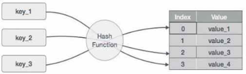
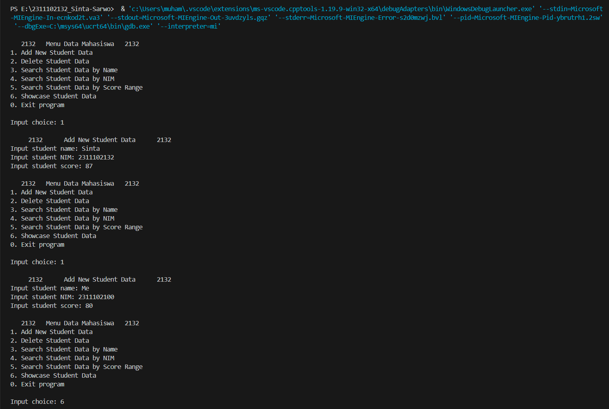
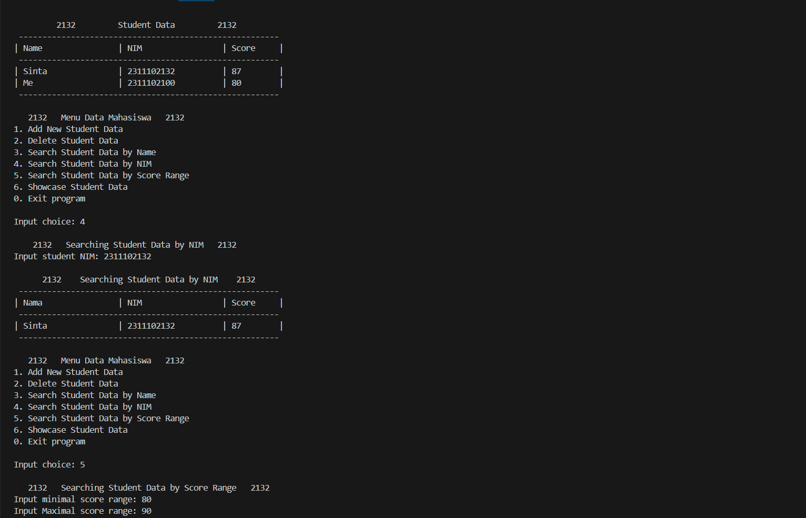
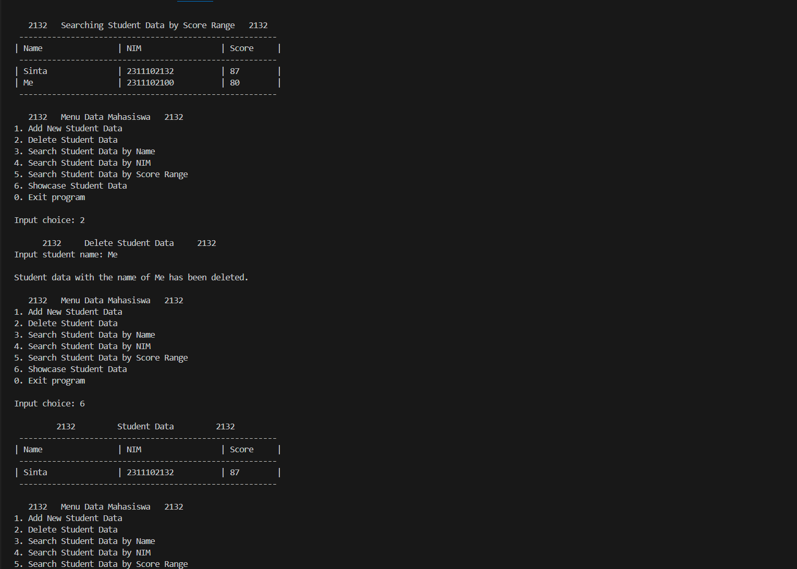
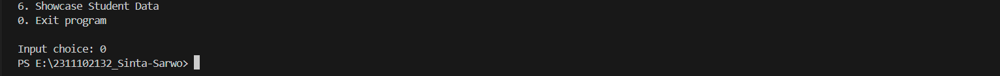
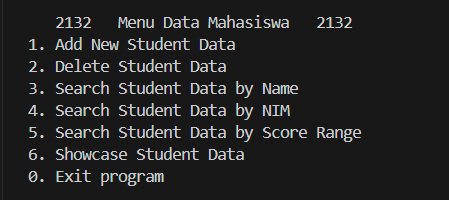

# <h1 align="center">Laporan Praktikum Modul 5 - Hash Tabel </h1>
<p align="center">Sinta Sarwo - 2311102132</p>

## Dasar Teori


## Guided 

### 1. Guided 1

Hash tabel merupakan struktur data yang digunakan untuk menyimpan dan mengambil data secara efisien menggunkan kunci-nilai. Hash tabel biasanya terdiri dari dua komponen utama: array/vektor dan fungsi hash. Data akan dipetakan ke posisi array dengan fungsi hash yang akan menghasilkan nilai dari setiap kunci.<br/>


- Fungsi Hash Tabel<br/>
Fungsi hash merupakan rumus matematika yang ketika dilakukan pada sebuah kunci maka akan menghasilkan sebuah nilai yang dapat digunakan sebagai indeks untuk kunci tersebut di dalam tabel hash. Tujuan dalam menggunakan fungsi hash agar elemen-elemen terdistribusi secara seragam. Fungsis ini akan menghasilkan sekumpul bilangan bulat yang unik dalam suaatu rentang yang sesuai untuk mengurangi jumlah tabrakan.

- Beberapa contoh kerja hash tabel:<br/>
    1. Inserton<br/>
    Memasukan data baru dalam hash tabel dengan memanggil fungsi hash untuk menentukan posisi slot yang tepat.
    2. Deletion<br/>
    Menghapus data dari hash tabel dengan menggunkan fungsi hash di mana akan menghapus kunci-nilai data tersebut.
    3. Searching<br/>
    Mencari data dalam hash tabel dengan mencari data menggunakan fungsi hash.

- Kekurangan hash tabel<br/>
    Hash tabel juga mempunyai keterbatasan yaitu "collision" atau benturan, dimana dua kunci berbeda bisa menghasilkan indekss yang sama dari fungsi hash. Ada dua metode untuk menanganinya seperti:<br/>
    1. Open hashing <br/>
    Metode open hashing atau metode chaining dapat mengatasi jumlah item data yang besar secara efektif dengan menyimpan semua item data dengan nilai indek yang sama ke dalam linked list. Setiap node pada linked list merepresentasikan satu item data. Tetapi saat linked list memiliki banyak node, proses penambahan atau pencarian item data menjadi lambat.
    2. Open Addressing <br/>
    Metode open adrressing atau metode closed hashing menghitung posisi baru menggunakan urutan probe dan catatan berikutnya disimpan pada posisi tersebut. Ada beberapa urutan probe yang popular:<br/>
    - Linear probing:<br/>
    Interval antara probe ditetapkan menjadi 1. Ini berarti bahwa posisi berikutnya yang tersedia dalam tabel akan dicoba.
    - Quadratic probing:<br/>
    Interval antara probe meningkat secara kuadratik. Ini berarti bahwa posisi berikutnya yang tersedia yang akan dicoba akan meningkat secara kuadratik.
    - Double hashing:<br/>
    Interval antara probe tetap untuk setiap record tetapi hash dihitung lagi dengan hashing ganda.

```C++
#include <iostream>

using namespace std;

const int MAX_SIZE = 10;

// Fungsi Hash Sederhana
int hash_func(int key)
{
    return key % MAX_SIZE;
}

// Struktur Data Untuk Setiap Node
struct Node
{
    int key;
    int value;
    Node *next;
    Node(int key, int value) : key(key), value(value), next(nullptr) {}
};

// Class Hash Table
class HashTable
{
private:
    Node **table;

public: 
    HashTable()
    {
        table = new Node *[MAX_SIZE]();
    }
    ~HashTable()
    {
        for (int i = 0; i < MAX_SIZE; i++)
        {
            Node *current = table[i];
            while (current != nullptr)
            {
                Node *temp = current;
                current = current->next;
                delete temp;
            }
        }
        delete[] table;
    }

    // Insertion
    void insert(int key, int value)
    {
        int index = hash_func(key);
        Node *current = table[index];
        while (current != nullptr)
        {
            if (current->key == key)
            {
                current->value = value;
                return;
            }
            current = current->next;
        }
        Node *node = new Node(key, value);
        node->next = table[index];
        table[index] = node;
    }

    // Searching
    int get(int key)
    {
        int index = hash_func(key);
        Node *current = table[index];
        while (current != nullptr)
        {
            if (current->key == key)
            {
                return current->value;
            }
                current = current->next;
        }
        return -1;
    }

    // Deletion
    void remove(int key)
    {
        int index = hash_func(key);
        Node *current = table[index];
        Node *prev = nullptr;
        while (current != nullptr)
        {
            if (current->key == key)
            {
                if (prev == nullptr)
                {
                    table[index] = current->next;
                }
                else
                {
                    prev->next = current->next;
                }
                delete current;
                return;
            }
            prev = current;
            current = current->next;
        }
    }

    // Traversal
    void traverse()
    {
        for (int i = 0; i < MAX_SIZE; i++)
        {
            Node *current = table[i];
            while (current != nullptr)
            {
                cout << current->key << " : " << current->value << endl;
                current = current->next;
            }
        }
    }
};

int main()
{
    HashTable ht;
    // Insertion
    ht.insert(1, 10);
    ht.insert(2, 20);
    ht.insert(3, 30);

    // Searching
    cout << "Get key 1: " << ht.get(1) << endl;
    cout << "Get key 4: " << ht.get(4) << endl;

    // Deletion
    ht.remove(4);

    // Traversal
    ht.traverse();

    return 0;
}
```
Kode di atas mengimplementasikan hash tabel. Kode di atas mendeklarasik const int MAX_SIZE untuk menentukan ukuran maksimal hash tabel. Fungsi hash_func diggunakan untuk memetakan kunci sebuah indeks dalam hash tabel, yang mengambil sebuah kunci bilangan bulat dan mengembalikan sisa dari kunci tersebut dibagi dengan MAX_SIZE. Kode di atas juga mengdeklarasikan stuct node dengan int key dan int value dan Node*next pointer yang merepresentasikan dalam hash tabel. Kode di atas mengdeklarasikan class HashTabel yang membuat pointer pada hash tabel yang private dan beberapa fungsi public yang dapat diakses. Fungsi-funsgi yang ada dalam class HashTabel yaitu:<br/>
1. void insert(int key, int value), berfungsi untuk menambahkan sebuah kunci dan nilai sebagai argumen dan memasukkan pasangan kunci-nilai ke dalam tabel hash. Jika kunci sudah ada dalam tabel hash, nilai akan diperbarui.
2. void get(int key), berfungsi untuk mecari data dalam hash tabel dengan kunci dan akan mengembalikan nilai tersebut. Jika kunci tidak ada maka akan mengembalikan nilai -1.
3. void remove(int key), berfungsi untuk menghapus kunci dan nilai dalam hash tabel.
4. void traverse(), berfungsi untuk mencetak semua pasangan kunci-nilai dalam hash tabel.

Fungsi utama dalam kode di atas untuk menunjukan penggunaan dari Hash Tabel dengan membuat tabel hash, menyisipkan beberapa pasangan kunci-nilai, mencari beberapa kunci, menghapus kunci, dan kemudian mencetak semua pasangan kunci-nilai dalam tabel hash.

### 2. Guided 2

```C++
#include <iostream>
#include <string>
#include <vector>

using namespace std;
const int TABLE_SIZE = 11;

string name;
string phone_number;
class HashNode
{
public:
    string name;
    string phone_number;

    HashNode(string name, string phone_number)
    {
        this->name = name;
        this->phone_number = phone_number;
    }
};

class HashMap
{
private:
    vector<HashNode*> table[TABLE_SIZE];

public:
    int hashFunc(string key)
    {
        int hash_val = 0;
        for (char c : key)
        {
            hash_val += c;
        }
        return hash_val % TABLE_SIZE;
    }

    void insert(string name, string phone_number)
    {
        int hash_val = hashFunc(name);
        for (auto node : table[hash_val])
        {
            if (node->name == name)
            {
                node->phone_number = phone_number;
                return;
            }
        }
        table[hash_val].push_back(new HashNode(name, phone_number));
    }

    void remove(string name)
    {
        int hash_val = hashFunc(name);
        for (auto it = table[hash_val].begin(); it != table[hash_val].end(); it++)
        {
            if ((*it)->name == name)
            {
                table[hash_val].erase(it);
                return;
            }
        }
    }

    string searchByName(string name)
    {
        int hash_val = hashFunc(name);
        for (auto node : table[hash_val])
        {
            if (node->name == name)
            {
                return node->phone_number;
            }
        }
        return "";
    }
    
    void print()
    {
        for (int i = 0; i < TABLE_SIZE; i++)
        {
            cout << i << ": ";
            for (auto pair : table[i])
            {
                if (pair != nullptr)
                {
                    cout << "[" << pair->name << ", " << pair->phone_number << "]";
                }
            }
        }
    }
};

int main()
{
    HashMap employee_map;
    employee_map.insert("Mistah", "1234");
    employee_map.insert("Pastah", "5678");
    employee_map.insert("Ghana", "91011");
    cout << "Nomer Hp Mistah : " << employee_map.searchByName("Mistah") << endl;
    cout << "Phone Hp Pastah : " << employee_map.searchByName("Pastah") << endl;
    employee_map.remove("Mistah");
    cout << "Nomer Hp Mistah setelah dihapus : " << employee_map.searchByName("Mistah") << endl << endl;
    cout << "Hash Table : " << endl;
    employee_map.print();

    return 0;
}
```
Kode di atas mirip dengan kode sebelumnya guided 1, tetapi pada kode di atas menggunakan vektor untuk menyimpan elemen array dinamis. Kode di atas juga mengdeklarasikan stuct node dengan string name dan string phone_number dan Node*next pointer yang merepresentasikan dalam hash tabel. Kode di atas mengdeklarasikan class HashTabel yang berisi sebuah vektor penunjuk HashNode, yang merupakan tabel hash itu sendiri, dan juga mempunyai beberapa fungsi public yang dapat diakses. Fungsi-funsgi yang ada dalam class HashTabel yaitu:<br/>
1. int hashFunc(string key), berfungsi untuk mengambil kunci string sebagai argumen dan mengembalikan nilai hash dari karakter-karakter di dalam kunci. Nilai hash digunakan untuk menentukan indeks dalam tabel hash di mana pasangan kunci-nilai harus disimpan.
2. void insert(string name, string phone_number), berfungsi untuk menambahkan sebuah kunci dan nilai sebagai argumen dan memasukkan pasangan kunci-nilai ke dalam tabel hash. Jika kunci sudah ada dalam tabel hash, nilai akan diperbarui.
3. void remove(string name), berfungsi untuk menghapus kunci dan nilai dalam hash tabel.
4. void searchByName(string name),  berfungsi untuk mecari data dalam hash tabel dengan kunci name dan akan mengembalikan nilai tersebut. Jika kunci tidak ada maka akan mengembalikan string kosong.
5. void print(), berfungsi untuk mencetak semua pasangan kunci-nilai dalam tabel hash.

Fungsi utama dalam kode di atas untuk menunjukan penggunaan dari Hash Tabel dengan membuat tabel hash, menyisipkan beberapa pasangan kunci-nilai, mencari beberapa kunci, menghapus kunci, dan kemudian mencetak semua pasangan kunci-nilai dalam tabel hash.


## Unguided 

### 1. Implementasikan hash table untuk menyimpan data mahasiswa. Setiap mahasiswa memiliki NIM dan nilai. Implementasikan fungsi untuk menambahkan data baru, menghapus data, mencari data berdasarkan NIM, dan mencari data berdasarkan nilai. Dengan ketentuan : <br/>
- Setiap mahasiswa memiliki NIM dan nilai.
- Program memiliki tampilan pilihan menu berisi poin C.
- Implementasikan fungsi untuk menambahkan data baru, menghapus data, mencari data berdasarkan NIM, dan mencari data berdasarkan rentang nilai (80 – 90).

```C++

// Sinta Sarwo - 2311102132

#include <iostream> // Library untuk fungsi input dan ouput
#include <iomanip>  // Library untuk memanipulasikan output untuk menjadi lebih rapi
#include <vector>   // Library yang menyediakan stuktur data array yang dinamis 
#include <string>   // Library untuk menyimpan dan memanipulasi data string (menggabungkan string, membandingkan string, mengekstrak substring, dan mengganti substring.)

using namespace std;

const int TableSize_2132 = 100; //Deklarasi const int TableSize_2132 untuk limit ukuran data yang dapat disimpan

// Struktur Data Untuk Setiap Node
struct Node
{
    string Name_2132;
    long long int NIM_2132;
    float Score_2132;
};

// Struktur data untuk setiap node
class HashNode
{
    // Deklarasi variabel
public:
    string Name_2132; // Deklarasi string Name_2132 untuk menyimpan nama mahasiswa
    long long int NIM_2132; // Deklarasi long long int NIM_2132 untuk menyimpan NIM mahasiswa
    int Score_2132; // Deklarasi int Score_2132 untuk menyimpan nilai mahasiswa

    HashNode(string name, long long int nim, int score)
    {
        this->Name_2132 = name;
        this->NIM_2132 = nim;
        this->Score_2132 = score;
    }
};

// Class HashMap
class HashMap
{
private:
    // Deklarasi vector table dengan ukuran TableSize_2132
    vector<HashNode *> table[TableSize_2132];

public:
    // Fungsi Hash Sederhana
    int hashFunc(string key)
    {
        int hash_val = 0;
        for (char c : key)
        {
            hash_val += c;
        }
        return hash_val % TableSize_2132;
    }

    // Menambahkan data mahasiswa
    void InsertData_2132(string name, long long int nim, int score)
    {
        int hash_val = hashFunc(name);
        for (auto node : table[hash_val])
        {
            if (node->Name_2132 == name)
            {
                node->NIM_2132 = nim;
                node->Score_2132 = score;
                cout << "Student data with the name of " << name << " have succefuly been added." << endl;
                return;
            }
        }
        table[hash_val].push_back(new HashNode(name, nim, score));
    }

    // Menghapus data mahasiswa
    void Remove_2132(string name)
    {
        int hash_val = hashFunc(name);
        for (auto it = table[hash_val].begin(); it != table[hash_val].end(); ++it)
        {
            if ((*it)->Name_2132 == name)
            {
                delete *it;
                table[hash_val].erase(it);
                cout << "Student data with the name of " << name << " has been deleted." << endl;
                return;
            }
        }
    }

    // Mencari data mahasiswa dengan nama mahasiswa
    void SearchByName_2132(string name)
    {
        bool found = false;
        for (int i = 0; i < TableSize_2132; ++i)
        {
            for (auto node : table[i])
            {
                if (node->Name_2132 == name)
                {
                    // Setw digunakan untuk menentukan lebar kolom dan merapikan output 
                    cout << "\n      2132    Searching Student Data by Name    2132    " << endl;
                    cout << " -------------------------------------------------------" << endl;
                    cout << left << "| " << setw(20) << "Nama" << "| " << setw(20) << "NIM" << "| " << setw(10) << "Score" << "|" << endl;
                    cout << " -------------------------------------------------------" << endl;
                    cout << "| " << left << setw(20) << node->Name_2132 << "| " << left << setw(20) << node->NIM_2132 << "| " << left << setw(10) << node->Score_2132 << "|" << endl;
                    cout << " -------------------------------------------------------" << endl;
                    found = true;
                    return;
                }
            }
        }
        if (!found) // Kondisi jika nama mahasiswa tidak dapat ditemukan dalam table
        {
            cout << "Student data with the name of " << name << " cannot be found." << endl;
        }
    }

    // Mecari data Mahasiswa dengan NIM mahasiswa
    void SearchByNIM_2132(long long int nim)
    {
        bool found = false;
        for (int i = 0; i < TableSize_2132; ++i)
        {
            for (auto node : table[i])
            {
                if (node->NIM_2132 == nim)
                {
                    // Setw digunakan untuk menentukan lebar kolom dan merapikan output
                    cout << "\n      2132    Searching Student Data by NIM    2132     " << endl;
                    cout << " -------------------------------------------------------" << endl;
                    cout << left << "| " << setw(20) << "Nama" << "| " << setw(20) << "NIM" << "| " << setw(10) << "Score" << "|" << endl;
                    cout << " -------------------------------------------------------" << endl;
                    cout << "| " << left << setw(20) << node->Name_2132 << "| " << left << setw(20) << node->NIM_2132 << "| " << left << setw(10) << node->Score_2132 << "|" << endl;
                    cout << " -------------------------------------------------------" << endl;
                    found = true;
                    return;
                }
            }
        }
        if (!found) // Kondisi jika NIM mahasiswa tidak dapat ditemukan dalam table
        {
            cout << "Student data with the nim of " << nim << " cannot be found." << endl;
        }
    }

    // Mencari data mahasiswa dengan rentang nilai
    void SearchByScoreRange_2132(int Min_2132, int Max_2132) // Deklrasi int Min_2132 dan int Max_2132 untuk menyimpan nilai rentang yang akan di cari dalam table
    {
        bool found = false;

        // Setw digunakan untuk menentukan lebar kolom dan merapikan output
        cout << "\n   2132   Searching Student Data by Score Range   2132   " << endl;
        cout << " -------------------------------------------------------" << endl;
        cout << left << "| " << setw(20) << "Name"<< "| " << setw(20) << "NIM" << "| " << setw(10) << "Score" << "|" << endl;
        cout << " -------------------------------------------------------" << endl;
        for (int i = 0; i < TableSize_2132; ++i)
        {
            for (auto node : table[i])
            {
                if (node->Score_2132 >= Min_2132 && node->Score_2132 <= Max_2132) // Kondisi jika data mahasiswa terdapat dalam rentang nilai yang di input
                {
                    cout << "| " << left << setw(20) << node->Name_2132<< "| " << left << setw(20) << node->NIM_2132 << "| " << left << setw(10) << node->Score_2132 << "|" << endl;
                    found = true;
                }
            }
        }
        if (!found) // Kondisi jika tidak ada data mahasiswa dengan rentang nilai yang di input oleh user
        {
            cout << "There is no Student data score with the range of " << Min_2132 << "-" << Max_2132 << "." << endl;
        }
        cout << " -------------------------------------------------------" << endl;
    }

    // Tampilkan data
    void PrintData_2132()
    {
        // Menampilkan data-data mahasiswa menggunakan setw untuk menentukan lebar kolom dan merapikan output
        cout << "\n         2132         Student Data         2132         " << endl;
        cout << " -------------------------------------------------------" << endl;
        cout << left << "| " << setw(20) << "Name" << "| " << setw(20) << "NIM" << "| " << setw(10) << "Score" << "|" << endl;
        cout << " -------------------------------------------------------" << endl;
        for (int i = 0; i < TableSize_2132; ++i)
        {
            for (auto pair : table[i])
            {
                cout << "| " << left << setw(20) << pair->Name_2132 << "| " << left << setw(20) << pair->NIM_2132  << "| " << left << setw(10) << pair->Score_2132 << "|" << endl;
            }
        }
        cout << " -------------------------------------------------------" << endl;
    }
};

int main(){
    HashMap student_map;
    int Choice_2132; // Deklarasi Choice_2132 untuk menjadi inputan dalam switch-case
    string name_2132; // Deklarasi name_2132 untuk variable (data nama mahasiswa) yang akan menyimpan inputan user nanti pada switch-case
    long long int nim_2132; // Deklarasi nim_2132 untuk variable (data nim mahasiswa) yang akan menyimpan inputan user nanti pada switch-case
    int score_2132; // Deklarasi score_2132 untuk variable (data nilai mahasiswa) yang akan menyimpan inputan user nanti pada switch-case
    int SearchScore1_2132; // Deklarasi SearchScore1_2132 untuk menyimpan nilai minimum dalam operasi SearchByScoreRange_2132
    int SearchScore2_2132; // Deklarasi SearchScore1_2132 untuk menyimpan nilai maximum dalam operasi SearchByScoreRange_2132

    while (true){
        cout <<"\n   2132   Menu Data Mahasiswa   2132   "; //Menu untuk memberi user pilihan untuk menggunakan fungsi-fungsi di dalam program
        cout <<"\n1. Add New Student Data";
        cout <<"\n2. Delete Student Data";
        cout <<"\n3. Search Student Data by Name";
        cout <<"\n4. Search Student Data by NIM";
        cout <<"\n5. Search Student Data by Score Range";
        cout <<"\n6. Showcase Student Data";
        cout <<"\n0. Exit program" << endl;
        cout <<"\nInput choice: ";
        cin >> Choice_2132; // Inputan user untuk berinteraksi dengan program

        switch (Choice_2132){
            case 1:{
                cout << "\n     2132      Add New Student Data      2132     " << endl;
                cout << "Input student name: ";
                cin >> name_2132; // Input nama mahasiswa yang ingin ditambahkan
                cout << "Input student NIM: ";
                cin >> nim_2132; // Input nim mahasiswa yang ingin ditambahkan
                cout << "Input student score: ";
                cin >> score_2132; // Input nilai mahasiswa yang ingin ditambahkan
                student_map.InsertData_2132(name_2132, nim_2132, score_2132); // Memanggil fungsi InsertData_2132
                break;
            }
            case 2:{
                cout << "\n      2132     Delete Student Data     2132      " << endl;
                cout << "Input student name: ";
                cin >> name_2132; // Input nama mahasiswa yang ingin di hapus
                cout << endl;
                student_map.Remove_2132(name_2132); // Memanggil fungsi Remove_2132
                break;
            }
            case 3:{
                cout << "\n   2132    Searching Student Data by Name    2132   " << endl;
                cout << "Input student name: ";
                cin >> name_2132; // Input nama mahasiswa yang ingin dicari
                student_map.SearchByName_2132(name_2132); // Memanggil fungsi SeachByName_2132
                break;
            }
            case 4:{
                cout << "\n    2132   Searching Student Data by NIM   2132   " << endl;
                cout << "Input student NIM: ";
                cin >> nim_2132; //Input nim mahasiswa yang ingin dicari
                student_map.SearchByNIM_2132(nim_2132); // Memanggil fungsi SeachByNIM_2132
                break;
            }
            case 5:{
                cout << "\n   2132   Searching Student Data by Score Range   2132   " << endl;
                cout << "Input minimal score range: ";
                cin >> SearchScore1_2132; // Input nilai minimum dalam rentang nilai
                cout << "Input Maximal score range: ";
                cin >> SearchScore2_2132; // Input nilai maximum dalam rentang nilai
                cout << endl;
                student_map.SearchByScoreRange_2132(SearchScore1_2132, SearchScore2_2132); // Memanggil fungsi SearchByRange_2132
                break;
            }
            case 6:{
                student_map.PrintData_2132(); // Memanggil fungsi PrintData_2132 untuk menampilkan semua data dalam hash table
                break;
            }
            case 0:{
                return 0; //User akan keluar dari program jika memilih 0
            }
            default:{
            cout << "Command Invalid!" << endl; //Jika user tidak memasukan pilihan yang tidak ada pada menu maka output akan keluar dan program akan mengulang
            break;
            }
        }
    }
    return 0;
}
```
#### Output:





Kode di atas menunjukan penggunaan dari Hash Tabel dengan membuat tabel hash, menyisipkan beberapa pasangan kunci-nilai, mencari beberapa kunci, menghapus kunci, dan kemudian mencetak semua pasangan kunci-nilai dalam tabel hash.

Dari soal yang diberi pada modul 5 nomor 1 pada poin pertama dapat dilakukan dengan mendeklarasikan long long int NIM_2132 dan int Score_2132 dalam struct node bersama string Name_2132. maka setiap data mempunyai nama, nim, dan nilai mahasiswa.


Pada poin ke-dua dan ke-tiga dapat dilakukan dengan menggunakan switch-case yang memiliki beberapa pilihan dimana user dapat berinteraksi dengan program. Fungsi untuk menambahkan data mahasiswa yang baru dapat menggunakan case 1. Fungsi untuk menghapus data dapat menggunakan case 2. Fungsi untuk mencari data berdasarkan NIM dapat menggunakan case 4 dan fungsi untuk mecari data bedasarkan rentang nilai (80-90) dapat menggunakaan case 5.

Pada case 3 dapat mencari data mahasiswa berdasarkan nama. Case 6 untuk mampilkan atau mencetak semua data pada hash tabel. Case 0 untuk keluar dari program, jika user menginput selain dari 0-6 maka program akan menampilkan "Command Invalid!" dan menggulang program.

## Kesimpulan
Hash tabel secara umum sangat efesien untuk operasi penyimpanan dan pengambilan data, tetapi hash tabel dapat menjadi kompleks jika terjadinya banyak benturan. Maka dari itu ada beberapa untuk mengatasi benturan tersebut yaitu metode chaining dan metode open addressing.

## Referensi
[1] Narasimha Karumanchi , "Data Structures And Algorithms Made Easy: Data Structures and Algorithmic Puzzles". CareerMonk Publication, 2020. <br/>
[2] Muhammad Nugraha, Dasar Pemrograman Dengan C++, Materi Paling Dasar untuk Menjadi Programmer Berbagai Platform. Yogyakarta: Deepublish, 2021.
