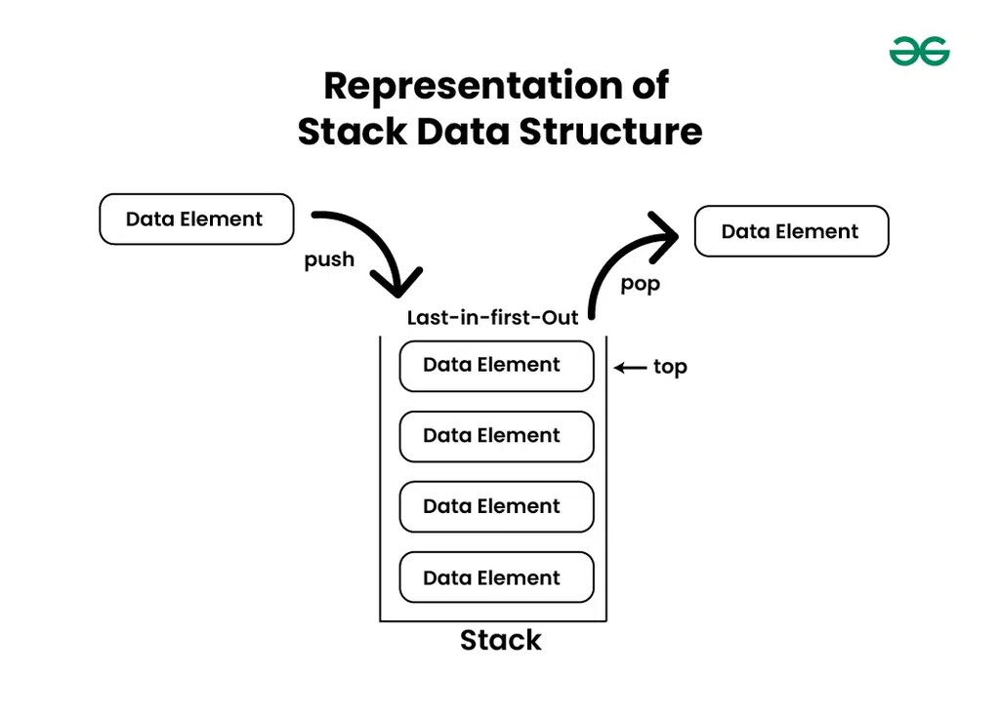
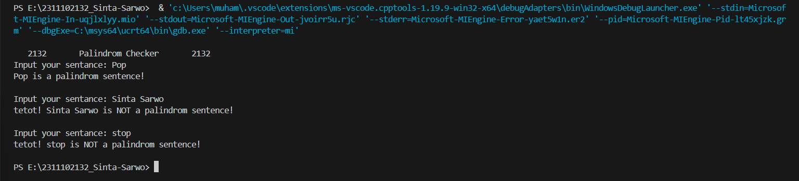
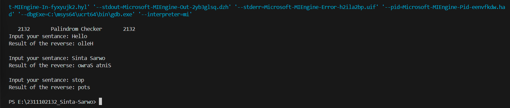

# <h1 align="center">Laporan Praktikum Modul 6 - Stack </h1>
<p align="center">Sinta Sarwo - 2311102132</p>

## Dasar Teori

Stack merupakan struktur data yang menggunakan alur prinsip "Last in, First out" (LIFO), dimana elemen terakhir yang ditambahkan ke stack akan menjadi elemen pertama yang diambil dari stack. Seperti gambar dibawah ini:<br/>

Bayangkan stack seperti tumpukan piring di dapur dimana piring terakhir yang diletakkan di tumpukan adalah piring pertama yang akan ambil.

- Konsep-Konsep dasar tentang stack: <br/>
    1. Push<br/>
    Penambahan elemen ke bagian atas stack.
    2. Deletion<br/>
    Menghapus elemen dari bagian atas stack.
    3. Top/Peek<br/>
    Melihat elemen di bagian atas stack tanpa menghapusnya.
    4. IsEmpty<br/>
    Memeriksa apakah stack kosong.
    5. Size<br/>
    Jumlah elemen dalam stack.
    6. Search<br/>
    Mencari keberadaan elemen tertentu dalam stack.

Stack sering digunakan dalam berbagai aplikasi komputasi, seperti membalikkan kata atau kalimat, memeriksa sintaks dalam kode program, dan bahkan dalam operasi sistem seperti manajemen memori dan pemanggilan fungsi.

## Guided 

### 1. Guided 

```C++
#include<iostream>
using namespace std;

string arrayBuku[5];
int maksimal=5,top=0;

bool isFull(){
    return(top == maksimal);
}

bool isEmpty(){
    return(top == 0);
}

void pushArrayBuku (string data) {
    if(isFull()){
        cout<<"Data telah penuh"<<endl;
    }else{
        arrayBuku[top]=data;
        top++;
    }
}

void popArrayBuku(){
    if(isEmpty()){
        cout<<"Tidak ada data yang dihapus"<<endl;
    }else{
        arrayBuku[top-1]="";
    top--;
    }
}

void peekArrayBuku(int posisi){
    if(isEmpty()){
        cout<<"Tidak ada data yang bisa dilihat"<<endl;
    }else{
        int index=top;
    for(int i= 1;i<=posisi;i++){
        index--;
    }
        cout << "Posisi ke " << posisi << " adalah " << arrayBuku[index] << endl;
    }
}
 
int countStack() {
    return top;
}

void changeArrayBuku(int posisi, string data) {
    if (posisi > top) {
        cout << "Posisi melebihi data yang ada" << endl;
    } else {
        int index = top;
        for (int i = 1; i <= posisi; i++) {
        index--;
    }
        arrayBuku[index] = data;
    }
}

void destroyArraybuku() {
    for (int i = top; i >= 0; i--) {
        arrayBuku[i] = " ";
    }
    top = 0;
}

void cetakArrayBuku() {
    if (isEmpty()) {
        cout << "Tidak ada data yang dicetak" << endl;
    } else {
        for (int i = top- 1; i >= 0; i--) {
            cout << arrayBuku[i] << endl;
        }
    }
}

int main() {
    pushArrayBuku("Kalkulus");
    pushArrayBuku("Struktur Data");
    pushArrayBuku("Matematika Diskrit");
    pushArrayBuku("Dasar Multimedia");
    pushArrayBuku("Inggris");
    cetakArrayBuku();
    cout << "\n";
    cout << "Apakah data stack penuh? " << isFull() << endl;
    cout << "Apakah data stack kosong? " << isEmpty() << endl;
    peekArrayBuku(2);
    popArrayBuku();
    cout << "Banyaknya data = " << countStack() << endl;
    changeArrayBuku(2,"Bahasa Jerman");
    cetakArrayBuku();
    cout << "\n";
    destroyArraybuku();
    cout << "Jumlah data setelah dihapus:" << top << endl;
    cetakArrayBuku();
    return 0;
}
```
Kode di atas merupakan implementasi dari struktur data stack menggunakan array. kode di atas mengdeklarasi array dengan data tipe string arrayBuku yang dapat menyimpan 5 data. Kode di atas juga mendeklarasikan int maksimal dan top untuk menentukan batas maksimum stack dan top digunakan untuk menunjukkan posisi teratas dari stack. Kode di atas memiliki beberapa fungsi:<br/>
1. bool isFull() & bool isEmpty():berfungsi untuk memeriksa kondisi stack kosong atau penuh.
2. void pushArrayBuku(string data): berfungsi untuk menambahkan data dalam stack, jika stack penuh maka akan menampilkan output "Data telah penuh".
3. void popArrayBuku(): berfungsi untuk menghapus data, jika tidak ada data maka akan menampilkan "Tidak ada data yang dihapus".
4. void peekArrayBuku(int posisi): berfungsi untuk melihat data pada posisi tertentu dalam stack.
5. void countStack():berfungsi untuk menghitung jumlah data dalam stack.
6. void changeArrayBuku(int posisi, string data): berfungsi untuk mengubah data pada posisi tertentu dalam stack.
7. void destroyArrayBuku(): berfungsi untuk menghapus semua data.
8. void cetakArrayBuku(): berfungsi untuk mencetak semua data.

Fungsi utama dalam kode di atas untuk menunjukan penggunaan dari stack dengan menambahkan data dalam stack, dan mencetaknya. Beberapa fungsi yang dapat di operasikan seperti memeriksa apakah tumpukan penuh atau kosong, melihat data pada posisi tertentu, menghapus data, menghitung jumlah data, mengubah data, dan menghapus semua data dalam stack.

## Unguided 

### 1. Buatlah program untuk menentukan apakah kalimat tersebut yang diinputkan dalam program stack adalah palindrom/tidak. Palindrom kalimat yang dibaca dari depan dan belakang sama. Jelaskan bagaimana cara kerja programnya. <br/>
Contoh :<br/>

Kalimat : ini
Kalimat tersebut adalah polindrom

Kalimat : telkom
Kalimat tersebut adalah bukan polidrom

```C++

// Sinta Sarwo - 2311102132

#include <iostream> // Library untuk fungsi input dan ouput
#include <stack>    // Library untuk menggunakan struktur data stack

using namespace std;

bool PalindromChecker_2132(string sentence_2132){ //Operasi untuk memerikasa jika kalimat adalah palindrom atau tidak
    for (int i = 0; i < sentence_2132.length(); i++){ // Mengkonversi kalimat ke huruf kecil
        sentence_2132[i] = tolower(sentence_2132[i]);
    }

    stack<char> s; // Membuat stack untuk menyimpan karakter kalimat

    for (int i = 0; i < sentence_2132.length(); i++){ // Masukkan karakter kalimat ke dalam stack
        s.push(sentence_2132[i]);
    }

    for (int i = 0; i < sentence_2132.length() / 2; i++){ // Operasi untuk membandingkan karakter dari depan dan belakang kalimat
        if (sentence_2132[i] != s.top()){
            return false;
        }
        s.pop();
    }

    return true;
}

int main(){

    string sentence_2132; // mendeklarasi string sentence_2132 untuk inputan yang user akan masukkan
    cout <<"\n   2132       Palindrom Checker       2132   " << endl;

    do
    {
        cout <<"Input your sentance: ";
        getline(cin, sentence_2132); // getline dapat membaca seluruh baris maka jika ada kalimat yang menggunakan kalimat tetap terbaca, dan Inputan kalimat yang ingin dicheck

        if(PalindromChecker_2132(sentence_2132)){// Memanggil fungsi PalindromChecker_2132
            cout << sentence_2132 << " is a palindrom sentence!"<< endl; //jika kalimat tersebut palindrom maka program akan menampilkan baris ini
            cout << endl;
        }else{
            cout << "tetot! " <<sentence_2132 << " is NOT a palindrom sentence!"<< endl; // jika tidak maka menampilkan baris ini
            cout << endl;
        }
    } while(sentence_2132 != "stop"); //Program akan berhenti jika user menginput stop dalam inputan sentence_2132
    return 0;
}
```
#### Output:


Kode di atas merupakan implementasi dari struktur data stack untuk menentukan kalimat yang diinputkan merupakn palindrom/tidak. Pada program terdapat fungsi bool PalindromChecker_2132 yang berkerja dengan beberapa tahap dibawah:<br/>
1. Fungsi pertama dimana karakter dalam kalimat tersebut akan diubah menjadi huruf kecil.
2. Lalu, setiap karakter dalam kalimat tersebut dimasukkan dalam stack.
3. Selanjutnya, fungsis akan membandingkan setiap karakter dari depan kalimat dengan karakter teratas dari stack. Jika terdapat karakter yang tidak sama, maka fungsi akan mengembalikan false, dimana kalimat tersebut bukan palindrom.
4. Jika semua karakter cocok, maka fungsi akan mengembalikan true, dimana kalimat tersebut merupakan palindrom.

Program ini akan terus terulang sampai inputan yang dimasukan user adalah "stop" maka program akan berhenti.

### 2. Buatlah program untuk melakukan pembalikan terhadap kalimat menggunakan stack dengan minimal 3 kata. Jelaskan output program dan source codenya beserta operasi/fungsi yang dibuat? <br/>
Contoh: <br/>

Kalimat: Telkom Purwokerto
Hasil: otrekowruP mokleT

```C++

// Sinta Sarwo - 2311102132

#include <iostream> // Library untuk fungsi input dan ouput
#include <stack>    // Library untuk menggunakan struktur data stack
#include <string>   // Library untuk operasi pada string

using namespace std;

string reverseSentence_2132(string sentence_2132) {
    stack<char> s; // Membuat stack untuk menyimpan karakter kalimat
    string reversed_2132; //Mendeklarasi reversed_2132 untuk menmampung hasil reverse

    if (sentence_2132.length() < 3) { //Kondisi untuk mengeoperasikan fungsi reverseSentence_2132
        return "Sentence must contain at least 3 characters!";
    }

    // Memasukkan setiap karakter dari kalimat ke dalam stack
    for (char c : sentence_2132) {
        s.push(c);
    }

    // Mengambil karakter dari stack dan menambahkannya ke string reversed_2132
    while (!s.empty()) {
        reversed_2132 += s.top();
        s.pop();
    }

    return reversed_2132;
}

int main() {
    string sentence_2132; // mendeklarasi string sentence_2132 untuk inputan yang user akan masukkan
    cout <<"\n   2132       Palindrom Checker       2132   " << endl;

    do{
        cout <<"Input your sentance: ";
        getline(cin, sentence_2132); // getline dapat membaca seluruh baris maka jika ada kalimat yang menggunakan kalimat tetap terbaca, dan Inputan kalimat yang ingin direverse

        string reversed_2132 = reverseSentence_2132(sentence_2132); //Mendeklarasi reversed_2132 untuk menmampung hasil reverse, dan memanggil fungsi reverseSentence_2132 untuk membalikan kalimat
        cout << "Result of the reverse: " << reversed_2132 << endl;
        cout << endl;

    }while (sentence_2132 != "stop"); //Program akan berhenti jika user menginput stop dalam inputan sentence_2132

    return 0;
}
```
#### Output:


Kode di atas merupakan implementasi dari struktur data stack untuk membalikan kalimat dengan minimal 3 kata. Pada program terdapat fungsi reverseSentence_2132 yang berkerja dengan beberapa tahap:
1. Fungsi ini akan memeriksa kalimat yang diinput memiliki 3 karakter minimal, jika tidak maka fungsi akan mengembalikan "Sentence must contain at least 3 characters!”
2. Lalu, fungsi akan memasukkan setiap karakter dalam kalimat ke stack.
3. Selanjutnya, fungsi akan mengambil dari stack (yang akan dalam urutan terbalik) dan menambahkannya ke string reversed_2132.

Program ini akan terus terulang sampai inputan yang dimasukan user adalah "stop" maka program akan berhenti.

## Kesimpulan
Stack merupakan struktur data yang menggunakan alur prinsip "Last in, First out" (LIFO), dan Stack sering digunakan dalam berbagai aplikasi komputasi, seperti membalikkan kata atau kalimat, memeriksa sintaks dalam kode program, dan bahkan dalam operasi sistem seperti manajemen memori dan pemanggilan fungsi.

## Referensi
[1] Narasimha Karumanchi , "Data Structures And Algorithms Made Easy: Data Structures and Algorithmic Puzzles". CareerMonk Publication, 2020. <br/>
[2] Muhammad Nugraha, Dasar Pemrograman Dengan C++, Materi Paling Dasar untuk Menjadi Programmer Berbagai Platform. Yogyakarta: Deepublish, 2021.
