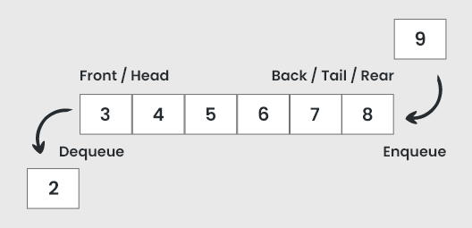
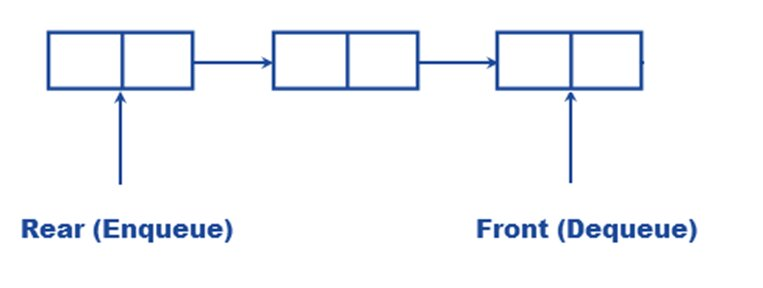
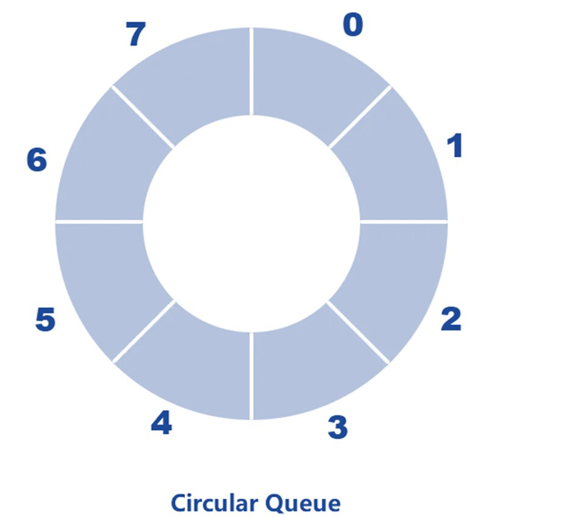
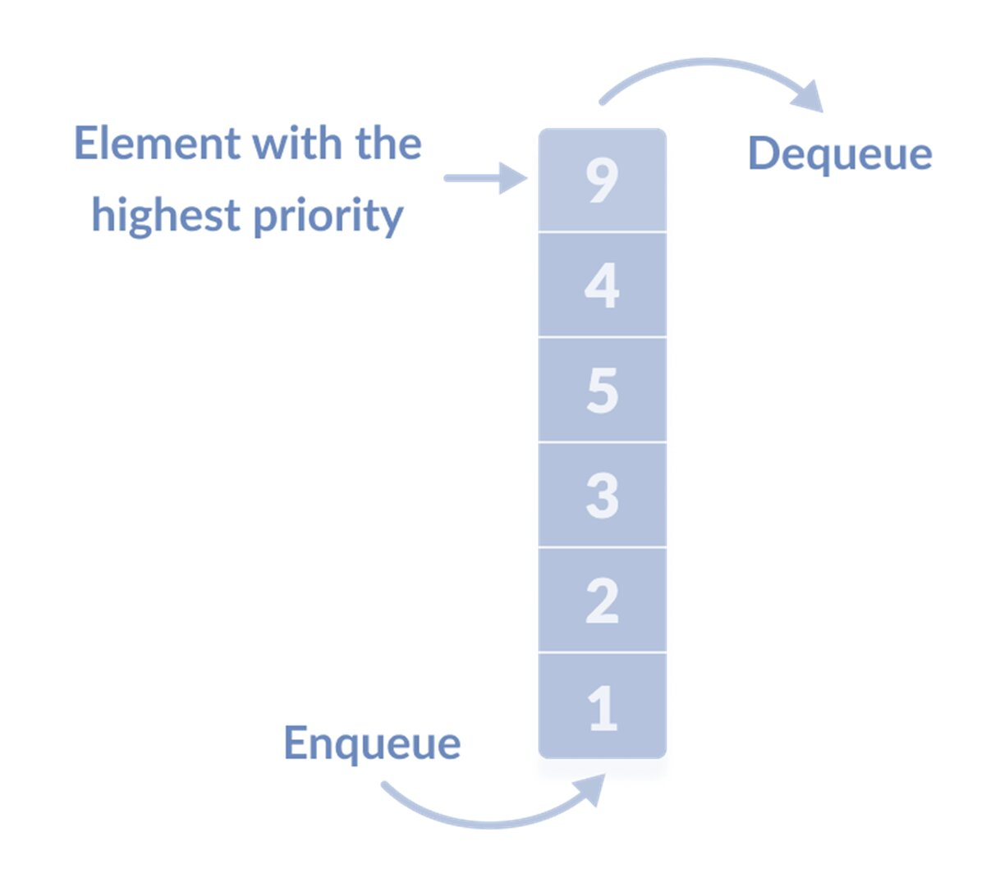
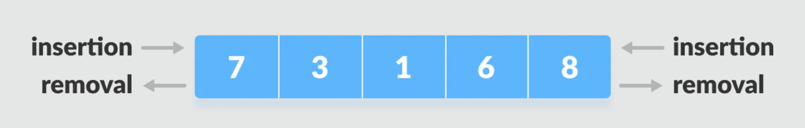
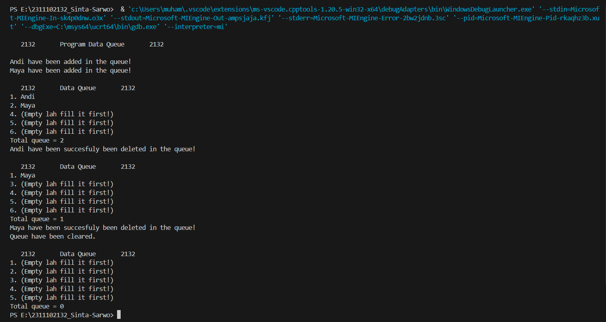
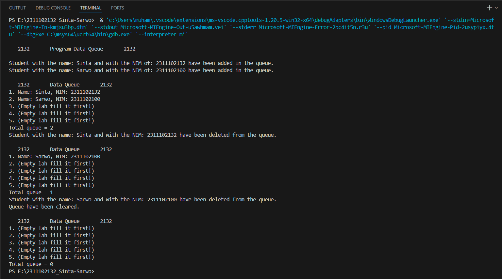

# <h1 align="center">Laporan Praktikum Modul Queue</h1>
<p align="center">Sinta Sarwo - 2311102132</p>

## Dasar Teori

Queue merupakan struktur data yang menggunakan prisip "First-in First-Out" dalam  penyimpanan data. Dimana data yang pertama masuk ke dalam queue akan menjadi data yang pertama dikeluarkan. Queue dapat dimplementasikan menggunakan array atau linked list. Di dalam queue terdapat pointer utama yaitu "front" and "rear". "Front" menunjuk ke data pertama dalam queue  sedanagkan "rear" menunjuk ke data terakhir. Kita dapat mengerti konsep queue dengan membayangkan sebuah antrian, orang pertama yang datang akan dilayani terlebih dahulu dan seterusnya.

Queue dan stack mempunyai kebedaan, queue memiliki aturan berbeda untuk menambah dan menghapus data. Pada stack, penambahan dan penghapusan data hanya dilakukan di satu ujung. Sedangkan pada queue, operasi tersebut dilakukan di dua ujung yang berbeda. Hal ini karena perubahan data selalu mengacu pada data terdepan ("head"). Oleh karena itu, hanya ada dua operasi dasar dalam queue: <br/>

1. Enqueue: Menambahkan data baru ke bagian belakang antrian.
2. Dequeue: Menghapus data terdepan dari antrian.



Saat Enqueue, data baru ditambahkan setelah data terakhir dalam antrian. Sedangkan saat Dequeue, "head" digeser untuk menunjuk ke data selanjutnya dalam antrian, layaknya antrian di taman hiburan yang terus bergerak.

Singkatnya, queue adalah struktur data yang mensimulasikan antrian dalam kehidupan nyata, di mana data diproses berdasarkan urutan kedatangannya.

#### Operasi Dasar Queue:<br/>
 - Enqueue() :menambahkan data kedalam queue.
 - Dequeue() :mengeluarkan data dari queue.
 - Peek()    :mengambil data dari queue tanpa menghapusnya.
 - isEmpty() :mengecek apakah queue kosong atau tidak.
 - isFull()  :mengecek apakah queue penuh atau tidak.
 - size()    :menghitung jumlah elemen dalam queue.

#### Jenis- jenis Operasi Queue:<br/>

Dalam antrian, data pertama yang masuk akan diproses terlebih dahulu. Operasi pada queue memungkinkan kita untuk mengelola data dalam antrian dengan mudah. Berikut adalah beberapa jenis operasi dasar pada queue:
1. Berdasarkan Implementasi Queue
    - Linear Queue: Elemen-elemen data tersusun dalam barisan lurus, dan penambahan serta penghapusan elemen hanya terjadi pada dua ujung barisan. <br/>
    


    - Circular Queue: Mirip dengan linear queue, tetapi ujung-ujung barisan terhubung satu sama lain, membentuk lingkaran.<br/>
    


2. Berdasarkan Penggunaan
    - Priority Queue: Setiap elemen memiliki prioritas tertentu. Elemen dengan prioritas tertinggi akan diambil terlebih dahulu.Elemen dengan prioritas rendah akan dihapus setelah elemen dengan prioritas tinggi. <br/>
    


    - Double-ended Queue (Dequeue): Elemen dapat ditambahkan atau dihapus dari kedua ujung antrian. <br/>
    


## Guided 

### 1. Latihan Queue

```C++
#include <iostream>

using namespace std;

const int maksimalQueue = 5;  // Maksimal antrian
int front = 0;                // Penanda antrian
int back = 0;                 // Penanda
string queueTeller[5];        // Fungsi pengecekan

bool isFull() {               // Pengecekan antrian penuh atau tidak
  if (back == maksimalQueue) {
    return true;  // =1
  } else {
    return false;
  }
}

bool isEmpty() {  // Antriannya kosong atau tidak
  if (back == 0) {
    return true;
  } else {
    return false;
  }
}

void enqueueAntrian(string data) {  // Fungsi menambahkan antrian
  if (isFull()) {
    cout << "Antrian penuh" << endl;
  } else {
    if (isEmpty()) {  // Kondisi ketika queue kosong
      queueTeller[0] = data;
      front++;
      back++;
    } else {  // Antrianya ada isi
      queueTeller[back] = data;
      back++;
    }
  }
}

void dequeueAntrian() {  // Fungsi mengurangi antrian
  if (isEmpty()) {
    cout << "Antrian kosong" << endl;
  } else {
    for (int i = 0; i < back; i++) {
      queueTeller[i] = queueTeller[i + 1];
    }
    back--;
  }
}

int countQueue() {  // Fungsi menghitung banyak antrian
  return back;
}

void clearQueue() {  // Fungsi menghapus semua antrian
  if (isEmpty()) {
    cout << "Antrian kosong" << endl;
  } else {
    for (int i = 0; i < back; i++) {
      queueTeller[i] = "";
    }
    back = 0;
    front = 0;
  }
}

void viewQueue() {  // Fungsi melihat antrian
  cout << "Data antrian teller:" << endl;
  for (int i = 0; i < maksimalQueue; i++) {
    if (queueTeller[i] != "") {
      cout << i + 1 << ". " << queueTeller[i] << endl;
    } else {
      cout << i + 1 << ". (kosong)" << endl;
    }
  }
}

int main() {
  enqueueAntrian("Andi");
  enqueueAntrian("Maya");
  viewQueue();
  cout << "Jumlah antrian = " << countQueue() << endl;
  dequeueAntrian();
  viewQueue();
  cout << "Jumlah antrian = " << countQueue() << endl;
  clearQueue();
  viewQueue();
  cout << "Jumlah antrian = " << countQueue() << endl;
  return 0;
}
```
Kode di atas merupakan implementasi sederhana dari struktur data queue menggunakan array. Program mendeklarasi beberapa variabel dan konstanta, const int maksimalQueue untuk menentukan kapasitas maksimal queue, int front, int back, dan string queueTeller untuk mengelola dalam queue. Program di atas mememiliki beberapa fungsi untuk di operasikan pada queue, sebagai berikut:<br/>
- isFull() dan isEmpty(): Untuk memeriksa apakah queue kosong atau tidak.
- enqueueAntrian(string data): Untuk menambahkan data ke dalam queue.
- dequeueAntrian(): Untuk menghapus data dari queue.
- countQueue(): Untuk menghitung jumlah data dalam queue.
- clearQueue(): Untuk menghapus semua data dari queue.
- viewQueue(): Untuk menampilkan data-data dalam queue. 

Fungsi utama dalam kode di atas untuk menunjukan penggunaan dari queue dengan operasi queue dilakukan seperti menambahkan data ke queue, menghapus data, dan menampilkan data dalam queue.

## Unguided 

## 1. Ubahlah penerapan konsep queue pada bagian guided dari array menjadi linked list.

```C++

// Sinta Sarwo - 2311102132

#include <iostream> // Library untuk fungsi input dan ouput

using namespace std;

const int MaxQueue = 5;  // Deklrasi Maksimal antrian adalah 5

// Deklarasi Node untuk menyimpan data dan pointer ke node berikutnya
struct Node {
    string Data_2132;
    Node* next;
};

class Queue {
private:
    Node* front; // Node depan dari queue
    Node* rear;  // Node belakang dari queue

public: 
    Queue() { 
        front = nullptr;
        rear = nullptr;
    }

    
    // Memeriksa apakah queue kosong
    bool isEmpty_2132() {
        if(front == NULL) {
            return true;
        } else {
            return false;
        }
    }

    // Menambahkan data ke queue
    void Enqueue_2132(const string& data) {
        Node* newNode = new Node;
        newNode->Data_2132 = data;
        newNode->next = nullptr;
        
        // Jika queue kosong
        if (isEmpty_2132()) {
            front = rear = newNode;
        } else { 
            rear->next = newNode;
            rear = newNode;
        }
        
        cout << data << " have been added in the queue!" << endl;
    }

    // Menghapus data dari queue
    void Dequeue_2132() {
        if (isEmpty_2132()) { // Jika queue kosong maka akan menampilkan pesan "Queue is empty!"
            cout << "Queue is empty!" << endl;
            return;
        }

        Node* temp = front; // Menyimpan node front ke dalam variabel temp untuk dihapus nantinya 
        front = front->next; // Geser front ke node selanjutnya

        cout << temp->Data_2132 << " have been succesfuly been deleted in the queue!" << endl; 
        delete temp; // Menghapus node yang disimpan di variabel temp

        // Jika setelah penghapusan queue menjadi kosong
        if (front == nullptr) {
            rear = nullptr;
        }
    }

    // Menampilkan seluruh data pada queue
    void DisplayQueue_2132() {
        if (isEmpty_2132()) { 
            cout << "\n   2132       Data Queue       2132   " << endl;
            for (int i = 0; i < MaxQueue; i++) {
                cout << i + 1 << ". (Empty lah fill it first!)" << endl;
            }
        } else { 
            cout << "\n   2132       Data Queue       2132   " << endl;
            Node* current = front;
            int i = 1;
            while (current != nullptr) { 
                cout << i << ". " << current->Data_2132 << endl;
                current = current->next;
                i++;
            }
            for (; i <= MaxQueue; i++) {  // Menampilkan pesan "(Empty lah fill it first!)" untuk antrian yang kosong 
                cout << i + 1 << ". (Empty lah fill it first!)" << endl;
            }
        }
    }

    // Mengembalikan jumlah data dalam queue
    int CountQueue_2132() {
        int count = 0;
        Node* current = front;
        while (current != nullptr) { // Selama current tidak menunjuk ke nullptr maka hitung jumlah data dalam queue
            count++;
            current = current->next;
        }
        return count; // Kembalikan jumlah data dalam queue
    }

    // Menghapus semua elemen dalam queue
    void ClearQueue_2132() {
        while (!isEmpty_2132()) { // Selama queue tidak kosong maka hapus data dalam queue
            Dequeue_2132(); // Memanggil fungsi Dequeue_2132 untuk menghapus data
        } 
        cout << "Queue have been cleared." << endl;
    }
};

int main() {
    Queue queue; // Deklarsi queue untuk dapat di operasikan

    cout << "\n   2132       Program Data Queue       2132   " << endl;
    cout << endl;

    queue.Enqueue_2132("Andi"); //Memasuka data dengan memanggil Enqueue
    queue.Enqueue_2132("Maya"); //Memasuka data dengan memanggil Enqueue
    queue.DisplayQueue_2132(); //Memanggil DisplayQueue_2132 dalam class queue untuk menampilkan data dalam queue
    cout << "Total queue = " << queue.CountQueue_2132() << endl; //Memanggil CountQueue_2132 untuk menunjukan jumlah data dalam queue
    queue.Dequeue_2132(); //Memanggil Dequeue_2132 untuk menghapus data dalam queue
    queue.DisplayQueue_2132(); //Memanggil DisplayQueue_2132 dalam class queue untuk menampilkan data dalam queue
    cout << "Total queue = " << queue.CountQueue_2132() << endl; //Memanggil CountQueue_2132 untuk menunjukan jumlah data dalam queue
    queue.ClearQueue_2132(); //Memanggil ClearQueue_2132 untuk menghapus seluruh data dalam queue
    queue.DisplayQueue_2132(); //Memanggil DisplayQueue_2132 dalam class queue untuk menampilkan data dalam queue
    cout << "Total queue = " << queue.CountQueue_2132() << endl; //Memanggil CountQueue_2132 untuk menunjukan jumlah data dalam queue

    return 0;
}
```
## Output:

Kode di atas merupakan implementasi sederhana dari struktur data queue menggunakan linked list. Kode diatas memiliki pengunaan yang sama pada program guided tetapi menggunakan linked list. Karena menggunakan linked list dalam kode terdapat beberapa deklarasi yaitu const int MaxQueue untuk menentukan kapasitas maksimal queue, struct Node, Class Queue yang mendefinisikan antrian dan fungsi-fungsi yang dapat dilakukan dalam queue, seperti berikut;<br/>
- bool isEmpty_2132(): Untuk memeriksa apakah queue kosong atau tidak.
- void Enqueque_2132(const string& data): Untuk menambahkan data dalam queue.
- void Dequeque_2132(): Untuk Untuk menghapus data dari queue.
- void DisplayQueue_2132(): Untuk menampilkan data-data dalam queue.
- void CountQueue(): Untuk menghitung jumlah data dalam queue.
- void ClearQueue_2132(): Untuk menghapus semua data dari queue.

Fungsi utama dalam kode di atas untuk menunjukan penggunaan dari queue dengan operasi queue menggunaka linked list. Program ini digunakan untuk mengelola queue dengan kapasitas maksimal 5 orang dan dapat menambahkan, menghapus, melihat, dan menghitung jumlah queue, serta menghapus seluruh data queue.

## 2. Dari nomor 1 buatlah konsep antri dengan atribut Nama mahasiswa dan NIM Mahasiswa.

```C++

// Sinta Sarwo - 2311102132

#include <iostream> // Library untuk fungsi input dan ouput
#include <string>   // Library untuk operasi pada string

using namespace std;

const int MaxQueue_2132 = 5;  // Maksimal queue adalah 5

// Deklarasi Node untuk menyimpan nama dan nim mahasiswa dan pointer ke node berikutnya
struct Node {
    string Name_2132;
    string Nim_2132;
    Node* next;
};

class Queue {
private:
    Node* front; // Node depan dari queue
    Node* rear;  // Node belakang dari queue

public: 
    Queue() { // Konstruktor untuk menginisialisasi queue kosong
        front = nullptr;
        rear = nullptr;
    }

    // Memeriksa apakah queue kosong
    bool isEmpty_2132() {
        if(front == NULL) {
            return true;
        } else {
            return false;
        }
    }

    // Menambahkan data ke queue
    void Enqueue_2132(const string& name, const string& nim) {
        Node* newNode = new Node;
        newNode->Name_2132 = name;
        newNode->Nim_2132 = nim;
        newNode->next = nullptr;
        
        // Jika queue kosong
        if (isEmpty_2132()) { // Jika queue kosong maka front dan rear menunjuk ke newNode yang baru dibuat 
            front = rear = newNode;
        } else { // Jika queue tidak kosong maka rear menunjuk ke newNode yang baru dibuat
            rear->next = newNode;
            rear = newNode;
        }
        
        cout << "Student with the name: " << newNode->Name_2132 << " and with the NIM of: " << newNode->Nim_2132<< " have been added in the queue." << endl;
    }

     //Menghapus data dari queue
    void Dequeue_2132() {
        if (isEmpty_2132()) { // Jika queue kosong maka akan menampilkan pesan "Queue is empty!" 
            cout << "Queue is empty!" << endl;
            return;
        }

        Node* temp = front; // Menyimpan node front ke dalam variabel temp untuk dihapus nantinya 
        front = front->next; // Geser front ke node selanjutnya 

        cout << "Student with the name: " << temp->Name_2132 << " and with the NIM: " << temp->Nim_2132 << " have been deleted from the queue." << endl; // Tampilkan data mahasiswa yang dihapus dari antrian 
        delete temp; // Menghapus node yang disimpan di variabel temp

        // Jika setelah penghapusan queue menjadi kosong
        if (front == nullptr) {
            rear = nullptr;
        }
    }

    // Menampilkan seluruh queue
    void DisplayQueue_2132() {
        if (isEmpty_2132()) { 
            cout << "\n   2132       Data Queue       2132   " << endl;
            for (int i = 0; i < MaxQueue_2132; i++) {
                cout << i + 1 << ". (Empty lah fill it first!)" << endl;
            }
        } else { 
            cout << "\n   2132       Data Queue       2132   " << endl;
            Node* current = front;
            int i = 1;
            while (current != nullptr) { 
                cout << i << ". " << "Name: " << current->Name_2132 << ", NIM: " << current->Nim_2132 << endl;
                current = current->next;
                i++;
            }
            for (; i <= MaxQueue_2132; i++) { // Menampilkan pesan "(Empty lah fill it first!)" untuk queue yang kosong 
                cout << i << ". (Empty lah fill it first!)" << endl;
            }
        }
    }

    // Mengembalikan jumlah data dalam queue
    int CountQueue_2132() {
        int count = 0;
        Node* current = front;
        while (current != nullptr) { // Selama current tidak menunjuk ke nullptr maka hitung jumlah data dalam queue
            count++;
            current = current->next;
        }
        return count; // Kembalikan jumlah data dalam queue
    }

    // Menghapus semua data dalam queue
    void ClearQueue_2132() {
        while (!isEmpty_2132()) { // Selama queue tidak kosong maka hapus data dalam queue
            Dequeue_2132(); // Memanggil fungsi Dequeue_2132 untuk menghapus data
        } 
        cout << "Queue have been cleared." << endl;
    }
};

int main() {
    Queue queue; // Deklarsi queue untuk dapat di operasikan


    cout << "\n   2132       Program Data Queue       2132   " << endl;
    cout << endl;


    queue.Enqueue_2132("Sinta", "2311102132"); //Memasuka data mahasiswa dengan memanggil Enqueue
    queue.Enqueue_2132("Sarwo", "2311102100"); //Memasuka data dengan memanggil Enqueue
    queue.DisplayQueue_2132(); //Memanggil DisplayQueue_2132 dalam class queue untuk menampilkan data dalam queue
    cout << "Total queue = " << queue.CountQueue_2132() << endl; //Memanggil CountQueue_2132 untuk menunjukan jumlah data dalam queue
    queue.Dequeue_2132(); //Memanggil Dequeue_2132 untuk menghapus data dalam queue
    queue.DisplayQueue_2132();//Memanggil DisplayQueue_2132 dalam class queue untuk menampilkan data dalam queue
    cout << "Total queue = " << queue.CountQueue_2132() << endl; //Memanggil CountQueue_2132 untuk menunjukan jumlah data dalam queue
    queue.ClearQueue_2132(); //Memanggil ClearQueue_2132 untuk menghapus seluruh data dalam queue
    queue.DisplayQueue_2132(); //Memanggil DisplayQueue_2132 dalam class queue untuk menampilkan data dalam queue
    cout << "Total queue = " << queue.CountQueue_2132() << endl; //Memanggil CountQueue_2132 untuk menunjukan jumlah data dalam queue

    return 0;
}
```
## Output:


Kode di atas merupakan implementasi sederhana dari struktur data queue menggunakan linked list sama seperti program sebelumnya. Kode diatas mendeklarasi const int MaxQueue untuk menentukan kapasitas maksimal queue, struct Node terdiri string Name_2132 dan string Nim_2132 untuk menyimpan data mahasiswa dan pointer ke node berikut, Class Queue yang mendefinisikan antrian dan fungsi-fungsi yang dapat dilakukan dalam queue, seperti berikut;<br/>
- bool isEmpty_2132(): Untuk memeriksa apakah queue penuh atau tidak.
- void Enqueque_2132(const string% name, const string nim): Untuk menambahkan data mahasiswa dalam queue.
- void Dequeque_2132(): Untuk Untuk menghapus data dari queue.
- void DisplayQueue_2132(): Untuk menampilkan data-data dalam queue.
- void CountQueue(): Untuk menghitung jumlah data dalam queue.
- void ClearQueue_2132(): Untuk menghapus semua data dari queue.

Fungsi utama dalam kode di atas untuk menunjukan penggunaan dari queue dengan operasi queue menggunaka linked list dengan data mahasiswa. Program ini digunakan untuk mengelola queue dengan kapasitas maksimal 5 mahasiswa dan dapat menambahkan, menghapus, melihat, dan menghitung jumlah queue, serta menghapus seluruh data queue.

## Kesimpulan

Queue merupakan struktur data yang menggunakan prisip "First-in First-Out" dalam  penyimpanan data. Dimana data yang pertama masuk ke dalam queue akan menjadi data yang pertama dikeluarkan. Queue dapat dimplementasikan menggunakan array atau linked list. Di dalam queue terdapat pointer utama yaitu "front" and "rear". "Front" menunjuk ke data pertama dalam queue  sedanagkan "rear" menunjuk ke data terakhir. Kita dapat mengerti konsep queue dengan membayangkan sebuah antrian, orang pertama yang datang akan dilayani terlebih dahulu dan seterusnya. Queue dan stack mempunyai kebedaan, queue memiliki aturan berbeda untuk menambah dan menghapus data. Pada stack, penambahan dan penghapusan data hanya dilakukan di satu ujung. Sedangkan pada queue, operasi tersebut dilakukan di dua ujung yang berbeda. Hal ini karena perubahan data selalu mengacu pada data terdepan ("head"). Oleh karena itu, hanya ada dua operasi dasar dalam queueAda beberapa jenis operasi queue, termasuk Simple Queue dan Circular Queue, serta jenis penggunaan seperti Priority Queue dan Double-ended Queue (Dequeue). 

#### Operasi Dasar Queue:<br/>
 - Enqueue() :menambahkan data kedalam queue.
 - Dequeue() :mengeluarkan data dari queue.
 - Peek()    :mengambil data dari queue tanpa menghapusnya.
 - isEmpty() :mengecek apakah queue kosong atau tidak.
 - isFull()  :mengecek apakah queue penuh atau tidak.
 - size()    :menghitung jumlah elemen dalam queue.

## Referensi
[1] Narasimha Karumanchi , "Data Structures And Algorithms Made Easy: Data Structures and Algorithmic Puzzles". CareerMonk Publication, 2020. <br/>
[2] Muhammad Nugraha, Dasar Pemrograman Dengan C++, Materi Paling Dasar untuk Menjadi Programmer Berbagai Platform. Yogyakarta: Deepublish, 2021.<br/>
[3] Meidyan Permata Putri, et al., Algoritma dan Struktur Data. Bandung: Widina Bhakti Persada Bandung, 2022.<br/>