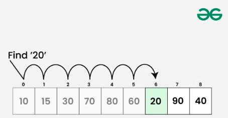
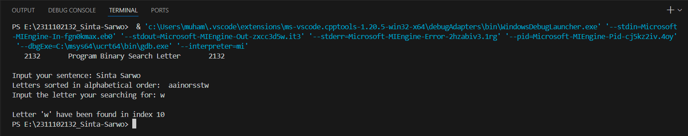
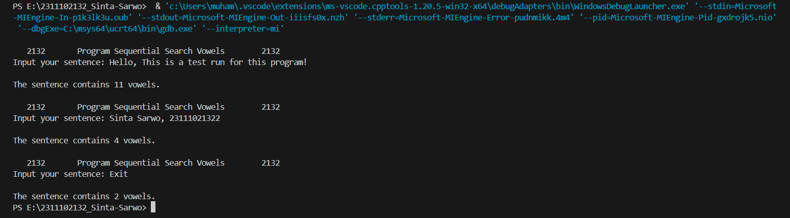

# <h1 align="center">Laporan Praktikum Modul 8 Searching </h1>
<p align="center">Sinta Sarwo - 2311102132</p>

## Dasar Teori

...




## Guided 

### 1. Sequential Search
```C++
#include <iostream>

using namespace std;

int main(){
    int n = 10;
    int data[n] = {9,4,1,7,5,12,4,13,4,10};
    int cari = 10;
    bool ketemu = false;
    int i;

    for (i = 0; i < n; i++){
        if(data[i] == cari){
            ketemu = true;
            break;
        }
    }

    cout << "Program Sequential Search" << endl;
    cout << "data : {9,4,1,7,5,12,4,13,4,10}" << endl;

    if (ketemu){
        cout << "\nAngka " << cari << " ditemukan pada indeks ke-" << i << endl;
    }else{
        cout << "data tidak ditemukan" << endl;
    }

    return 0;
}
```
Kode di atas...

### 2. Binary Search
```C++
#include<iostream>
#include<conio.h>
#include<iomanip>

using namespace std;

int dataArray[7] = {1, 8, 2, 5, 4, 9, 7};
int cari;

void Selection_Sort(){
    int temp, min, i, j;
    for(i = 0; i < 7; i++){
        min = i;
        for(j = i + 1; j < 7; j++){
            if(dataArray[j] < dataArray[min]){
                min = j;
            }
        }
        temp = dataArray[i];
        dataArray[i] = dataArray[min];
        dataArray[min] = temp;
    }
}

void BinarySearch(){
    int awal, akhir, tengah;
    bool b_flag = false;
    awal = 0;
    akhir = 6;
    while(!b_flag && awal <= akhir){
        tengah = (awal + akhir)/2;
        if(dataArray[tengah] == cari){
            b_flag = true;
        } else if(dataArray[tengah] < cari){
            awal = tengah + 1;
        } else {
            akhir = tengah - 1;
        }
    }
    if(b_flag){
        cout << "\nData ditemukan pada index ke-" << tengah << endl;
    } else {
        cout << "\nData tidak ditemukan" << endl;
    }
}

int main(){
    cout << "BINARY SEARCH" << endl;
    cout << "\nData : ";
    
    for(int x = 0; x < 7; x++){
        cout << setw(3) << dataArray[x];
    }
    cout << endl;

    cout << "Masukkan data yang ingin dicari : ";
    cin >> cari;
    
    cout << "\nData diurutkan : ";
    Selection_Sort();

    for(int x = 0; x < 7; x++){
        cout << setw(3) << dataArray[x];
    }
    cout << endl;
    BinarySearch();
    _getche();
    return 0;
}
```
Kode di atas...

## Unguided 

## 1.

```C++

// Sinta Sarwo - 2311102132

#include <iostream> // Library untuk fungsi input dan ouput

using namespace std;

int main(){

}
```
## Output:

Kode di atas...

## 2. 

```C++
// Sinta Sarwo - 2311102132

#include <iostream> // Library untuk fungsi input dan ouput

using namespace std;

int main(){

}
```
## Output:


Kode di atas

## 3.
```C++

// Sinta Sarwo - 2311102132

#include <iostream> // Library untuk fungsi input dan ouput

using namespace std;

int main(){

}
``` 
Kode diatas...

## Kesimpulan

...


## Referensi
[1] Narasimha Karumanchi , "Data Structures And Algorithms Made Easy: Data Structures and Algorithmic Puzzles". CareerMonk Publication, 2020. <br/>
[2] Muhammad Nugraha, Dasar Pemrograman Dengan C++, Materi Paling Dasar untuk Menjadi Programmer Berbagai Platform. Yogyakarta: Deepublish, 2021.<br/>
[3] Meidyan Permata Putri, et al., Algoritma dan Struktur Data. Bandung: Widina Bhakti Persada Bandung, 2022.<br/>