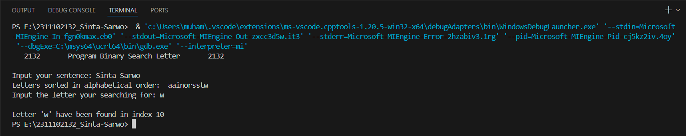

# <h1 align="center">Laporan Praktikum Modul 8 Searching </h1>
<p align="center">Sinta Sarwo - 2311102132</p>

## Dasar Teori

Searching merupakan algoritma untuk mencari elemen tertentu dalam sebuah array atau struktur data lainnya. Searching adalah suatu proses pencarian, dalam pencarian ini hasil dari pencarian ada tiga kemungkinan di mana data ditemukan, data ditemukan lebih dari satu, dan data tidak ditemukan. Proses searching menggunakan cara mengecek satu persatu pada setiap index baris atau setiap index kolomnya dengan menggunakan teknik perulangan untuk melakukan pencarian data. Searching memiliki beberapa jenis sebagai berikut:<br/>

1. Linear Search / Sequential Search<br/>
Sequential search merupakan algoritma searching yang paling sederhana dan mudah dipahami. Cara kerja sequential search ini, setiap elemen pada array atau struktur data lainnya akan diperiksa secara satu per satu hingga elemen yang dicari ditemukan atau seluruh elemen telah diperiksa.<br/>


Seperti di gambar di atas terdapat proses yang dilakukan adalah:<br/>
- Start: Elemen pertama akan diperiksa dari kumpulan elemen.
- Compare: Membandingkan elemen tersebut dengan yang dicari.
- Found: Jika elemen saat ini sama dengan elemen yang dicari, kembalikan true atau indeks ke elemen saat ini.
- Move: Jika tidak, pindah ke elemen berikutnya dalam koleksi (proses langkah 2-4 akan diulang sehingga mecapai elemen terakhir).
- Not found: Jika pada elemen terakhir juga tidak ditemukan maka akan mengembalikan elemen yang dicari tidak ada dalam array.

2. Binary Search<br/>
Binary search merupakan algoritma searching yang lebih efesien dibandingkan dengan sequential search jika elemen dalam array sudah terurut. Cara kerja dari binary search ini, elemen yang dicari akan dibandingkan dengan elemen tengan pada array. Jika elemen tersebut lebih besar dari nilai tengah, maka hanya setengah dari array tersebut yang perlu diperiksa dan sebaliknya. Proses ini dilakukan berulang hingga elemen yang dicari ditemukan atau seluruh elemen telah diperiksa.<br/>


Seperti di gambar di atas terdapat proses yang dilakukan dan kondisi untuk menggunakan binary search:<br/>
- Kondisi <br/>
1. Data elemen harus terurut.
- Cara kerja:<br/>
1. Menentukan nilai awal, tengah, dan akhir: Nilai awal biasanya adalah indeks pertama, nilai akhir adalah indeks terkahir, dan nilai tengah adalah rata-rata dari nilai awal dan akhir.
2. Compare: Nilai tengah akan dibandingkan dengan nilai yang dicari,<br/>
-  Jika nilai tengah sama dengan nilai yang dicari, maka pencarian selesai elemen telah ditemukan.
- Jika nilai tengah lebih kecil dari nilai yang dicari, maka nilai yang dicari pasti berada di setengah bagian kanan array. Oleh karena itu, ubah nilai awal menjadi tengah + 1.
- Jika nilai tengah lebih besar dari nilai yang dicari, maka nilai yang dicari pasti berada di setengah bagian kiri array. Oleh karena itu, ubah nilai akhir menjadi tengah - 1.
Langkah 1 dan 2 akan diulang  sampai nilai yang dicari ditemukan atau sampai seluruh elemen telah diperiksa.
3. Found: Jika elemen ditemukan, kembalikan indeks elemen tersebut. 
4. Not found: Jika area pencarian tidak memiliki elemen lagi dan elemen belum ditemukan, berarti elemen tidak ada dalam array.

## Guided 

### 1. Sequential Search
Buatlah sebuah project dengan menggunakan sequential search sederhana untuk melakukan pencarian data.
```C++
#include <iostream>

using namespace std;

int main(){
    int n = 10;
    int data[n] = {9,4,1,7,5,12,4,13,4,10};
    int cari = 10;
    bool ketemu = false;
    int i;

    for (i = 0; i < n; i++){
        if(data[i] == cari){
            ketemu = true;
            break;
        }
    }

    cout << "Program Sequential Search" << endl;
    cout << "data : {9,4,1,7,5,12,4,13,4,10}" << endl;

    if (ketemu){
        cout << "\nAngka " << cari << " ditemukan pada indeks ke-" << i << endl;
    }else{
        cout << "data tidak ditemukan" << endl;
    }

    return 0;
}
```
Kode di atas merupakan implementasi dari Sequential Search sederhana. Dalam kode di atas sequential seach digunakan untuk mencari suatu nilai dalam array yang di deklarsi. Setiap data array akan di periksa satu per satu hingga nilai yang dicari ditemukan atau data telah diperiksa semua.

Kode di atas mendeklarasikan int n untuk ukuran data array int data[n], kode juga mendeklarasi int cari = 10, di mana variabel cari merupakan nilai yang di cari dalam array. Bool ketemu digunakan untuk menentukan jika nilai tersebut ditemukan atau tidak. Perulangan dalam program merupakan sequential search yang berfungsi untuk memeriksa data array, dan di kondisikan jika data array sama dengan nilai yang di cari maka variabel ketemu akan mejadi true. Sehingga program dapat menampilkan angka yang telah dicari ditemukan dalam indek berapa, tetapi jika nilai yang di cari tidak ditemukan maka program akan menampilkan "data tidak ditemukan".

### 2. Binary Search
Buatlah sebuah project untuk melakukan pencarian data dengan menggunakan Binary Search.
```C++
#include<iostream>
#include<conio.h>
#include<iomanip>

using namespace std;

int dataArray[7] = {1, 8, 2, 5, 4, 9, 7};
int cari;

void Selection_Sort(){
    int temp, min, i, j;
    for(i = 0; i < 7; i++){
        min = i;
        for(j = i + 1; j < 7; j++){
            if(dataArray[j] < dataArray[min]){
                min = j;
            }
        }
        temp = dataArray[i];
        dataArray[i] = dataArray[min];
        dataArray[min] = temp;
    }
}

void BinarySearch(){
    int awal, akhir, tengah;
    bool b_flag = false;
    awal = 0;
    akhir = 6;
    while(!b_flag && awal <= akhir){
        tengah = (awal + akhir)/2;
        if(dataArray[tengah] == cari){
            b_flag = true;
        } else if(dataArray[tengah] < cari){
            awal = tengah + 1;
        } else {
            akhir = tengah - 1;
        }
    }
    if(b_flag){
        cout << "\nData ditemukan pada index ke-" << tengah << endl;
    } else {
        cout << "\nData tidak ditemukan" << endl;
    }
}

int main(){
    cout << "BINARY SEARCH" << endl;
    cout << "\nData : ";
    
    for(int x = 0; x < 7; x++){
        cout << setw(3) << dataArray[x];
    }
    cout << endl;

    cout << "Masukkan data yang ingin dicari : ";
    cin >> cari;
    
    cout << "\nData diurutkan : ";
    Selection_Sort();

    for(int x = 0; x < 7; x++){
        cout << setw(3) << dataArray[x];
    }
    cout << endl;
    BinarySearch();
    _getche();
    return 0;
}
```
Kode di atas merupakan implementasi dari Binary search. kode di atas menggunkan #include<conio.h> dan #include<iomanip> untuk fungsi console input/output dab manipulasi format output. Program mendekarasi int dataArray[7], dan int cari untuk menyimpan nilai yang akan dicari oleh user. Dalam program diatas terdapat dua fungsi void Selection_Sort() dan void Binary Search():
-  void Selection_Sort(), Fungsi ini mengimplementasikan algoritma Selection Sort, yang digunakan untuk mengurutkan elemen dalam array dataArray dari terkecil ke terbesar.
- void BinarySearch(),  Fungsi ini mengimplementasikan algoritma Binary Search, yang digunakan untuk mencari nilai yang dimasukkan oleh pengguna (cari) dalam array dataArray yang sudah diurutkan.

Pada main program user diminta untuk memasukkan nilai yang ingin dicari, program akan memanggil fungsi Selectio_Sort() untuk mengurutkan dara array, dan memanggil BinarSearch() untuk mencari nilai tersebut dalam array. _getche() digunaka untuk menahan layar console agak tidak langsung tetutup setelah program selesai dijalankan.

## Unguided 

## 1. Buatlah sebuah program untuk mencari sebuah huruf pada sebuah kalimat yang sudah di input dengan menggunakan binary search!
```C++

// Sinta Sarwo - 2311102132

#include <iostream> // Library untuk fungsi input dan ouput
#include <string>   // Library untuk fungsi string
#include <algorithm>// Library untuk fungsi sort

using namespace std;

// Binary search untuk mencari huruf dalam kalimat yang di input oleh user
void BinarySearch_2132(const string& str, char find){
    int awal, akhir, tengah;
    bool b_flag = false;
    awal = 0;
    akhir = str.length() - 1;

    while(!b_flag && awal <= akhir){
        tengah = (awal + akhir) / 2;
        if(str[tengah] == find){
            b_flag = true;
        } else if(str[tengah] < find){
            awal = tengah + 1;
        } else {
            akhir = tengah - 1;
        }
    }
    if(b_flag){
        cout << "\nLetter '" << find << "' have been found in index " << tengah << endl;
    } else {
        cout << "\nLetter can't be find in this sentence!" << endl;
    }
}


int main(){
    string Sentence_2132; //Deklarasi string Sentence_2132 untuk menyimpan kalimat yang di input user
    char Letter_2132; // Deklarasi char Letter_2132 untuk menyimpan huruf yang ingin di cari oleh user

    cout << "   2132       Program Binary Search Letter       2132   " << endl;
    cout << endl;

    cout << "Input your sentence: ";
    getline(cin, Sentence_2132); // getline dapat membaca seluruh baris maka jika ada kalimat yang menggunakan kalimat tetap terbaca, dan Inputan kalimat yang ingin dicheck

    for (char &c : Sentence_2132){ //Perulangan yang membuat kalimat inputan menjadi huruf kecil agar mempermudah proses pengechekan
        c = tolower(c); // Mengubah huruf menjadi huruf kecil untuk mempermudah pengecekan
    }

    sort(Sentence_2132.begin(), Sentence_2132.end()); //Sentence_2132 yang telah di ubah menjadi huruf kecil akan di urutkan secara alphabet menggunkan fungsi sort
    cout << "Letters sorted in alphabetical order: " << Sentence_2132 << endl;

    cout << "Input the letter your searching for: ";
    cin >> Letter_2132;

    BinarySearch_2132(Sentence_2132, Letter_2132); //Memanggil BinarySearch_2132 untuk mecari huruf yang ingin di cari

    return 0;
}
```
## Output:

Kode di atas merupakan implementasi binary search untuk mencari sebuah huruf pada sebuah kalimat yang di input oleh user. Dalam program tersebut terdapat fungsi void BinarySearch_2132(const string& str, char find) yang digunakan untuk mencari huruf yang user input. Pada main program user diminta untuk memasukan sebuah kalimat yang nanti akan disimpan oleh variabel Sentence_2132 dan kalimat tersebut akan dibuat menjadi huruf kecil agar mempermudah proses pengechekan dan huruf tersebut akan di urutkan secara alphabet. Setelah itu user akan diminta untuk menginput huruf yang akan di simpan dalam variabel char Letter_2132 apa yang ingin di cari program akan memangil BinarySearch_2132 untuk mecari huruf tersebut. Jika huruf tidak ditemukan maka program akan menampilkan "Letter can't be find in this sentence!".

## 2. Buatlah sebuah program yang dapat menghitung banyaknya huruf vocal dalam sebuah kalimat!
```C++

// Sinta Sarwo - 2311102132

#include <iostream> // Library untuk fungsi input dan ouput
#include <string>   // Library untuk fungsi string

using namespace std;

bool isVowel_2132(char c){ //Fungsi pengechekan huruf vokal
    c = tolower(c); // Mengubah huruf menjadi huruf kecil untuk mempermudah pengecekan
    return c == 'a' || c == 'e' || c == 'i' || c == 'o' || c == 'u';
}

int CountVowels_2132(const string &sentence) { //Fungsi untuk menghitung berapa banya huruf vokal dalam kalimat
    int count = 0;
    for (char c : sentence) { //Perulangan untuk pengechekan huruf vokal
        if (isVowel_2132(c)) {
            count++; //Jika ketemu maka akan di tambah 1 sampai kalimat tersebut selesai
        }
    }
    return count; //Fungsi akan mengembalikan berapa banyak huruf vokal dalam kalimat
}

int main(){
    string Sentence_2132;//Deklarasi string Sentence_2132 untuk menyimpan kalimat yang di input user
    char Letter_2132; // Deklarasi char Letter_2132 untuk menyimpan huruf yang ingin di cari oleh user

    do{ //Looping
        cout << "\n   2132       Program Sequential Search Vowels        2132   " << endl;

        cout << "Input your sentence: ";
        getline(cin, Sentence_2132); // getline dapat membaca seluruh baris maka jika ada kalimat yang menggunakan kalimat tetap terbaca, dan Inputan kalimat yang ingin dicheck

        int Count_2132 = CountVowels_2132(Sentence_2132); //Deklarasi int Count_2132 untuk menyimpan hasil pengembalian fungsi int CountVowels_2132
        cout << "\nThe sentence contains " << Count_2132 << " vowels." << endl;

    }while(Sentence_2132 != "Exit"); //Program akan berhenti jika user menginput "Exit" dalam inputan sentence_2132
    return 0;

}
```
## Output:


Kode di atas merupakan implementasi sequential saerch untuk menghitung jumlah huruf vokal dallam kalimat yang diinput oleh user. Pada kode di atas memiliki 2 fungsi yang digunakan untuk mempermudah menghitung jumlah huruf vokal yaitu bool isVowel_2132(char c) dan int CountVowels_2132(const string &sentence).<br/>
- bool isVowel_2132(char c): digunakan untuk memeriksa apakah suatu karakter adalah huruf vokal atau bukan. Fungsi ini mengubah karakter menjadi huruf kecil menggunakan fungsi tolower() untuk mempermudah pengechekan, lalu memeriksa apakah karakter tersebut adalah ‘a’, ‘e’, ‘i’, ‘o’, atau ‘u’.
- int CountVowels_2132(const string &sentence): Fungsi ini digunakan untuk menghitung jumlah huruf vokal dalam suatu kalimat. Fungsi ini melakukan iterasi atas setiap karakter dalam kalimat, dan jika karakter tersebut adalah huruf vokal (diperiksa menggunakan fungsi isVowel_2132()), maka counter akan ditambahkan.

Pada main program terdapat variabel string Sentence_2132 untuk menyimpan kalimat yang di input user dan char Letter_2132 untuk menyimpan huruf yang ingin di cari oleh user. Saat program dimulai user akan diminta untuk menginput kalimat dan program akan menjalankan CountVowels_2132(Sentence_2132) yang di deklarasi dengan int Count_2132 untuk mengimpan nilai pengembalian dari fungsi CountVowels_2132(Sentence_2132), sehingga menunjukan berapa banyak huruf vokal dalam kalimat inputan user.

## 3. Diketahui data = 9, 4, 1, 4, 7, 10, 5, 4, 12, 4. Hitunglah berapa banyak angka 4 dengan menggunakan algoritma Sequential Search! 
```C++

// Sinta Sarwo - 2311102132

#include <iostream> // Library untuk fungsi input dan ouput

using namespace std;

int main(){
    int n = 10; //Deklarasi ukuran array
    int Data_2132[n] = {9, 4, 1, 4, 7, 10, 5, 4, 12, 4}; //Deklarasi data dalam array
    int Find_2132; //Deklarasi int Find_2132 untuk menyimpan data yang di input oleh user
    int Count_2132 = 0; //Deklarasi int Count_2132 untuk menyimpan berapa banyak data yang di cari


    cout << "   2132       Program Sequential Search       2132   " << endl;
    cout << endl;
    cout << "Data : {9, 4, 1, 4, 7, 10, 5, 4, 12, 4}" << endl;
    cout << "Input the number you want to count occurrences of: ";
    cin >> Find_2132;

    for (int i = 0; i < n; i++) { //Perulangan untuk menghitung berapa banyak data tersebut
        if (Data_2132[i] == Find_2132){ 
            Count_2132++; //Jika ketemu maka akan di tambah 1 sampai data tersebut selesai
        }
    }

    if (Count_2132 > 0) { //Kondisi jika data yang di input oleh user ditemukan maka akan manampilkan pesan di bawah
        cout << "The number " << Find_2132 << " occurs " << Count_2132 << " times." << endl;
    } else { //Jika data tersebut tidak ditemukan maka akan menampilkan pesan di bawah
        cout << "The number " << Find_2132 << " isn't in the data!" << endl;
    }

    return 0; //Program akan selesai
}
``` 


Kode di atas merupakan implementasi dari sequential search untuk menghitung berapa banyak angka dalam sebuah data array dalam program. Pada main progam beberapa variabel di deklarasikan yaitu int n untuk ukuran array, int Data_2132[n] = {9, 4, 1, 4, 7, 10, 5, 4, 12, 4} data dalam array, int Find_2132 untuk menyimpan data yang di input oleh user, dan int Count_2132 untuk menyimpan berapa banyak data yang di cari. Pada main program user akan diminta untuk memasukkan angka yang ingin dicari dan menghitung jumlah kemunculan angka tersebut dalam array menggunakan sequential search. Dalam sequential search digunakan untuk mengiterasi setiap elemen dalam array. Jika elemen saat ini sama dengan angka yang dicari, maka counter (Count_2132) akan ditambahkan. program akan memeriksa apakah counter lebih besar dari 0 (yang berarti angka yang dicari ditemukan dalam array). Jika ya, program akan mencetak jumlah kemunculan angka tersebut. Jika tidak, program akan mencetak pesan bahwa angka tersebut tidak ditemukan dalam array.

## Kesimpulan

Algoritma searching adalah serangkaian langkah untuk mencari elemen tertentu dalam sebuah array atau struktur data lainnya. Ada dua jenis algoritma searching yang umum digunakan:<br/>
1. Sequential Search, Algoritma searching paling sederhana berkerja dengan memeriksa setiap elemen satu per satu hingga elemen yang dicari ditemukan atau seluruh elemen telah diperiksa. Tetapi tidak efesien untuk data yang besar.
2. Binary Search, Algoritma searching yang lebih efisien untuk data yang terurut. Berkerja dengan membagi array menjadi dua bagian secara berulang, dan membandingkan elemen yang dicari dengan elemen tengah. Tetapi memerlukan data yang terurut telebih dahulu, kita dapat menggunakan algotima sorting untuk ini.

## Referensi
[1] Narasimha Karumanchi , "Data Structures And Algorithms Made Easy: Data Structures and Algorithmic Puzzles". CareerMonk Publication, 2020. <br/>
[2] Muhammad Nugraha, Dasar Pemrograman Dengan C++, Materi Paling Dasar untuk Menjadi Programmer Berbagai Platform. Yogyakarta: Deepublish, 2021.<br/>
[3] Rangga Gelar Guntara, Algoritma dan Pemrograman Dasar Menggunakan Bahasa Pemrograman C ++ dengan Contoh Kasus Aplikasi untuk Bisnis dan Manajemen. Bontomarannu: CV. Ruang Tentor, 2023.
