# <h1 align="center">Laporan Praktikum Modul 9 Graph dan Pohon </h1>
<p align="center">Sinta Sarwo - 2311102132</p>

## Dasar Teori

### Graph 
Graph merupakan kumpulan node yang terhubung oleh sisi. Ini digunakan untuk merepresentasikan hubungan antara berbagai entitas. Algoritma Graf adalah metode yang digunakan untuk memanipulasi dan menganalisis graf, menyelesaikan berbagai masalah seperti menemukan jalur terpendek atau mendeteksi siklus. <br/>
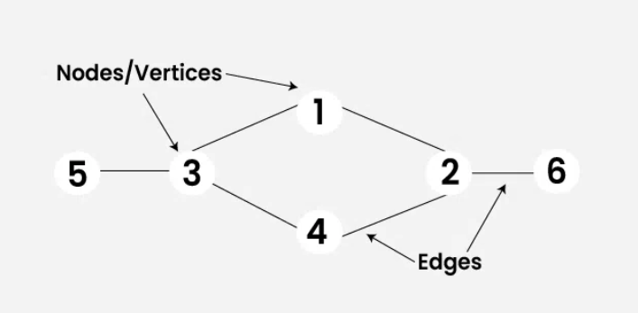

Graph terdiri dari beberapa komponen yaitu:
1. Matriks Adjacency: Representasi matriks dua dimensi di mana setiap elemen matriks menunjukkan apakah ada sisi yang menghubungkan dua simpul atau tidak.
2. Daftar Adjacency: Representasi daftar di mana setiap simpul memiliki daftar simpul-simpul yang terhubung langsung dengannya.

Jenis-jenis Graph:

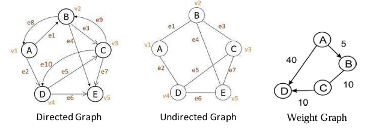
1. Graf Sederhana: Graf di mana tidak ada sisi yang menghubungkan simpul dengan dirinya sendiri (loop) dan tidak ada lebih dari satu sisi yang menghubungkan dua simpul yang sama (multiple edges).
2. Graf Lintas: Graf yang setiap simpulnya terhubung dengan semua simpul lainnya.
3. Graf Berkelompok: Graf yang simpul-simpulnya terbagi menjadi beberapa kelompok yang terhubung secara internal.

### Tree
Tree ataupohon merupakan struktur data hierarkis yang terdiri dari simpul-simpul yang terhubung secara berjenjang. Dalam pohon, ada satu simpul yang menjadi simpul paling atas yang disebut sebagai "akar". Setiap simpul dalam pohon dapat memiliki satu atau lebih simpul anak, kecuali simpul daun yang tidak memiliki anak. Simpul-simpul dalam pohon terhubung oleh sisi-sisi yang disebut "garis-garis". Setiap simpul kecuali akar memiliki satu simpul "induk" yang terhubung langsung dengannya, dan setiap simpul kecuali simpul daun memiliki satu atau lebih simpul "anak" yang terhubung langsung kepadanya. Pohon sering digunakan untuk merepresentasikan hierarki data, seperti struktur organisasi perusahaan, struktur direktori pada sistem komputer, atau hubungan antara kategori dan subkategori dalam pengindeksan data.
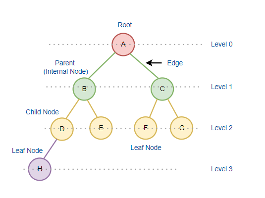

Konsep dasar pohon:
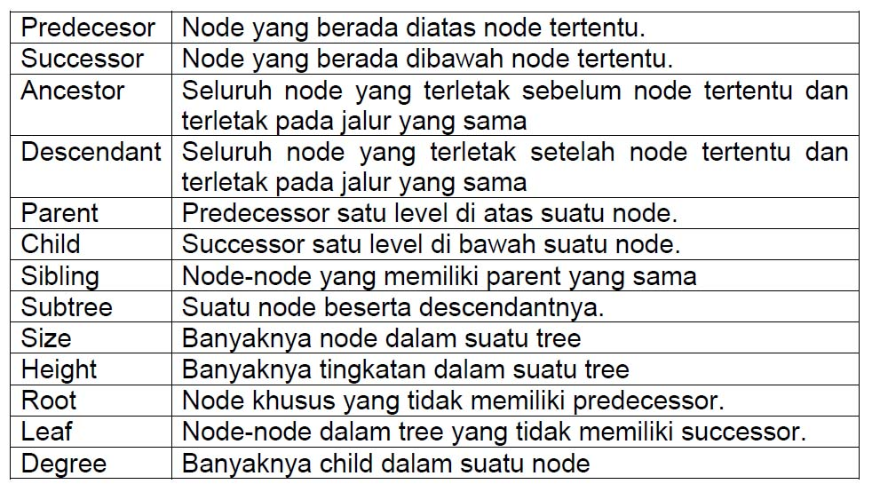

Pohon dapat memiliki berbagai jenis, termasuk pohon biner (yang setiap simpulnya memiliki paling banyak dua anak), pohon biner pencarian (BST) yang memiliki aturan tertentu untuk pengurutan data, dan pohon n-ari yang memungkinkan setiap simpul memiliki lebih dari dua anak. Pohon digunakan dalam berbagai algoritma dan aplikasi, seperti penyimpanan data, struktur pencarian, dan optimisasi.

## Guided 

### 1. Program Graph
```C++
#include <iostream>
#include <iomanip>

using namespace std;

string simpul[7] = {
    "Ciamis", "Bandung", "Bekasi", "Tasikmalaya", "Cianjur", "Purwokerto", "Yogyakarta"
};

int busur[7][7] = {
    {0, 7, 8, 0, 0 ,0 ,0},
    {0, 0, 5, 0, 0 , 15, 0},
    {0, 6, 0, 0 , 5, 0, 0},
    {0, 5, 0, 0, 2, 4, 0},
    {23, 0, 0, 10, 0, 0, 8},
    {0, 0, 0, 0, 7, 0, 3},
    {0, 0, 0, 0, 9, 4, 0}
};

void tampilGraph(){
    for (int baris = 0; baris < 7; baris++){
        cout << " " << setiosflags(ios::left) << setw(15) << simpul[baris] <<": ";
        for (int kolom = 0; kolom < 7; kolom++){
            if (busur[baris][kolom] != 0){
                cout << " " << simpul[kolom] << "(" << busur[baris][kolom] << ")";
            }
        }cout << endl;
    }
}

int main(){
    tampilGraph();
    return 0;
}
```
Kode di atas merupakan implementasi sederhana graf menggunakan matriks berbobot. Program di atas menggambarkan sebuah graf yang terdiri dari nodes yang dihubungkan oleh busur-busur, dengan setiap busur mememiliki bobot tertentu. Program terdapat pendeklarasian array simpul yang berisi nama-nama simpul atau nodes dalam graf. Deklarasi matriks busur untuk merepresentasikan hubungan antar node. Pada fungsi tampilGraph() digunakan untuk menampilkan graf dalam bentuk yang lebih mudah dipahami. Fungsi ini melakukan iterasi melalui setiap elemen dalam matriks busur dan mencetak hubungan antar simpul beserta bobotnya. Pada main program funsgi tampilGraph() dipanngil untuk menampilkan graf yang sudah didefinisikan.

### 2. Program Tree
```C++
#include <iostream>
#include <iomanip>

using namespace std;

struct Pohon
{
    char data;
    Pohon *left, *right, *parent;
};

Pohon *root, *baru;

void init()
{
    root = NULL;
}

bool isEmpty()
{
    return root == NULL;
}

void buatNode(char data)
{
    if (isEmpty())
    {
        root = new Pohon();
        root->data = data;
        root->left = NULL;
        root->right = NULL;
        root->parent = NULL;
        cout << "\n Node " << data << " berhasil dibuat sebagai root."
             << endl;
    }
    else
    {
        cout << "\n Tree sudah ada!" << endl;
    }
}

Pohon *insertLeft(char data, Pohon *node)
{
    if (isEmpty())
    {
        cout << "\n Buat tree terlebih dahulu!" << endl;
        return NULL;
    }
    else
    {
        if (node->left != NULL)
        {
            cout << "\n Node " << node->data << " sudah ada child kiri !" << endl;
            return NULL;
        }
        else
        {
            Pohon *baru = new Pohon();
            baru->data = data;
            baru->left = NULL;
            baru->right = NULL;
            baru->parent = node;
            node->left = baru;
            cout << "\n Node " << data << " berhasil ditambahkan kechild kiri " << baru->parent->data << endl;
            return baru;
        }
    }
}

Pohon *insertRight(char data, Pohon *node)
{
    if (isEmpty())
    {
        cout << "\n Buat tree terlebih dahulu!" << endl;
        return NULL;
    }
    else
    {
        if (node->right != NULL)
        {
            cout << "\n Node " << node->data << " sudah ada child kanan !" << endl;
            return NULL;
        }
        else
        {
            Pohon *baru = new Pohon();
            baru->data = data;
            baru->left = NULL;
            baru->right = NULL;
            baru->parent = node;
            node->right = baru;
            cout << "\n Node " << data << " berhasil ditambahkan ke child kanan " << baru->parent->data << endl;
            return baru;
        }
    }
}

void update(char data, Pohon *node)
{
    if (isEmpty())
    {
        cout << "\n Buat tree terlebih dahulu!" << endl;
    }
    else
    {
        if (!node)
        {
            cout << "\n Node yang ingin diganti tidak ada!!" << endl;
        }
        else
        {
            char temp = node->data;
            node->data = data;
            cout << "\n Node " << temp << " berhasil diubah menjadi "
                 << data << endl;
        }
    }
}

void retrieve(Pohon *node)
{
    if (isEmpty())
    {
        cout << "\n Buat tree terlebih dahulu!" << endl;
    }
    else
    {
        if (!node)
        {
            cout << "\n Node yang ditunjuk tidak ada!" << endl;
        }
        else
        {
            cout << "\n Data node : " << node->data << endl;
        }
    }
}

void find(Pohon *node)
{
    if (isEmpty())
    {
        cout << "\n Buat tree terlebih dahulu!" << endl;
    }
    else
    {
        if (!node)
        {
            cout << "\n Node yang ditunjuk tidak ada!" << endl;
        }
        else
        {
            cout << "\n Data Node : " << node->data << endl;
            cout << " Root : " << root->data << endl;
            if (!node->parent)
                cout << " Parent : (tidak punya parent)" << endl;
            else
                cout << " Parent : " << node->parent->data << endl;
            if (node->parent != NULL && node->parent->left != node &&
                node->parent->right == node)
                cout << " Sibling : " << node->parent->left->data << endl;
            else if (node->parent != NULL && node->parent->right != node && node->parent->left == node)
                cout << " Sibling : " << node->parent->right->data << endl;
            else
                cout << " Sibling : (tidak punya sibling)" << endl;
            if (!node->left)
                cout << " Child Kiri : (tidak punya Child kiri)" << endl;
            else
                cout << " Child Kiri : " << node->left->data << endl;
            if (!node->right)
                cout << " Child Kanan : (tidak punya Child kanan)" << endl;
            else
                cout << " Child Kanan : " << node->right->data << endl;
        }
    }
}

// Penelusuran (Traversal)
// preOrder
void preOrder(Pohon *node = root)
{
    if (isEmpty())
    {
        cout << "\n Buat tree terlebih dahulu!" << endl;
    }
    else
    {
        if (node != NULL)
        {
            cout << " " << node->data << ", ";
            preOrder(node->left);
            preOrder(node->right);
        }
    }
}

// inOrder
void inOrder(Pohon *node = root)
{
    if (isEmpty())
    {
        cout << "\n Buat tree terlebih dahulu!" << endl;
    }
    else
    {
        if (node != NULL)
        {
            inOrder(node->left);
            cout << " " << node->data << ", ";
            inOrder(node->right);
        }
    }
}

// postOrder
void postOrder(Pohon *node = root)
{
    if (isEmpty())
    {
        cout << "\n Buat tree terlebih dahulu!" << endl;
    }
    else
    {
        if (node != NULL)
        {
            postOrder(node->left);
            postOrder(node->right);
            cout << " " << node->data << ", ";
        }
    }
}

// Hapus Node Tree
void deleteTree(Pohon *node)
{
    if (isEmpty())
    {
        cout << "\n Buat tree terlebih dahulu!" << endl;
    }
    else
    {
        if (node != NULL)
        {
            if (node != root)
            {
                node->parent->left = NULL;
                node->parent->right = NULL;
            }
            deleteTree(node->left);
            deleteTree(node->right);
            if (node == root)
            {
                delete root;
                root = NULL;
            }
            else
            {
                delete node;
            }
        }
    }
}

// Hapus SubTree
void deleteSub(Pohon *node)
{
    if (isEmpty())
    {
        cout << "\n Buat tree terlebih dahulu!" << endl;
    }
    else
    {
        deleteTree(node->left);
        deleteTree(node->right);
        cout << "\n Node subtree " << node->data << " berhasil dihapus." << endl;
    }
}

void clear()
{
    if (isEmpty())
    {
        cout << "\n Buat tree terlebih dahulu!!" << endl;
    }
    else
    {
        deleteTree(root);
        cout << "\n Pohon berhasil dihapus." << endl;
    }
}

// Cek Size Tree
int size(Pohon *node = root)
{
    if (isEmpty())
    {
        cout << "\n Buat tree terlebih dahulu!!" << endl;
        return 0;
    }
    else
    {
        if (!node)
        {
            return 0;
        }
        else
        {
            return 1 + size(node->left) + size(node->right);
        }
    }
}

// Cek Height Level Tree
int height(Pohon *node = root)
{
    if (isEmpty())
    {
        cout << "\n Buat tree terlebih dahulu!" << endl;
        return 0;
    }
    else
    {
        if (!node)
        {
            return 0;
        }
        else
        {
            int heightKiri = height(node->left);
            int heightKanan = height(node->right);
            if (heightKiri >= heightKanan)
            {
                return heightKiri + 1;
            }
            else
            {
                return heightKanan + 1;
            }
        }
    }
}

// Karakteristik Tree
void characteristic()
{
    cout << "\n Size Tree : " << size() << endl;
    cout << " Height Tree : " << height() << endl;
    cout << " Average Node of Tree : " << size() / height() << endl;
}

int main()
{
    buatNode('A');
    Pohon *nodeB, *nodeC, *nodeD, *nodeE, *nodeF, *nodeG, *nodeH, *nodeI, *nodeJ;
    nodeB = insertLeft('B', root);
    nodeC = insertRight('C', root);
    nodeD = insertLeft('D', nodeB);
    nodeE = insertRight('E', nodeB);
    nodeF = insertLeft('F', nodeC);
    nodeG = insertLeft('G', nodeE);
    nodeH = insertRight('H', nodeE);
    nodeI = insertLeft('I', nodeG);
    nodeJ = insertRight('J', nodeG);
    update('Z', nodeC);
    update('C', nodeC);
    retrieve(nodeC);
    find(nodeC);

    cout << "\n PreOrder :" << endl;
    preOrder(root);
    cout << "\n"<< endl;

    cout << " InOrder :" << endl;
    inOrder(root);
    cout << "\n" << endl;

    cout << " PostOrder :" << endl;
    postOrder(root);
    cout << "\n" << endl;

    characteristic();
    deleteSub(nodeE);
    cout << "\n PreOrder :" << endl;
    preOrder();
    cout << "\n" << endl;

    characteristic();
}
```
Kode di atas merupakan implementasi sederhana dari struktur data pohon biner. Program di atas mendeklaras struct pohon yang terdapat char data, pointer node left, right, dan parent dan deklarasi pohon pointer node root dan baru. Program di atas memiliki beberaa fungsi:
1. init(), digunakan untuk menginisialisasi pohon dengan mengatur root menjadi NULL.
2. isEmpty(), Pengecekan jika pohon kosong.
3. buatNode(char data), untuk  membuat simpul baru sebagai root.
4. insertLeft(char data, Pohon* node), untuk menambahkan node child kiri pada nodeParent.
5. insertRight(char data, Pohon* node), untuk menambahkan node child kanan pada nodeParent.
6. update(char data, Pohon* node), untuk memperbarui data node.
7. find(Pohon* node), untuk menampilkan informasi tentang suatu node, termasuk data, induk, saudara kandung, anak kiri, dan anak kanan.
8. deleteTree(Pohon* node), untuk menghapus seluruh pohon, termasuk node dan hubungan antar node.
9. deleteSub(Pohon* node), untuk menghapus subtree yang dimulai dari node.
10. size(Pohon* node), untuk menghitung jumlah node dalam pohon.
11. height(Pohon* node), untuk menghitung tinggi pohon.
12. characteristic(), untuk menampilkan karakteristik pohon, termasuk ukuran, tinggi, dan rata-rata node per level.

Terdapat fungsi Traversal (penelurusan) dalam program:
1. preOrder(Pohon* node), untuk mengurutkan pohon secara pre-order.
2. inOrder(Pohon* node), untuk mengurutkan pohon secara in-order.
3. postOrder(Pohon* node), untuk mengurutkan pohon secara post-order.

Fungsi utama dalam kode di atas untuk membuat pohon dengan mengaitkan simpul-simpul menggunakan operasi-insert, memperbarui data simpul, menampilkan informasi tentang simpul, melakukan penelusuran pohon, menampilkan karakteristik pohon, menghapus subtree, dan menampilkan kembali penelusuran pohon dan karakteristiknya setelah subtree dihapus.

## Unguided 
Cantumkan NIM pada salah satu variabel di dalam program.
## 1. Buatlah program graph dengan menggunakan inputan user untuk menghitung jarak dari sebuah kota ke kota lainnya.
Output Program:<br/>
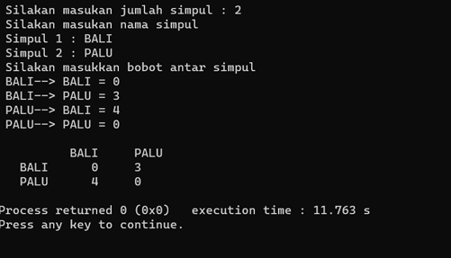

```C++

// Sinta Sarwo - 2311102132

#include <iostream> // Library untuk fungsi input dan ouput
#include <iomanip>  // Library untuk memanipulasikan output untuk menjadi lebih rapi
#include <string>   // Library untuk fungsi string

using namespace std;

const int MaxCities_2132 = 10; //Maksimal banyak data yang dapat ditampung pada variabel MAX_CITIES untuk struct Graph

struct Graph {
    string CityNames_2132[MaxCities_2132]; // Banyaknya data string yang dapat disimpan dalam string sesuai dengan kapasitas MAX_CITIES
    int BusurMatrix_2132[MaxCities_2132][MaxCities_2132]; // Menggunakan array 2 dimensi, dengan ukuran maksimal sesuai MAX_CITIES
    int numCities_2132; // Variabel yang digunakan untuk menyimpan jumlah kota dalam graph
};

//Mencetak Matrix
void printMatrix_2132(const Graph& graph) {
    cout << setw(15) << " ";
    for (int i = 0; i < graph.numCities_2132; i++) {
        cout << setw(15) << graph.CityNames_2132[i];
    }
    cout << endl;

    for (int i = 0; i < graph.numCities_2132; i++) {
        cout << setw(15) << graph.CityNames_2132[i];
        for (int j = 0; j < graph.numCities_2132; j++) {
            cout << setw(15) << graph.BusurMatrix_2132[i][j];
        }
        cout << endl;
    }
}

int main() {
    Graph graph;
    cout << "\n 2132     Aplikasi Jarak Antar Kota     2132 " << endl;
    cout << "Input jumlah simpul: ";
    cin >> graph.numCities_2132;
    cin.ignore(); // Mengabaikan karakter newline yang tersisa

    for (int i = 0; i < graph.numCities_2132; i++) {
        cout << "Simpul " << i + 1 << ": ";
        getline(cin, graph.CityNames_2132[i]);
    }

    cout << "Input bobot antar simpul" << endl;
    for (int i = 0; i < graph.numCities_2132; i++) {
        for (int j = 0; j < graph.numCities_2132; j++) {
            cout << graph.CityNames_2132[i] << " ---> " << graph.CityNames_2132[j] << " = ";
            cin >> graph.BusurMatrix_2132[i][j];
        }
    }

    cout << endl;
    printMatrix_2132(graph); //Memanggil fungsi printMatrix_2132 untuk mencetak hasil Matrix

    return 0;
}
```
## Output:
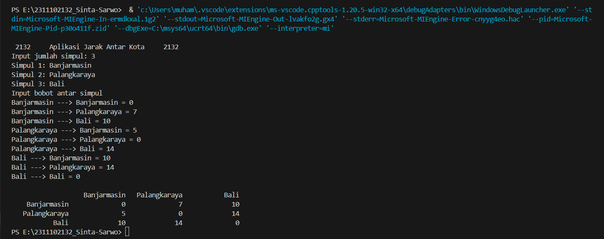
Kode di atas merupakan implementasi graf sederhana untuk mengelola jarak antar kota. Terdapat const int MaxCities_2132, struct Graph yang dideklarasi untuk menyimpan jumlah maksimal kota dan struct Graph yang terdapat CityNames_2132 dan BusurMatrix_2132 untuk menyimpan nama kota dan bobot antar kota. Program di atas terdapat fungsi printMatrix_2132 yang digunakan untuk mencetak matriks yang merepresentasikan bobot antar kota. Mencetak nama kota di baris dan kolom, serta bobot dari setiap sambungan antara kota.

Fungsi utama dalam kode di atas terdapat deklarasi variabel graph untuk menyimpan data graf. User akan diminta untuk menginput jumlah kota yang akan dimasukkan ke dalam graf dan user akan memasukkan nama-nama kota dan menyimpan dalam array. User juga akan diminta untuk menginput bobot antar kota dan menyimpannya dalam matriks. Lalu fungsi printMatrix_2132 dipanggil untuk mencetak matriks bobot antar kota yang telah di input.

## 2. Modifikasi guided tree diatas dengan program menu menggunakan input data tree dari user dan berikan fungsi tambahan untuk menampilkan node child dan descendant dari node yang diinput kan!
```C++

// Sinta Sarwo - 2311102132

#include <iostream> // Library untuk fungsi input 
#include <iomanip>  // Library untuk memanipulasikan output untuk menjadi lebih rapi
#include <queue>    // Library untuk menggunakan queue, yang digunakan dalam pencarian dan penelusuran pohon

using namespace std;

struct Pohon
{
    char Data_2132;
    Pohon *left, *right, *parent;
};

Pohon *root, *baru; // Deklarasi root dan node baru

// Inisialisasi tree
void Initialization_2132()
{
    root = NULL;
}

bool isEmpty_2132()
{
    return root == NULL;
}

// Membuat node root
void buatNode_2132(char data)
{
    if (isEmpty_2132())
    {
        root = new Pohon();
        root->Data_2132 = data;
        root->left = NULL;
        root->right = NULL;
        root->parent = NULL;
        cout << "\n Node " << data << " have been succesfully added as roots." << endl;
    }
    else
    {
        cout << "\n Tree sudah ada!" << endl;
    }
}

// Menambah node anak kiri
Pohon *insertLeft_2132(char data, Pohon *node)
{
    if (isEmpty_2132())
    {
        cout << "\n Make the tree first lah!" << endl;
        return NULL;
    }
    else
    {
        if (node->left != NULL)
        {
            cout << "\n Node " << node->Data_2132 << " sudah ada child kiri !" << endl;
            return NULL;
        }
        else
        {
            Pohon *baru = new Pohon();
            baru->Data_2132 = data;
            baru->left = NULL;
            baru->right = NULL;
            baru->parent = node;
            node->left = baru;
            cout << "\n Node " << data << " berhasil ditambahkan ke child kiri " << baru->parent->Data_2132 << endl;
            return baru;
        }
    }
}

// Menambah node anak kanan
Pohon *insertRight_2132(char data, Pohon *node)
{
    if (isEmpty_2132())
    {
        cout << "\n Make the tree first lah!" << endl;
        return NULL;
    }
    else
    {
        if (node->right != NULL)
        {
            cout << "\n Node " << node->Data_2132 << " sudah ada child kanan !" << endl;
            return NULL;
        }
        else
        {
            Pohon *baru = new Pohon();
            baru->Data_2132 = data;
            baru->left = NULL;
            baru->right = NULL;
            baru->parent = node;
            node->right = baru;
            cout << "\n Node " << data << " berhasil ditambahkan ke child kanan " << baru->parent->Data_2132 << endl;
            return baru;
        }
    }
}

// Mengupdate data node
void Update_2132(char data, Pohon *node)
{
    if (isEmpty_2132())
    {
        cout << "\n Make the tree first lah! >:(" << endl;
    }
    else
    {
        if (!node)
        {
            cout << "\n Node yang ingin diganti tidak ada!!" << endl;
        }
        else
        {
            char temp = node->Data_2132;
            node->Data_2132 = data;
            cout << "\n Node " << temp << " have been succesfully updated to " << data << endl;
        }
    }
}

// Mengambil data node
void Retrieve_2132(Pohon *node)
{
    if (isEmpty_2132())
    {
        cout << "\n Make the tree first lah!" << endl;
    }
    else
    {
        if (!node)
        {
            cout << "\n Node yang ditunjuk tidak ada!" << endl;
        }
        else
        {
            cout << "\n Data node : " << node->Data_2132 << endl;
        }
    }
}

// Menemukan node dan menampilkan informasinya
void find_2132(Pohon *node)
{
    if (isEmpty_2132())
    {
        cout << "\n Make the tree first lah!" << endl;
    }
    else
    {
        if (!node)
        {
            cout << "\n Node yang ditunjuk tidak ada!" << endl;
        }
        else
        {
            cout << "\n Data Node : " << node->Data_2132 << endl;
            cout << " Root : " << root->Data_2132 << endl;
            if (!node->parent)
                cout << " Parent : (tidak punya parent)" << endl;
            else
                cout << " Parent : " << node->parent->Data_2132 << endl;
            if (node->parent != NULL && node->parent->left != node &&
                node->parent->right == node)
                cout << " Sibling : " << node->parent->left->Data_2132 << endl;
            else if (node->parent != NULL && node->parent->right != node && node->parent->left == node)
                cout << " Sibling : " << node->parent->right->Data_2132 << endl;
            else
                cout << " Sibling : (tidak punya sibling)" << endl;
            if (!node->left)
                cout << " Child Kiri : (tidak punya Child kiri)" << endl;
            else
                cout << " Child Kiri : " << node->left->Data_2132 << endl;
            if (!node->right)
                cout << " Child Kanan : (tidak punya Child kanan)" << endl;
            else
                cout << " Child Kanan : " << node->right->Data_2132 << endl;
        }
    }
}

// Menampilkan anak dari node
void DisplayChildren_2132(Pohon *node)
{
    if (node == NULL)
    {
        cout << "No child/ There are nothing in the node." << endl;
        return;
    }
    cout << "Child kiri: " << (node->left ? node->left->Data_2132 : '-') << endl;
    cout << "Child kanan: " << (node->right ? node->right->Data_2132 : '-') << endl;
}

// Menampilkan semua keturunan dari node
void DisplayDescendants_2132(Pohon *node)
{
    if (node == NULL)
    {
        cout << "Make the node first lah!" << endl;
        return;
    }
    queue<Pohon*> q; // Menggunakan queue untuk traversal level-order
    q.push(node);
    while (!q.empty())
    {
        Pohon* current = q.front();
        q.pop();
        if (current != node) cout << current->Data_2132 << " ";
        if (current->left) q.push(current->left);
        if (current->right) q.push(current->right);
    }
    cout << endl;
}

// Penelusuran (Traversal)
// preOrder
void preOrder_2132(Pohon *node = root)
{
    if (isEmpty_2132())
    {
        cout << "\n Make the tree first lah!" << endl;
    }
    else
    {
        if (node != NULL)
        {
            cout << " " << node->Data_2132 << ", ";
            preOrder_2132(node->left);
            preOrder_2132(node->right);
        }
    }
}

// inOrder
void inOrder_2132(Pohon *node = root)
{
    if (isEmpty_2132())
    {
        cout << "\n Make the tree first lah!" << endl;
    }
    else
    {
        if (node != NULL)
        {
            inOrder_2132(node->left);
            cout << " " << node->Data_2132 << ", ";
            inOrder_2132(node->right);
        }
    }
}

// postOrder
void PostOrder_2132(Pohon *node = root)
{
    if (isEmpty_2132())
    {
        cout << "\n Make the tree first lah!" << endl;
    }
    else
    {
        if (node != NULL)
        {
            PostOrder_2132(node->left);
            PostOrder_2132(node->right);
            cout << " " << node->Data_2132 << ", ";
        }
    }
}

// Menghapus seluruh tree
void DeleteTree_2132(Pohon *node)
{
    if (isEmpty_2132())
    {
        cout << "\n Make the tree first lah!" << endl;
    }
    else
    {
        if (node != NULL)
        {
            if (node != root)
            {
                node->parent->left = NULL;
                node->parent->right = NULL;
            }
            DeleteTree_2132(node->left);
            DeleteTree_2132(node->right);
            if (node == root)
            {
                delete root;
                root = NULL;
            }
            else
            {
                delete node;
            }
        }
    }
}

// Hapus SubTree
void DeleteSub_2132(Pohon *node)
{
    if (isEmpty_2132())
    {
        cout << "\n Make the tree first lah!" << endl;
    }
    else
    {
        DeleteTree_2132(node->left);
        DeleteTree_2132(node->right);
        cout << "\n Node subtree " << node->Data_2132 << " have been succesfully deleted." << endl;
    }
}

// Clears Seluruh Tree
void Clear_2132()
{
    if (isEmpty_2132())
    {
        cout << "\n Make the tree first lah!!" << endl;
    }
    else
    {
        DeleteTree_2132(root);
        cout << "\n Tree have been succesfully cleared!" << endl;
    }
}

// Cek Size Tree
int size_2132(Pohon *node = root)
{
    if (isEmpty_2132())
    {
        cout << "\n Make the tree first lah!!" << endl;
        return 0;
    }
    else
    {
        if (!node)
        {
            return 0;
        }
        else
        {
            return 1 + size_2132(node->left) + size_2132(node->right);
        }
    }
}

// Cek Height Level Tree
int height_2132(Pohon *node = root)
{
    if (isEmpty_2132())
    {
        cout << "\n Make the tree first lah!" << endl;
        return 0;
    }
    else
    {
        if (!node)
        {
            return 0;
        }
        else
        {
            int heightKiri = height_2132(node->left);
            int heightKanan = height_2132(node->right);
            if (heightKiri >= heightKanan)
            {
                return heightKiri + 1;
            }
            else
            {
                return heightKanan + 1;
            }
        }
    }
}

// Karakteristik Tree
void Characteristic_2132()
{
    cout << "\n Size Tree : " << size_2132() << endl;
    cout << " Height Tree : " << height_2132() << endl;
    cout << " Average Node of Tree : " << size_2132() / height_2132() << endl;
}

Pohon* findNode_2132(Pohon* node, char data)
{
    if (node == NULL)
        return NULL;
    if (node->Data_2132 == data)
        return node;
    Pohon* foundNode = findNode_2132(node->left, data);
    if (foundNode == NULL)
        foundNode = findNode_2132(node->right, data);
    return foundNode;
}

int main()
{
    Initialization_2132(); // Inisialisasi Graph/Tree
    int Choice_2132; // Deklarai Choice_2132 untuk menjadi inputan dalam switch-case
    char Data_2132, ParentData_2132; //Deklarasi Data_2132 dan ParentData_2132 untuk menyimpan data yang akan diinput oleh user
    Pohon* parentNode; //Deklarasi untuk menyimpan pointer pada node untuk operasi
    Pohon* node; //Deklarasi untuk menyimpan pointer pada node untuk operasi

    do{
        cout <<"\n   2132   Menu Data Tree/Graph   2132   " << endl; //Menu untuk memberi user pilihan ingin menggunakan fungsi-fungsi di dalam program
        cout << "1. Buat node root\n";
        cout << "2. Insert left\n";
        cout << "3. Insert right\n";
        cout << "4. Update node\n";
        cout << "5. Retrieve node\n";
        cout << "6. Find node\n";
        cout << "7. Display children\n";
        cout << "8. Display descendants\n";
        cout << "9. Pre-Order Traversal\n";
        cout << "10. In-Order Traversal\n";
        cout << "11. Post-Order Traversal\n";
        cout << "12. Delete subtree\n";
        cout << "13. Clear tree\n";
        cout << "14. Tree characteristics\n";
        cout << "0. Exit" << endl;
        cout << endl;
        cout <<"Input Operasi: ";
        cin >> Choice_2132; // Inputan user untuk berinteraksi dengan program

    switch (Choice_2132){
    case 1:{
        cout << "\n   2132   Buat Node Root   2132   " << endl;
        cout << "Input data root: ";
        cin >> Data_2132;
        buatNode_2132(Data_2132); //Memanggil buatNode_2132 untuk menjalakan operasi tersebut
        break;
    }
    case 2:{
        cout << "\n   2132   Insert Left   2132   " << endl;
        cout << "Input data node: ";
        cin >> Data_2132;
        cout << "Input parent node: ";
        cin >> ParentData_2132;
        parentNode = findNode_2132(root, ParentData_2132); //Memanggil fungsi findNode_2132 untuk menemukan node dengan data yang ditentukan di pohon
        insertLeft_2132(Data_2132, parentNode); //Memanggil insertLeft_2132 untuk menjalakan operasi tersebut
        break;       
    }
    case 3:{
        cout << "\n   2132   Insert Right   2132   " << endl;
        cout << "Input data node: ";
        cin >> Data_2132;
        cout << "Input parent node: ";
        cin >> ParentData_2132;
        parentNode = findNode_2132(root, ParentData_2132); //Memanggil fungsi findNode_2132 untuk menemukan node dengan data yang ditentukan di pohon
        insertRight_2132(Data_2132, parentNode); //Memanggil insertRight_2132 untuk menjalakan operasi tersebut
        break;        
    }
    case 4:{
        cout << "\n   2132   Update Node   2132   " << endl;
        cout << "Input data baru: ";
        cin >> Data_2132;
        cout << "Masukkan data node yang akan di-update: ";
        cin >> ParentData_2132;
        parentNode = findNode_2132(root, ParentData_2132); //Memanggil fungsi findNode_2132 untuk menemukan node dengan data yang ditentukan di pohon
        Update_2132(Data_2132, parentNode); //Memanggil Update_2132 untuk menjalakan operasi tersebut
        break;        
    }
    case 5:{
        cout << "\n   2132   Retrieve Node   2132   " << endl;
        cout << "Input data node: ";
        cin >> Data_2132;
        node = findNode_2132(root, Data_2132); //Memanggil fungsi findNode_2132 untuk menemukan node dengan data yang ditentukan di pohon
        Retrieve_2132(node); //Memanggil Retrieve_2132 untuk menjalakan operasi tersebut
        break;
    }
    case 6:{
        cout << "\n   2132   Find Node   2132   " << endl;
        cout << "Input data node: ";
        cin >> Data_2132;
        node = findNode_2132(root, Data_2132); //Memanggil fungsi findNode_2132 untuk menemukan node dengan data yang ditentukan di pohon
        find_2132(node); //Memanggil find_2132 untuk menjalakan operasi tersebut
        break;
    }
    case 7:{
        cout << "\n   2132   Display Childern   2132   " << endl;
        cout << "Input data node: ";
        cin >> Data_2132;
        node = findNode_2132(root, Data_2132); //Memanggil fungsi findNode_2132 untuk menemukan node dengan data yang ditentukan di pohon
        DisplayChildren_2132(node); //Memanggil DisplayChildren_2132 untuk menjalakan operasi tersebut
        break;        
    }
    case 8:{
        cout << "\n   2132   Display Descendants   2132   " << endl;
        cout << "Input data node: ";
        cin >> Data_2132;
        node = findNode_2132(root, Data_2132); //Memanggil fungsi findNode_2132 untuk menemukan node dengan data yang ditentukan di pohon
        DisplayDescendants_2132(node); //Memanggil DisplayDescendants_2132 untuk menjalakan operasi tersebut
        break;           
    }
    case 9:{
        cout << "\n   2132   Pre-Order Traversal   2132   " << endl;
        preOrder_2132(); //Memanggil fungsi preOrder_2132 untuk menjalakan operasi tersebut
        cout << "\n" << endl;
        break;
    }
    case 10:{
        cout << "\n   2132   In-Order Traversal   2132   " << endl;
        inOrder_2132(); //Memanggil fungsi inOrder_2132 untuk menjalakan operasi tersebut
        cout << "\n" << endl;
        break;
    }
    case 11:{
        cout << "\n   2132   Post-Order Traversal   2132   " << endl;
        PostOrder_2132(); //Memanggil fungsi PostOrder_2132 untuk menjalakan operasi tersebut
        cout << "\n" << endl;
        break;        
    }
    case 12:{
        cout << "\n   2132   Delete Subtree   2132   " << endl;
        cout << "Input data node: ";
        cin >> Data_2132;
        node = findNode_2132(root, Data_2132); //Memanggil fungsi findNode_2132 untuk menemukan node dengan data yang ditentukan di pohon
        DeleteSub_2132(node); //Memanggil fungsi DeleteSub_2132 untuk menjalakan operasi tersebut
        break;
    }
    case 13:{
        Clear_2132(); //Memanggil fungsi Clear_2132 untuk menjalakan operasi tersebut
        break;
    }
    case 14:{
        Characteristic_2132(); //Memanggil fungsi Characteristic_2132 untuk menjalakan operasi tersebut
        break;
    }
    case 0:{
        cout << "Exit Program, see you again in 2132 Program =D!" << endl;
        break; //User akan keluar dari program jika memilih 0
    }
    default:{
        cout << "Umm...What did you put in? Invalid command!" << endl;
    }
    }
}while (Choice_2132 != 0); //p\Program akan berhenti jika user menginputkan 0 atau 4 dalam pilihan switch case

return 0;
}
```
## Output:
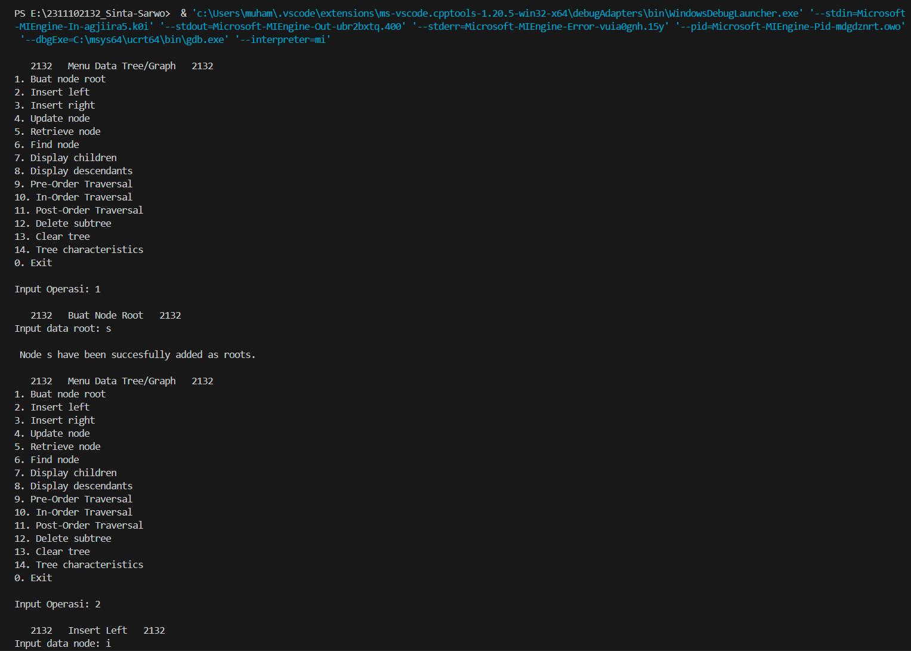
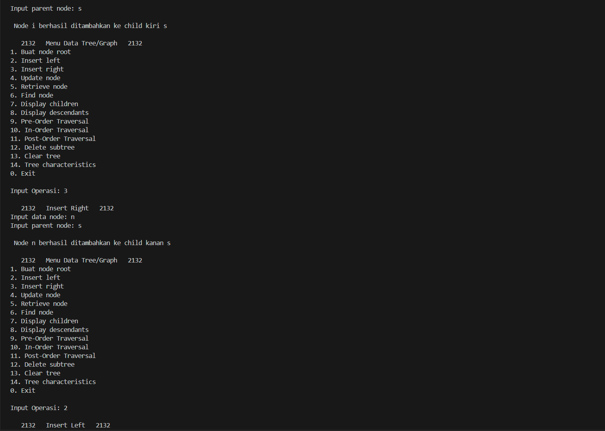
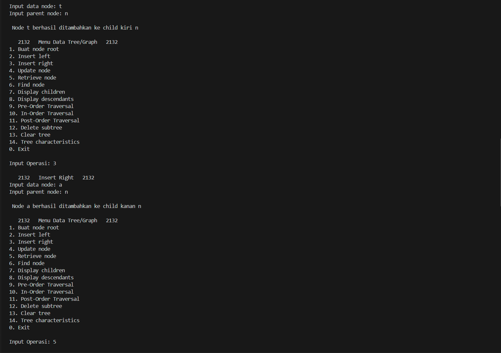
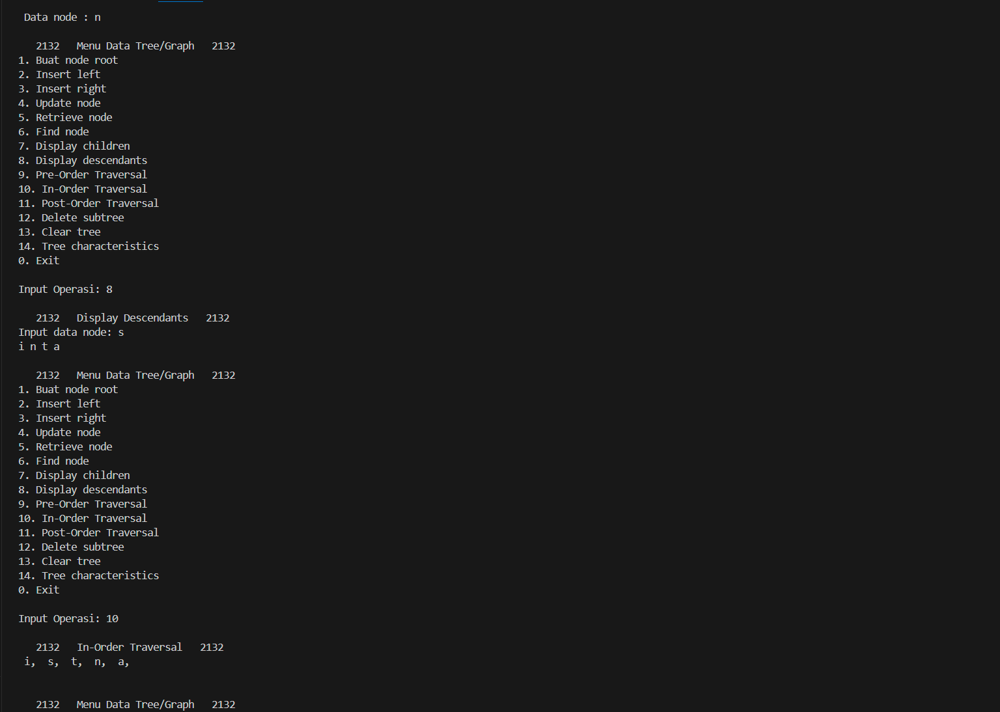
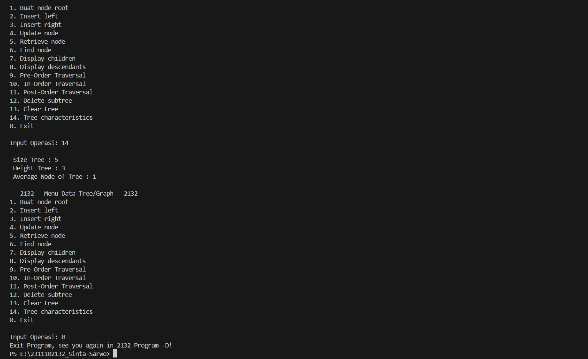

Kode di atas sama dengan program sebelumnya pada guided 2, tetapi dalam program ini terdapar 3 fungsi baru yaitu:
1. DisplayChildren_2132(): Menampilkan anak-anak dari node tertentu.
2. DisplayDescendants_2132(): Menampilkan semua keturunan dari node tertentu.
3. findNode_2132(): Mencari node dengan data tertentu dalam pohon untuk membantuk menindentifikasi node setelah data telah di input oleh user dan menjalankan operasi.

Fungsi utama dalam kode di atas terdapat menu dimana user dapat berinteraksi dan memilih operasi yang ingin dilakukan pada pohon. User dapat membuat node baru, menambahkan anak kiri atau kanan, memperbarui data, menemukan simpul, menampilkan anak-anak dan keturunan, melakukan penelusuran pohon, menghapus subtree, menghapus seluruh pohon, serta menampilkan karakteristik pohon.

## Kesimpulan
Graph adalah struktur data yang terdiri dari node-node yang terhubung oleh sisi-sisi, digunakan untuk merepresentasikan hubungan antara berbagai entitas. Algoritma Graf merupakan metode yang memungkinkan manipulasi dan analisis graf, seperti menemukan jalur terpendek atau mendeteksi siklus. Sedangkan pohon merupakan struktur data hierarkis yang memiliki simpul-simpul terhubung secara berjenjang, dengan satu simpul akar dan setiap simpul memiliki satu induk dan satu atau lebih anak. Pohon digunakan untuk merepresentasikan hierarki data, seperti struktur organisasi perusahaan atau struktur direktori pada sistem komputer.

## Referensi
[1] Narasimha Karumanchi , "Data Structures And Algorithms Made Easy: Data Structures and Algorithmic Puzzles". CareerMonk Publication, 2020. <br/>
[2] Muhammad Nugraha, Dasar Pemrograman Dengan C++, Materi Paling Dasar untuk Menjadi Programmer Berbagai Platform. Yogyakarta: Deepublish, 2021.<br/>
[3] Rangga Gelar Guntara, Algoritma dan Pemrograman Dasar Menggunakan Bahasa Pemrograman C ++ dengan Contoh Kasus Aplikasi untuk Bisnis dan Manajemen. Bontomarannu: CV. Ruang Tentor, 2023.
